# 香港工具有限公司

## HONG KONG TOOLS CO LIMITED

## 產品目錄

2019

## HK TOOLS

地址：香港荃灣沙咀道26-38號

匯力工業中心11樓26室(辦公室)

852-2540 8908

852-2548 3406

9010 2502

香港工具

  
WeChat

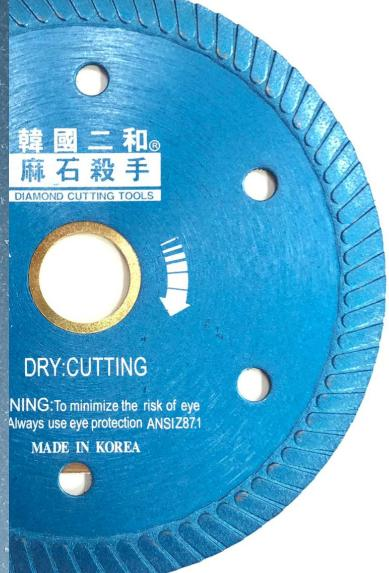

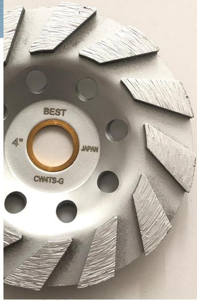

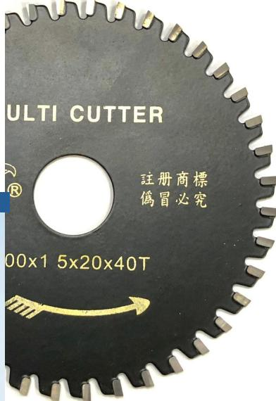

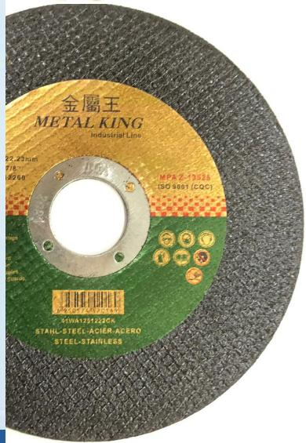

## 鑽石工具系列:

1. 4"-- 14"韓國EHWA麻石殺手鎅石碟(專業型) 1-2  
2. 3"& 4"& 4.5"麻石/雲石/瓷磚/水泥,人造石鎅碟 2-5   
3. 4"電鍍/釬焊:雲石/瓷磚/玻璃鎅碟&磨碟 6  
4. 5"-- 30"麻石鎅碟/混凝土/馬路鎅碟 7-11  
5. 4"-- 14"水泥,混凝土,馬路鎅坑碟(粗坑碟) 12   
6. 3.5"-- 7"麻石/水泥/混凝土磨碟(磨盤) 13-14  
7. 1"--16"韓國EHWA麻石殺手三節囉頭(專業型) 15   
8. 1"--14"麻石忍者三節囉頭 16  
9. 1"-- 3.5"油壓鑽/鑽孔機用囉頭 17-18  
10. 各種鑽孔機轉換接頭/運水頭/加長杆/集水器 19-20  
11. 麻石令梳/電鍍玻璃令梳/ 麻石,雲石拋光碟 20-21

## 電動工具系列:

12V & 16.8V 雙速鋰電批 22  
2. 20V無碳刷鋰電批,起子批,扳手(卜批)(與得偉通用) 23   
3. 21V無碳刷鋰電池起子批,扳手,磨機(與紅M通用) 24   
4. 21V鋰電池高壓水槍 25   
5. 18V紅M代用鋰電池&充電器 26   
6. 18V鋰電池轉換器(得偉轉紅M) 26  
18V得偉代用鋰電池&充電器 27   
8. 220V & 110V 幼柄4"磨機, 4"石材切割機 28   
9. 220V & 110V 攪拌機,及碟&杆 29   
10. 220V 萬應寶震震機 , 4"石材切割機 30  
11. 220V 4"手提鑽孔機, 7",8",10"台式鑽孔機 31

## 五金工具系列:

1. 3"--14"超薄拮碟 32  
2. 4"--7"萬用碟 33-34  
3. 4"--14"木鎅碟/鋁合金鎅碟 35-37  
4. 加硬細電炮尖/四坑炮尖 38   
5. 加硬大電炮尖/五坑炮尖/瓦仔鎅筆 39  
6. 萬應寶震震機配件 40-41   
7. 十字頭/三角頭玻璃鑽咀 42  
8. 鋒鋼令梳 43-44   
9. 鑽石鋼令梳 44-45   
10. 美式鋒鋼令梳杯 46   
11. 電鑽老虎鋸/老虎鋸片/大利鋸/摺鋸 47   
12. 魔術貼膠托/各種風喉喼輪 48   
13. 六角磁卜/磁性接杆/四坑油壓鑽咀/密碼鎖 49   
14. 各種批咀 50

(EHWA 是全球鑽石工具第二大生產廠家, 廠房遍佈: 韓國, 日本, 泰國, 中國…等地.)

100% 韓國製造 < 原裝韓國"EHWA 麻石殺手"最新配方產品 >

### 麻石至尊

#### 4"

### 麻石殺手

#### 4" (波紋片)

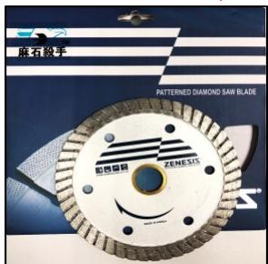

<table><tr><td>產品名稱:</td><td>4&quot;麻石錠碟--(EHWA麻石至尊)</td></tr><tr><td>編號:</td><td>EH-DW4Z</td></tr><tr><td>規格:</td><td>4&quot;(106×2.2×10×20(16)內孔)mm</td></tr><tr><td>切割材料:</td><td>可干錠高硬度麻石,雲石,水泥,行人路高溫磚...等</td></tr><tr><td>包裝:</td><td>24片/紙盒</td></tr></table>

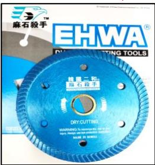

<table><tr><td>產品名稱:</td><td>4&quot;麻石錠碟(波紋片)--(麻石殼手)</td></tr><tr><td>編號:</td><td>EH-DW4S</td></tr><tr><td>規格:</td><td>4&quot;(105×2.0×8×20(16)內孔)mm</td></tr><tr><td>切割材料:</td><td>可干錠高硬度麻石,雲石,水泥, 瓷磚,行人路高溫磚...等</td></tr><tr><td>包裝:</td><td>24片/紙盒</td></tr></table>

### 麻石殺手

#### 4" (1.2超薄片)

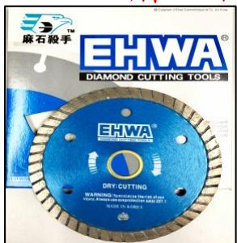

<table><tr><td>產品名稱:</td><td>4&quot;麻石錠碟(1.2超薄片)</td></tr><tr><td>編號:</td><td>EH-DW4T</td></tr><tr><td>規格:</td><td>4&quot;(105×1.2×8×20(16)內孔)mm</td></tr><tr><td>切割材料:</td><td>可干錠高硬度麻石,雲石,水泥, 瓷磚,行人路高溫磚...等</td></tr><tr><td>包裝:</td><td>24片/紙盒</td></tr></table>

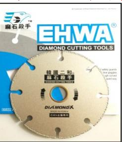

<table><tr><td>產品名稱:</td><td>4&quot;麻石殼手萬用碟</td></tr><tr><td>編號:</td><td>EH-DX</td></tr><tr><td>規格:</td><td>4&quot;(100 x 1.5 x 20(16)內孔)mm</td></tr><tr><td>切割材料:</td><td>可干錫金屬,高硬度麻石,雲石,水泥,瓷磚,行人路高溫磚...等</td></tr><tr><td>包裝:</td><td>24片/紙盒</td></tr></table>

### 麻石殺手

#### 4"(干片)

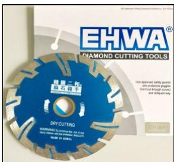

<table><tr><td>產品名稱:</td><td>4&quot;麻石殺手錐石碟(刀神干片)</td></tr><tr><td>編號:</td><td>EH-DW4D-AG</td></tr><tr><td>規格:</td><td>4&quot;(105×1.8×7×20(16)內孔)mm</td></tr><tr><td>切割材料:</td><td>可干錠高硬度麻石,雲石,水泥,行人路高溫磚...等</td></tr><tr><td>包裝:</td><td>24片/紙盒</td></tr></table>

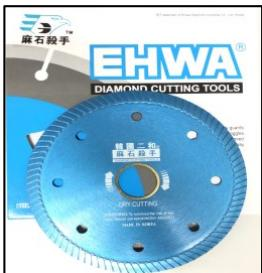

### 石殺手 5" (波紋片)

<table><tr><td>產品名稱:</td><td>5&quot;麻石錠碟(波紋片)--(麻石殼手)</td></tr><tr><td>編號:</td><td>EH-DW5S</td></tr><tr><td>規格:</td><td>5&quot;(125×2.0×8×25.4(22.2&amp;20)內孔)mm</td></tr><tr><td>切割材料:</td><td>可干錠高硬度麻石,雲石,水泥, 瓷磚,行人路高溫磚...等</td></tr><tr><td>包裝:</td><td>12片/紙盒</td></tr></table>

### 麻石殺手

#### 6"(干片)

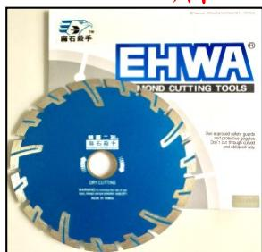

<table><tr><td>產品名稱:</td><td>6&quot;麻石殼手錳石碟(刀神千片)</td></tr><tr><td>編號:</td><td>EH-DW6D-AG</td></tr><tr><td>規格:</td><td>6&quot;(155×2.0×8×25.4(22.2&amp;20)內孔)mm</td></tr><tr><td>切割材料:</td><td>可干錳高硬度麻石,雲石,水泥,行人路高溫磚...等</td></tr><tr><td>包裝:</td><td>12片/紙盒</td></tr></table>

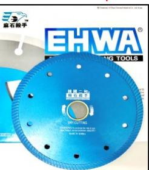

<table><tr><td>產品名稱:</td><td>6&quot;麻石錫碟(波紋片)--(麻石殺手)</td></tr><tr><td>編號:</td><td>EH-DW6S</td></tr><tr><td>規格:</td><td>6&quot;(150 x 2.2 x 8 x 25.4(22.2&amp;20)內孔)mm</td></tr><tr><td>切割材料:</td><td>可干錳高硬度麻石,雲石,水泥, 瓷磚,行人路高溫磚...等</td></tr><tr><td>包裝:</td><td>12片/紙盒</td></tr></table>

### 麻石殺手

#### 7"(干片)

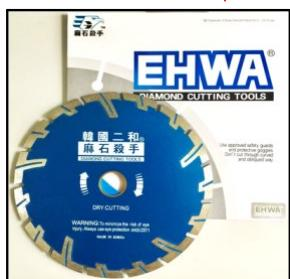

<table><tr><td>產品名稱:</td><td>7&quot;麻石殼手錠石碟(刀神干片)</td></tr><tr><td>編號:</td><td>EH-DW7D-AG</td></tr><tr><td>規格:</td><td>7&quot;(180×2.0×8×25.4(22.2&amp;20)內孔)mm</td></tr><tr><td>切割材料:</td><td>可干錠高硬度麻石,雲石,水泥,行人路高溫磚...等</td></tr><tr><td>包裝:</td><td>12片/紙盒</td></tr></table>

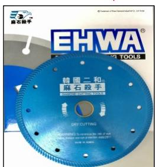

<table><tr><td colspan="2">殺手 7&quot; (波紋片)</td></tr><tr><td>產品名稱:</td><td>7&quot;麻石錠碟(波紋片)--(麻石)</td></tr><tr><td>編號:</td><td>EH-DW7S</td></tr><tr><td>規格:</td><td>7&quot;(180x2.2x8x25.4(22.2&amp;20)內)</td></tr><tr><td>切割材料:</td><td>可干錠高硬度麻石,雲石,水 瓷磚,行人路高溫磚...等</td></tr><tr><td>包裝:</td><td>12片/紙盒</td></tr></table>

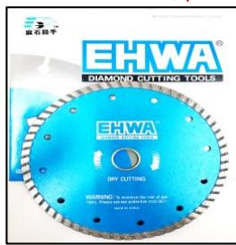

<table><tr><td>產品名稱:</td><td>7&quot;麻石錠碟(干濕片)</td></tr><tr><td>編號:</td><td>EH-DW7T</td></tr><tr><td>規格:</td><td>7&quot;(180 x 2.3 x 8 x 25.4(22.2&amp;20)內孔)mm</td></tr><tr><td>切割材料:</td><td>可干錠高硬度麻石,雲石,水泥,行人路高溫磚...等</td></tr><tr><td>包裝:</td><td>12片/紙盒</td></tr></table>

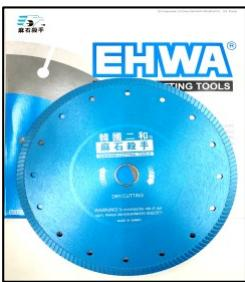

<table><tr><td>產品名稱:</td><td>9&quot;麻石錫碟(波紋片)</td></tr><tr><td>編號:</td><td>EH-DW9S</td></tr><tr><td>規格:</td><td>9&quot;(230 x 2.3 x 8 x 25.4(22.2&amp;20)內孔)mm</td></tr><tr><td>切割材料:</td><td>可干錠高硬度麻石,雲石,水泥, 瓷磚,行人路高溫磚...等</td></tr><tr><td>包裝:</td><td>10片/紙盒</td></tr></table>

### 麻石殺手

#### 10" (波紋片)

### 麻石殺手(高溫磚/麻石用)12"

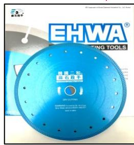

<table><tr><td>產品名稱:</td><td>10&quot;麻石錫碟(波紋片)</td></tr><tr><td>編號:</td><td>EH-DW10S</td></tr><tr><td>規格:</td><td>10&quot;(250x2.3x8x25.4(22.2&amp;20)內孔)mm</td></tr><tr><td>切割材料:</td><td>可干錫高硬度麻石,雲石,水泥, 瓷磚,行人路高溫磚...等</td></tr><tr><td>包裝:</td><td>10片/紙盒</td></tr></table>

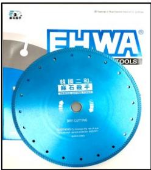

<table><tr><td>產品名稱:</td><td>12&quot;麻石錐碟(波紋片)</td></tr><tr><td>編號:</td><td>EH-DW12S</td></tr><tr><td>規格:</td><td>12&quot;(300 x 2.5 x 8 x 27(25.4)內孔)mm</td></tr><tr><td>切割材料:</td><td>可干錠高硬度麻石,雲石,水泥, 瓷磚,行人路高溫磚...等</td></tr><tr><td>包裝:</td><td>10片/紙盒</td></tr></table>

### 麻石殺手(高溫磚/麻石用) 14"

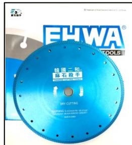

<table><tr><td>產品名稱:</td><td>14&quot;麻石錫碟(波紋片)</td></tr><tr><td>編號:</td><td>EH-DW 14S</td></tr><tr><td>規格:</td><td>14&quot;(350 x 2.5 x 8 x 27(25.4)內孔)mm</td></tr><tr><td>切割材料:</td><td>可干錫高硬度麻石,雲石,水泥, 瓷磚,行人路高溫磚...等</td></tr><tr><td>包裝:</td><td>10片/紙盒</td></tr></table>

### 麻石殺手(瀝青馬路/水泥鎅碟)12"

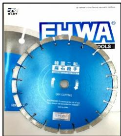

<table><tr><td>產品名稱:</td><td>12&quot;麻石殺手(馬路錳碟)</td></tr><tr><td>編號:</td><td>EH-DW12L</td></tr><tr><td>規格:</td><td>12&quot;(310×3.2×15×27(25.4)內孔)mm</td></tr><tr><td>切割材料:</td><td>可干錳高硬度水泥,麻石,瀝青馬路...等</td></tr><tr><td>包裝:</td><td>10片/紙盒</td></tr></table>

### 麻石殺手(麻石,雲石用)14"(50MM孔)

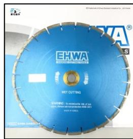

<table><tr><td>產品名稱:</td><td>14&quot;麻石錫碟(雲石鋪專用)</td></tr><tr><td>編號:</td><td>EH-DW 14G</td></tr><tr><td>規格:</td><td>14&quot;(355 x 3.2 x 15 x 50(25.4)內孔)mm</td></tr><tr><td>切割材料:</td><td>可干錫高硬度麻石,雲石,水泥,行人路高溫磚...等</td></tr><tr><td>包裝:</td><td>10片/紙盒</td></tr></table>

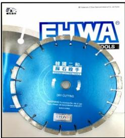

<table><tr><td>產品名稱:</td><td>14&quot;麻石殺手(馬路錳碟)</td></tr><tr><td>編號:</td><td>EH-DW14L</td></tr><tr><td>規格:</td><td>14&quot;(360×3.2×15×27(25.4)內孔)mm</td></tr><tr><td>切割材料:</td><td>可干錳高硬度水泥, 麻石, 毫青馬路...等</td></tr><tr><td>包裝:</td><td>10片/紙盒</td></tr></table>

### 大摩牌 4" (1.6MM超薄)

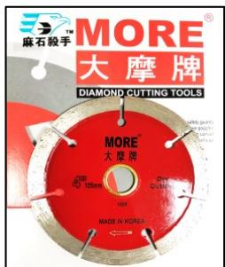

<table><tr><td>產品名稱:</td><td>4&quot;麻石錫碟(1.6MM千片)</td></tr><tr><td>編號:</td><td>EH-DW4M</td></tr><tr><td>規格:</td><td>4&quot;(105×1.6×10×20(16)內孔)mm</td></tr><tr><td>切割材料:</td><td>可干錫高硬度麻石,雲石,水泥, 瓷磚,行人路高溫磚...等</td></tr><tr><td>包裝:</td><td>24片/紙盒</td></tr></table>

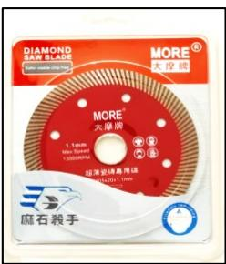

### 大摩牌 4" (1.1MM超薄)

<table><tr><td>產品名稱:</td><td>4&quot;麻石錫碟(1.1MM瓷磚片)</td></tr><tr><td>編號:</td><td>EH-DW4T1.1</td></tr><tr><td>規格:</td><td>4&quot;(105×1.1×12×20(16)內孔)mm</td></tr><tr><td>切割材料:</td><td>可干錫高硬度麻石,雲石,人造石, 瓷磚,拋光磚…等</td></tr><tr><td>包裝:</td><td>20片/紙盒</td></tr></table>

### 大摩牌 4" (1.2MM超薄)

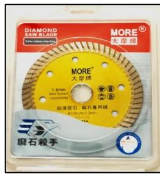

<table><tr><td>產品名稱:</td><td>4&quot;麻石錫碟(1.2MM錫石片)</td></tr><tr><td>編號:</td><td>EH-DW4T1.2</td></tr><tr><td>規格:</td><td>4&quot;(105 x 1.2 x 12 x 20(16)內孔)mm</td></tr><tr><td>切割材料:</td><td>可干錫高硬度麻石,雲石,人造石,瓷磚…</td></tr><tr><td>包裝:</td><td>20片/紙盒</td></tr></table>

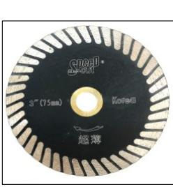

### "SPEED"

#### 3" (1MM超薄)

<table><tr><td>產品名稱:</td><td>3&quot;麻石錫碟(1MM瓷磚片)</td></tr><tr><td>編號:</td><td>DW3T</td></tr><tr><td>規格:</td><td>3&quot;(76 x 1 x 10 x 15(10)內孔)mm</td></tr><tr><td>切割材料:</td><td>可干錠高硬度麻石,雲石,人造石,瓷磚...</td></tr><tr><td>包裝:</td><td>20片/紙盒</td></tr></table>

### 鑽石工具系列---麻石,雲石,瓷磚,水泥,人造石鎅碟

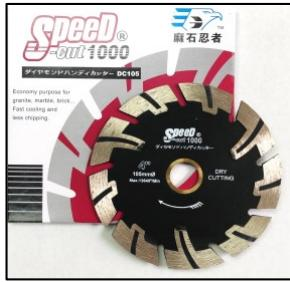  
( 麻石忍者 )  
4"&4.5" (麻石忍者)

<table><tr><td>產品名稱:</td><td>4&quot;麻石錠碟(千片)-麻石忍者-1000</td></tr><tr><td>編號:</td><td>DW4D-1000</td></tr><tr><td>規格:</td><td>4&quot;(105×1.8×10×20(16)內孔)mm</td></tr><tr><td>切割材料:</td><td>可干錠高硬度麻石,雲石,水泥,人造石,行人路高溫磚...等</td></tr><tr><td>包裝:</td><td>24片/紙盒</td></tr></table>

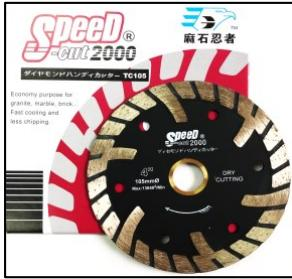

<table><tr><td>產品名稱:</td><td>4&quot;麻石錠碟(干濕片)--麻石忍者-2000</td></tr><tr><td>編號:</td><td>DW4T-2000</td></tr><tr><td>規格:</td><td>4&quot;(105 x 2.0 x 10 x 20(16)內孔)mm</td></tr><tr><td>切割材料:</td><td>可干錠高硬度麻石,雲石,水泥,人造石,行人路高溫磚...等</td></tr><tr><td>包裝:</td><td>24片/紙盒</td></tr></table>

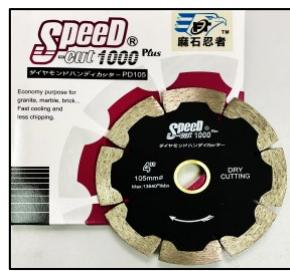

<table><tr><td>產品名稱:</td><td>4&quot;麻石錠碟(護齒干片)麻石忍者-1000P</td></tr><tr><td>編號:</td><td>DW4D-1000P</td></tr><tr><td>規格:</td><td>4&quot;(105 x 1.9 x 8 x 20(16)內孔)mm</td></tr><tr><td>切割材料:</td><td>可干錠高硬度麻石,雲石,水泥,人造石,行人路高溫磚...等</td></tr><tr><td>包裝:</td><td>24片/紙盒</td></tr></table>

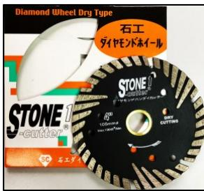

<table><tr><td>產品名稱:</td><td>4&quot;麻石錫碟(千片)--STONE1</td></tr><tr><td>編號:</td><td>DW4D-1</td></tr><tr><td>規格:</td><td>4&quot;(105 x 2.2 x 8 x 20(16)內孔)mm</td></tr><tr><td>切割材料:</td><td>可干錫高硬度麻石,雲石,水泥,人造石,行人路高溫磚...等</td></tr><tr><td>包裝:</td><td>24片/紙盒</td></tr></table>

#### 1.2mm超薄,麻石,雲石,瓷磚專用!

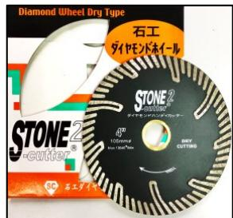

<table><tr><td>產品名稱:</td><td>4&quot;麻石錠碟(干濕片)--STONE2</td></tr><tr><td>編號:</td><td>DW4T-2</td></tr><tr><td>規格:</td><td>4&quot;(105×2.0×9×20(16)內孔)mm</td></tr><tr><td>切割材料:</td><td>可干錠高硬度麻石,雲石,水泥,人造石,行人路高溫磚...等</td></tr><tr><td>包裝:</td><td>24片/紙盒</td></tr></table>

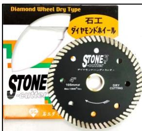

<table><tr><td>產品名稱:</td><td>4&quot;麻石鉆碟(1.2MM超薄片)STONE3</td></tr><tr><td>編號:</td><td>DW4T-3</td></tr><tr><td>規格:</td><td>4&quot;(105 x 1.2 x 8 x 20(16)內孔)mm</td></tr><tr><td>切割材料:</td><td>可干錫高硬度麻石,雲石,人造石, 瓷磚,高溫磚...等</td></tr><tr><td>包裝:</td><td>24片/紙盒</td></tr></table>

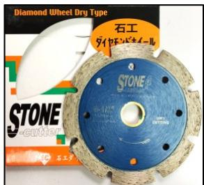  
113MM 4-1/2"

<table><tr><td>產品名稱:</td><td>4.5&quot;麻石錫碟(加闊千片)STONE 4</td></tr><tr><td>編號:</td><td>DW4.5D-4</td></tr><tr><td>規格:</td><td>4.5&quot;(113×2.0×12×20(16)內孔)mm</td></tr><tr><td>切割材料:</td><td>可干錫中硬度麻石,雲石,水泥,行人路高溫磚...等</td></tr><tr><td>包裝:</td><td>24片/紙盒</td></tr></table>

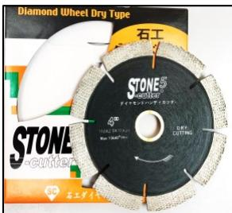  
110MM

<table><tr><td>產品名稱:</td><td>4&quot;麻石錫碟(千片)--整列型STONE 5</td></tr><tr><td>編號:</td><td>DW4D-5</td></tr><tr><td>規格:</td><td>4&quot;(110 x 1.8 x 11 x 20(16)內孔)mm</td></tr><tr><td>切割材料:</td><td>可干錫中硬度麻石,雲石,水泥,行人路高溫磚...等</td></tr><tr><td>包裝:</td><td>24片/紙盒</td></tr></table>

#### 1.2mm超薄,麻石,雲石,瓷磚專用!

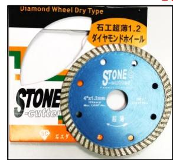

<table><tr><td>產品名稱:</td><td>4&quot;麻石錫碟(1.2超薄片)STONE6</td></tr><tr><td>編號:</td><td>DW4T-6</td></tr><tr><td>規格:</td><td>4&quot;(105×1.2×8×20(16)內孔)mm</td></tr><tr><td>切割材料:</td><td>可干錫中硬度麻石,雲石, 瓷磚,行人路高溫磚...等</td></tr><tr><td>包裝:</td><td>24片/紙盒</td></tr></table>

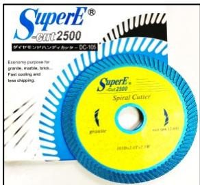

<table><tr><td>產品名稱:</td><td>4&quot;麻石錫碟(波紋片)SuperE 2500</td></tr><tr><td>編號:</td><td>DW4T-E2500</td></tr><tr><td>規格:</td><td>4&quot;(105×2.0×8×20(16)內孔)mm</td></tr><tr><td>切割材料:</td><td>可干錫中硬度麻石,雲石,人造石,高溫磚…等</td></tr><tr><td>包裝:</td><td>24片/紙盒</td></tr></table>

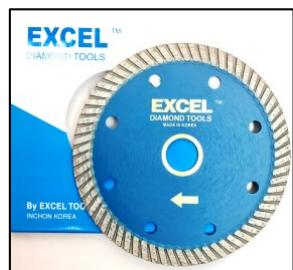

<table><tr><td>產品名稱:</td><td>4&quot;麻石錫碟(干濕片)--EXCEL</td></tr><tr><td>編號:</td><td>DW4T-EX</td></tr><tr><td>規格:</td><td>4&quot;(105×2.0×9×20(16)內孔)mm</td></tr><tr><td>切割材料:</td><td>可干錫中硬度麻石,雲石,水泥,行人路高溫磚...等</td></tr><tr><td>包裝:</td><td>24片/紙盒</td></tr></table>

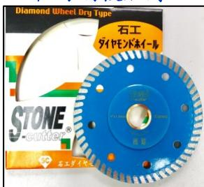

#### 1.2mm超薄,麻石,雲石,瓷磚專用!

<table><tr><td>產品名稱:</td><td>4&quot;加強超薄瓷磚鋼碟---STONE-8</td></tr><tr><td>編號:</td><td>DW4T-8</td></tr><tr><td>規格:</td><td>4&quot;(105×1.2×8×20(16)內孔)mm</td></tr><tr><td>切割材料:</td><td>可干鋼高硬度麻石,雲石,人造石, 瓷磚,高溫磚...等</td></tr><tr><td>包裝:</td><td>24片/紙盒</td></tr></table>

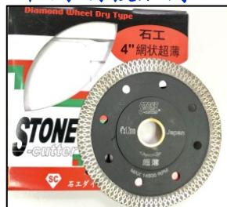  
中間鋼板加厚!!

#### 1.2mm超薄,麻石,雲石,瓷磚專用!

<table><tr><td>產品名稱:</td><td>4&quot;網狀超薄瓷磚碟STONE</td></tr><tr><td>編號:</td><td>DW4T-T</td></tr><tr><td>規格:</td><td>4&quot;(105 x 1.2 x 10 x 20(16)內孔)mm</td></tr><tr><td>切割材料:</td><td>可干鉆高硬度麻石,雲石,人造石, 瓷磚,高溫磚...等</td></tr><tr><td>包裝:</td><td>24片/紙盒</td></tr></table>

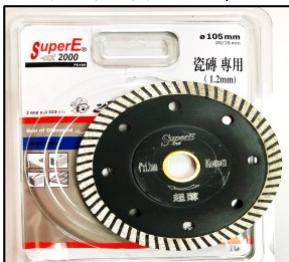  
中間鋼板加厚!!

#### 1.2mm超薄,麻石,雲石,瓷磚專用!

<table><tr><td>產品名稱:</td><td>4&quot;加強超薄瓷磚碟SuperE2000</td></tr><tr><td>編號:</td><td>DW4T-E2000</td></tr><tr><td>規格:</td><td>4&quot;(105×1.2×8×20(16)內孔)mm</td></tr><tr><td>切割材料:</td><td>可干礦中硬度麻石,雲石,人造石, 瓷磚,高溫磚...等</td></tr><tr><td>包裝:</td><td>24片/紙盒</td></tr></table>

### 鑽石工具系列---麻石,雲石,瓷磚, 水泥, 人造石鎅碟

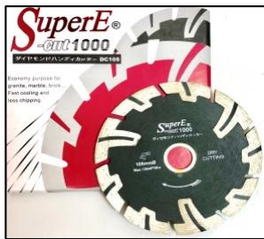

<table><tr><td>產品名稱:</td><td>4&quot;麻石錫碟(千片)--Super E1000</td></tr><tr><td>編號:</td><td>DW4D-E1000</td></tr><tr><td>規格:</td><td>4&quot;(105 x 1.8 x 8 x 20(16)內孔)mm</td></tr><tr><td>切割材料:</td><td>可干錫中硬度麻石,雲石,水泥行人路高溫磚...等</td></tr><tr><td>包裝:</td><td>24片/紙盒</td></tr></table>

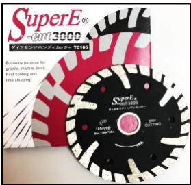

武士牌 (干片)  

<table><tr><td>產品名稱:</td><td>4&quot;麻石錫碟(干濕片)--Super E3000</td></tr><tr><td>編號:</td><td>DW4T-E3000</td></tr><tr><td>規格:</td><td>4&quot;(105 x 2.0 x 8 x 20(16)內孔)mm</td></tr><tr><td>切割材料:</td><td>可干錫中硬度麻石,雲石,水泥,行人路高溫磚...等</td></tr><tr><td>包裝:</td><td>24片/紙盒</td></tr></table>

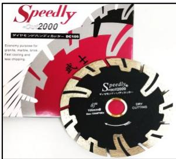

<table><tr><td>產品名稱:</td><td>4&quot;麻石錫碟(千片)Speedly2000武士牌</td></tr><tr><td>編號:</td><td>DW4D-SLY2000</td></tr><tr><td>規格:</td><td>4&quot;(105 x 2.0 x 8 x 20(16)內孔)mm</td></tr><tr><td>切割材料:</td><td>可干錫中硬度麻石,雲石,水泥,行人路高溫磚...等</td></tr><tr><td>包裝:</td><td>24片/紙盒</td></tr></table>

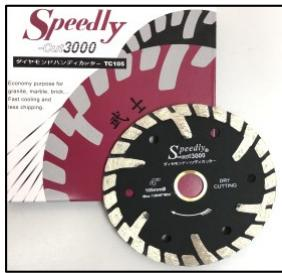

<table><tr><td>產品名稱:</td><td>4&quot;麻石錫碟(干濕片)Speedly3000武士牌</td></tr><tr><td>編號:</td><td>DW4T-SLY3000</td></tr><tr><td>規格:</td><td>4&quot;(105 x 2.0 x 8 x 20(16)內孔)mm</td></tr><tr><td>切割材料:</td><td>可干錫中硬度麻石,雲石,水泥,行人路高溫磚...等</td></tr><tr><td>包裝:</td><td>24片/紙盒</td></tr></table>

#### 武士牌--1.2mm超薄,麻石,雲石,瓷磚專用!

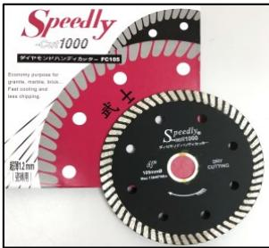

<table><tr><td>產品名稱:</td><td>4&quot;麻石錫碟(1.2超薄)Speedly1000武士牌</td></tr><tr><td>編號:</td><td>DW4T-SLY1000</td></tr><tr><td>規格:</td><td>4&quot;(105 x 1.2 x 8 x 20(16)內孔)mm</td></tr><tr><td>切割材料:</td><td>可干錫中硬度麻石,雲石, 瓷磚, ...等</td></tr><tr><td>包裝:</td><td>24片/紙盒</td></tr></table>

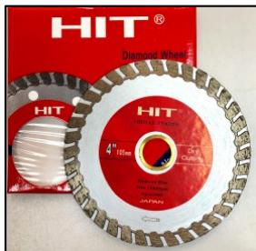

<table><tr><td>產品名稱:</td><td>4&quot;麻石錫碟(干濕片)--HIT</td></tr><tr><td>編號:</td><td>DW4T-HIT</td></tr><tr><td>規格:</td><td>4&quot;(105×2.0×10×20(16)內孔)mm</td></tr><tr><td>切割材料:</td><td>可干錫中硬度麻石,雲石,水泥,行人路高溫磚...等</td></tr><tr><td>包裝:</td><td>24片/紙盒</td></tr></table>

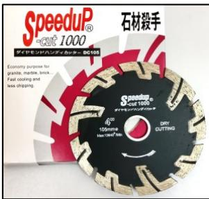

<table><tr><td>產品名稱:</td><td>4&quot;麻石錫碟(千片)Speedup1000</td></tr><tr><td>編號:</td><td>DW4D-U1000</td></tr><tr><td>規格:</td><td>4&quot;(105 x 1.9 x 8 x 20)(16)內孔)mm</td></tr><tr><td>切割材料:</td><td>可干錫低硬度麻石,雲石,水泥,行人路高溫磚...等</td></tr><tr><td>包裝:</td><td>24片/紙盒</td></tr></table>

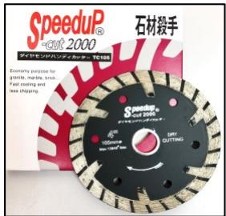

<table><tr><td>產品名稱:</td><td>4&quot;麻石錠碟(千濕片)Speedup2000</td></tr><tr><td>編號:</td><td>DW4T-U2000</td></tr><tr><td>規格:</td><td>4&quot;(105 x 1.9 x 9 x 20(16)內孔)mm</td></tr><tr><td>切割材料:</td><td>可干錠低硬度麻石,雲石,水泥,行人路高溫磚...等</td></tr><tr><td>包裝:</td><td>24片/紙盒</td></tr></table>

#### 瓷磚殺手--1.2mm超薄,麻石,雲石,瓷磚專用

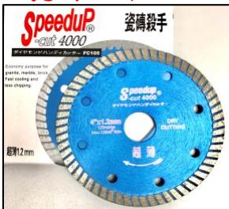

<table><tr><td>產品名稱:</td><td>4&quot;(1.2超薄瓷磚片)-Speedup-4000</td></tr><tr><td>編號:</td><td>DW4T-U4000</td></tr><tr><td>規格:</td><td>4&quot;(105 x 1.2 x 8 x 20(16)內孔)mm</td></tr><tr><td>切割材料:</td><td>可干錫中硬度麻石,雲石, 瓷磚,…等</td></tr><tr><td>包裝:</td><td>24片/紙盒</td></tr></table>

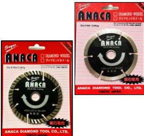

<table><tr><td>產品名稱:</td><td>4&quot;麻石錠碟(千片)--ANACA</td></tr><tr><td>編號:</td><td>DW4D-P</td></tr><tr><td>規格:</td><td>4&quot;(105×2.0×8×20(16)內孔)mm</td></tr><tr><td>切割材料:</td><td>可干錠中硬度麻石,雲石,水泥,行人路高溫磚...等</td></tr><tr><td>包裝:</td><td>24片/紙盒</td></tr></table>

<table><tr><td>產品名稱:</td><td>4&quot;麻石錠碟(干濕片)--ANACA</td></tr><tr><td>編號:</td><td>DW4T-P</td></tr><tr><td>規格:</td><td>4&quot;(105×2.0×8×20(16)內孔)mm</td></tr><tr><td>切割材料:</td><td>可干錠中硬度麻石,雲石,水泥,行人路高溫磚...等</td></tr><tr><td>包裝:</td><td>24片/紙盒</td></tr></table>

<table><tr><td colspan="2">110MM 小蜜蜂--13MM閣</td></tr><tr><td>產品名稱:</td><td>4&quot;麻石錫碟(闖齒干片)小蜜蜂110</td></tr><tr><td>編號:</td><td>DW4D-B110</td></tr><tr><td>規格:</td><td>4&quot;(110 x 1.8 x 13 x 20(16)內孔)mm</td></tr><tr><td>切割材料:</td><td>可千錙中硬度麻石,雲石,水泥,行人路高溫磚...等</td></tr><tr><td>包裝:</td><td>24片/紙盒</td></tr></table>

<table><tr><td>產品名稱:</td><td>4&quot;麻石錠碟(干濕片)--ANACA</td></tr><tr><td>編號:</td><td>DW4T-G</td></tr><tr><td>規格:</td><td>4&quot;(105 x 1.8 x 8 x 20(16)內孔)mm</td></tr><tr><td>切割材料:</td><td>可干錠低硬度麻石,雲石,水泥,行人路高溫磚...等</td></tr><tr><td>包裝:</td><td>24片/紙盒</td></tr></table>

<table><tr><td>產品名稱:</td><td>4&quot;麻石錫碟(千片)--ANACA</td></tr><tr><td>編號:</td><td>DW4D-G</td></tr><tr><td>規格:</td><td>4&quot;(105×2.0×8×20(16)內孔)mm</td></tr><tr><td>切割材料:</td><td>可干錫低硬度麻石,雲石,水泥,行人路高溫磚...等</td></tr><tr><td>包裝:</td><td>24片/紙盒</td></tr></table>

### 鑽石工具系列---麻石,雲石,瓷磚, 水泥, 人造石鎅碟

<table><tr><td>產品名稱:</td><td>4&quot;麻石錫碟(千片)--BEST</td></tr><tr><td>編號:</td><td>DW4D-H</td></tr><tr><td>規格:</td><td>4&quot;(105 x 2.0 x 8 x 20(16)內孔)mm</td></tr><tr><td>切割材料:</td><td>可干錠低硬度麻石,雲石,水泥,行人路高溫磚...等</td></tr><tr><td>包裝:</td><td>24片/紙盒</td></tr></table>

<table><tr><td>產品名稱:</td><td>4&quot;麻石錠碟(干濕片)--BEST</td></tr><tr><td>編號:</td><td>DW4T-H</td></tr><tr><td>規格:</td><td>4&quot;(105 x 2.0 x 8 x 20(16)內孔)mm</td></tr><tr><td>切割材料:</td><td>可干錠低硬度麻石,雲石,水泥,行人路高溫磚...等</td></tr><tr><td>包裝:</td><td>24片/紙盒</td></tr></table>

<table><tr><td colspan="2">突破--3號</td></tr><tr><td>產品名稱:</td><td>4&quot;麻石錫碟(千片)--突破3</td></tr><tr><td>編號:</td><td>DW4D-BS108</td></tr><tr><td>規格:</td><td>4&quot;(105 x 1.8 x 8 x 20(16)內孔)mm</td></tr><tr><td>切割材料:</td><td>可干錫低硬度麻石,雲石,水泥,行人路高溫磚...等</td></tr><tr><td>包裝:</td><td>10片/彩盒</td></tr></table>

<table><tr><td colspan="2">突破--6號</td></tr><tr><td>產品名稱:</td><td>4&quot;麻石錫碟(千片)--突破6</td></tr><tr><td>編號:</td><td>DW4D-BS105</td></tr><tr><td>規格:</td><td>4&quot;(105×1.8×8×20(16)內孔)mm</td></tr><tr><td>切割材料:</td><td>可干錫低硬度麻石,雲石,水泥,行人路高溫磚...等</td></tr><tr><td>包裝:</td><td>10片/彩盒</td></tr></table>

#### 博深牌--1.2mm超薄,麻石,雲石,瓷磚專用!

<table><tr><td>產品名稱:</td><td>4&quot;麻石錫碟(超薄濁輪片)</td></tr><tr><td>編號:</td><td>DW4T-BS1.2</td></tr><tr><td>規格:</td><td>4&quot;(105×1.2×8×20(16)內孔)mm</td></tr><tr><td>切割材料:</td><td>可干錫低硬度麻石,雲石,水泥,行人路高溫磚...等</td></tr><tr><td>包裝:</td><td>10片/彩盒</td></tr></table>

#### 110MM 鋒泰--3號(110MM)

<table><tr><td>產品名稱:</td><td>4&quot;麻石錫碟(闊千片)鋒泰3</td></tr><tr><td>編號:</td><td>DW4D-FT3</td></tr><tr><td>規格:</td><td>4&quot;(110×1.8×12×20(16)內孔)mm</td></tr><tr><td>切割材料:</td><td>可干錠中硬度麻石,雲石,水泥,行人路高溫磚...等</td></tr><tr><td>包裝:</td><td>10片/彩盒</td></tr></table>

<table><tr><td>產品名稱:</td><td>4&quot;麻石錫碟(千片)--鋒泰鋒利</td></tr><tr><td>編號:</td><td>DW4D-FTFL</td></tr><tr><td>規格:</td><td>4&quot;(105 x 1.8 x 8 x 20(16)內孔)mm</td></tr><tr><td>切割材料:</td><td>可干錫低硬度麻石,雲石,水泥,行人路高溫磚...等</td></tr><tr><td>包裝:</td><td>10片/彩盒</td></tr></table>

<table><tr><td>產品名稱:</td><td>4&quot;麻石錫碟(千片)--CUT</td></tr><tr><td>編號:</td><td>DW4D-L</td></tr><tr><td>規格:</td><td>4&quot;(105×2×8×20(16)內孔)mm</td></tr><tr><td>切割材料:</td><td>可干錳低硬度麻石,雲石,水泥,行人路高溫磚...等</td></tr><tr><td>包裝:</td><td>24片/紙盒</td></tr></table>

<table><tr><td>產品名稱:</td><td>4&quot;麻石錫碟(干凍片)--CUT</td></tr><tr><td>編號:</td><td>DW4T-L</td></tr><tr><td>規格:</td><td>4&quot;(105 x 2 x 8 x 20(16)內孔)mm</td></tr><tr><td>切割材料:</td><td>可干錫低硬度麻石,雲石,水泥,行人路高溫磚...等</td></tr><tr><td>包裝:</td><td>24片/紙盒</td></tr></table>

<table><tr><td colspan="2">水泥殺手(15MM闢刀頭)</td></tr><tr><td>產品名稱:</td><td>4&quot;麻石錫碟(超闢干片)--H15</td></tr><tr><td>編號:</td><td>DW4D-H15</td></tr><tr><td>規格:</td><td>4&quot;(110×2.0×15×20(16)內孔)mm</td></tr><tr><td>切割材料:</td><td>可干錠低硬度麻石,雲石,水泥,行人路高溫磚...等</td></tr><tr><td>包裝:</td><td>24片/紙盒</td></tr></table>

  
110MM

12MM闊刀頭  

<table><tr><td>產品名稱:</td><td>4&quot;麻石錫碟(闢干片)銀翼凱</td></tr><tr><td>編號:</td><td>DW4D-JKS</td></tr><tr><td>規格:</td><td>4&quot;(110×2.0×12×20(16)內孔)mm</td></tr><tr><td>切割材料:</td><td>可干錫中硬度麻石,雲石,水泥,行人路高溫磚...等</td></tr><tr><td>包裝:</td><td>24片/紙盒</td></tr></table>

  
114MM

13MM闊刀頭  
濕片(需加水切割)   

<table><tr><td>產品名稱:</td><td>4.5&quot;牆壁錫碟(闢干片)114MM</td></tr><tr><td>編號:</td><td>DW4.5D-W</td></tr><tr><td>規格:</td><td>4.5&quot;(114x2x13x20(16)內孔)mm</td></tr><tr><td>切割材料:</td><td>可干錫中硬度麻石,雲石,水泥,行人路高溫磚...等</td></tr><tr><td>包裝:</td><td>24片/紙盒</td></tr></table>

<table><tr><td>產品名稱:</td><td>4&quot;麻石錫碟(千片)--燕子</td></tr><tr><td>編號:</td><td>DW4D-S</td></tr><tr><td>規格:</td><td>4&quot;(105 x 2.0 x 7 x 20(16)內孔)mm</td></tr><tr><td>切割材料:</td><td>可干錠中硬度麻石,雲石,水泥,行人路高溫磚...等</td></tr><tr><td>包裝:</td><td>24片/紙盒</td></tr></table>

<table><tr><td>產品名稱:</td><td>4&quot;麻石錠碟(千片)--ANACA</td></tr><tr><td>編號:</td><td>DW4W-STAR</td></tr><tr><td>規格:</td><td>4&quot;(110x1.5x5x20(16)內孔)mm</td></tr><tr><td>切割材料:</td><td>可濕錠低硬度麻石,雲石,水泥,行人路高溫磚...等</td></tr><tr><td>包裝:</td><td>24片/紙盒</td></tr></table>

<table><tr><td>產品名稱:</td><td>4&quot;電鍍錫碟(波紋型)--SHARP</td></tr><tr><td>編號:</td><td>EDW4-T (專業型)</td></tr><tr><td>規格:</td><td>4&quot;(100 x 1.0 x 20 x 20(16)內孔)mm</td></tr><tr><td>切割材料:</td><td>可打磨/錳玻璃, 瓷磚, 雲石, 麻石…</td></tr><tr><td>包裝:</td><td>24片/紙盒</td></tr></table>

<table><tr><td>產品名稱:</td><td>4&quot;電鍍錫碟(消音型)--SHARP</td></tr><tr><td>編號:</td><td>EDW4-S (專業型)</td></tr><tr><td>規格:</td><td>4&quot;(100 x 1.0 x 20 x 20(16)內孔)mm</td></tr><tr><td>切割材料:</td><td>可打磨/錫玻璃, 瓷磚, 雲石, 麻石…</td></tr><tr><td>包裝:</td><td>24片/紙盒</td></tr></table>

<table><tr><td>產品名稱:</td><td>4&quot;電鍍錫碟(千錫型)--SHARP</td></tr><tr><td>編號:</td><td>EDW4-D (專業型)</td></tr><tr><td>規格:</td><td>4&quot;(100 x 1.3 x 3 x 20(16)內孔)mm</td></tr><tr><td>切割材料:</td><td>可錫玻璃, 瓷磚, 雲石, 麻石…</td></tr><tr><td>包裝:</td><td>24片/紙盒</td></tr></table>

專業型:耐用,鋒利,切割面比較光滑.電鍍產品使用時需加水冷卻.效果更好.

<table><tr><td>產品名稱:</td><td>4&quot;電鍍錫碟(波紋型)--BEST</td></tr><tr><td>編號:</td><td>REDW4-T (通用型)</td></tr><tr><td>規格:</td><td>4&quot;(100 x 1.0 x 18 x 20(16)內孔)mm</td></tr><tr><td>切割材料:</td><td>可打磨/錫玻璃, 瓷磚, 雲石, 麻石…</td></tr><tr><td>包裝:</td><td>24片/紙盒</td></tr></table>

<table><tr><td>產品名稱:</td><td>4&quot;電鍍錳碟(千介型)--BEST</td></tr><tr><td>編號:</td><td>REDW4-D (通用型)</td></tr><tr><td>規格:</td><td>4&quot;(100 x 1.2 x 3.5 x 20(16)內孔)mm</td></tr><tr><td>切割材料:</td><td>可錳玻璃, 瓷磚, 雲石, 麻石…</td></tr><tr><td>包裝:</td><td>24片/紙盒</td></tr></table>

(碗型磨碟)

<table><tr><td>產品名稱:</td><td>4&quot;電鍍錫碟(旋風型)--BEST</td></tr><tr><td>編號:</td><td>REDW4-S (通用型)</td></tr><tr><td>規格:</td><td>4&quot;(100 x 1.0 x 18 x 20(16)內孔)mm</td></tr><tr><td>切割材料:</td><td>可打磨/錫玻璃, 瓷磚, 雲石, 麻石…</td></tr><tr><td>包裝:</td><td>24片/紙盒</td></tr></table>

<table><tr><td>產品名稱:</td><td>4&quot;電鍍錫碟(碗磨型)--BEST</td></tr><tr><td>編號:</td><td>RECW4 (通用型)</td></tr><tr><td>規格:</td><td>4&quot;(100 x 1.2 x 20 x 20(16)內孔)mm</td></tr><tr><td>切割材料:</td><td>可打磨玻璃, 瓷磚, 雲石, 麻石…</td></tr><tr><td>包裝:</td><td>24片/紙盒</td></tr></table>

### 釬焊:雲石,瓷磚,玻璃,鎅碟/磨碟

4 (碗型磨碟)

<table><tr><td>產品名稱:</td><td>4&quot;鈺焊錫碟(千錳型)--BEST</td></tr><tr><td>編號:</td><td>BEDW4-D (通用型)</td></tr><tr><td>規格:</td><td>4&quot;(100 x 1.5 x 12 x 20(16)內孔)mm</td></tr><tr><td>切割材料:</td><td>可打磨/錫玻璃, 瓷磚, 雲石, 麻石…</td></tr><tr><td>包裝:</td><td>24片/紙盒</td></tr></table>

<table><tr><td>產品名稱:</td><td>4&quot;鈺焊磨碟(碗磨型)--BEST</td></tr><tr><td>編號:</td><td>BECW4 (通用型)</td></tr><tr><td>規格:</td><td>4&quot;(100 x 1.5 x 26 x 20(16)內孔)mm</td></tr><tr><td>切割材料:</td><td>可打磨玻璃, 瓷磚, 雲石, 麻石…</td></tr><tr><td>包裝:</td><td>24片/紙盒</td></tr></table>

### 鑽石工具系列---麻石,雲石,瓷磚, 水泥, 人造石鎅碟

5" (麻石忍者)   

<table><tr><td>產品名稱:</td><td>5&quot;麻石錫碟(千片)--SPEED--3000</td></tr><tr><td>編號:</td><td>DW5D-3000</td></tr><tr><td>規格:</td><td>5&quot;(125x2x8x25.4(22.23)內孔)mm</td></tr><tr><td>切割材料:</td><td>可干錫高硬度麻石,雲石,水泥,行人路高溫磚...等</td></tr><tr><td>包裝:</td><td>15片/紙盒</td></tr></table>

5" (武士牌)   

<table><tr><td>產品名稱:</td><td>5&quot;麻石錫碟(千片)--SUPER-E4000</td></tr><tr><td>編號:</td><td>DW5D-E4000</td></tr><tr><td>規格:</td><td>5&quot;(125x2x8x25.4(22.23)內孔)mm</td></tr><tr><td>切割材料:</td><td>可干錫中高硬度麻石,雲石,水泥,行人路高溫磚...等</td></tr><tr><td>包裝:</td><td>15片/紙盒</td></tr></table>

  
中間鋼板加厚!!  
5"(1.2MM超薄網狀波紋-武士牌)

<table><tr><td>產品名稱:</td><td>5&quot;瓷磚錫碟(1.2超薄)--SUPERE</td></tr><tr><td>編號:</td><td>DW5T-T</td></tr><tr><td>規格:</td><td>5&quot;(125x1.2x10x25.4(22.23)內孔mm</td></tr><tr><td>切割材料:</td><td>可干錫中高硬度麻石,雲石, 瓷磚...等</td></tr><tr><td>包裝:</td><td>15片/紙盒</td></tr></table>

  
5" (石材殺手)

<table><tr><td>產品名稱:</td><td>5&quot;麻石錫碟(千片)--SPEEDUP-5000</td></tr><tr><td>編號:</td><td>DW5D-U5000</td></tr><tr><td>規格:</td><td>5&quot;(125x2x8x25.4(22.23)內孔mm</td></tr><tr><td>切割材料:</td><td>可錫低硬度麻石,雲石,水泥...等</td></tr><tr><td>包裝:</td><td>15片/紙盒</td></tr></table>

5" ( BEST )   

<table><tr><td>產品名稱:</td><td>5&quot;麻石錫碟(千片)-BEST</td></tr><tr><td>編號:</td><td>DW5D-H</td></tr><tr><td>規格:</td><td>5&quot;(125x2x8x25.4(22.23)內孔mm</td></tr><tr><td>切割材料:</td><td>可干錫中硬度麻石,雲石,水泥...等</td></tr><tr><td>包裝:</td><td>15片/紙盒</td></tr></table>

  
5" ( BEST )

<table><tr><td>產品名稱:</td><td>5&quot;麻石錫碟(波紋片)-BEST</td></tr><tr><td>編號:</td><td>DW5T-H</td></tr><tr><td>規格:</td><td>5&quot;(125x2.2x8x25.4(22.23)內孔mm</td></tr><tr><td>切割材料:</td><td>可干錫中硬度麻石,雲石,水泥...等</td></tr><tr><td>包裝:</td><td>15片/紙盒</td></tr></table>

  
6" (麻石忍者)

<table><tr><td>產品名稱:</td><td>6&quot;麻石錠碟(千片)--SPEED--4000</td></tr><tr><td>編號:</td><td>DW6D-4000</td></tr><tr><td>規格:</td><td>6&quot;(150x2.2x11x25.4(22.23)內孔)mm</td></tr><tr><td>切割材料:</td><td>可干錠高硬度麻石,雲石,水泥,行人路高溫磚...等</td></tr><tr><td>包裝:</td><td>15片/紙盒</td></tr></table>

  
6" (武士牌)

<table><tr><td>產品名稱:</td><td>6&quot;麻石錫碟(千片)--SUPER-E5000</td></tr><tr><td>編號:</td><td>DW6D-E5000</td></tr><tr><td>規格:</td><td>6&quot;(150x2.2x11x25.4(22.23)內孔)mm</td></tr><tr><td>切割材料:</td><td>可干錫中高硬度麻石,雲石,水泥,行人路高溫磚...等</td></tr><tr><td>包裝:</td><td>15片/紙盒</td></tr></table>

  
中間鋼板加厚!!  
6"(1.4MM超薄網狀波紋-武士牌)

<table><tr><td>產品名稱:</td><td>6&quot;瓷磚錫碟(1.4超薄)--SUPERE</td></tr><tr><td>編號:</td><td>DW6T-T</td></tr><tr><td>規格:</td><td>6&quot;(150x1.4x10x25.4(22.23)內孔mm</td></tr><tr><td>切割材料:</td><td>可干錫中高硬度麻石,雲石, 瓷磚...等</td></tr><tr><td>包裝:</td><td>15片/紙盒</td></tr></table>

  
6" (石材殺手)

<table><tr><td>產品名稱:</td><td>6&quot;麻石錫碟(千片)--SPEEDUP-6000</td></tr><tr><td>編號:</td><td>DW6D-U6000</td></tr><tr><td>規格:</td><td>6&quot;(150x2.2x8x25.4(22.23)內孔)mm</td></tr><tr><td>切割材料:</td><td>可錫低硬度麻石,雲石,水泥...等</td></tr><tr><td>包裝:</td><td>15片/紙盒</td></tr></table>

  
6 ( BEST )

<table><tr><td>產品名稱:</td><td>6&quot;麻石錫碟(千片)-BEST</td></tr><tr><td>編號:</td><td>DW6D-H</td></tr><tr><td>規格:</td><td>6&quot;(150x2.2x11x25.4(22.23)內孔)mm</td></tr><tr><td>切割材料:</td><td>可干錫中硬度麻石,雲石,水泥...等</td></tr><tr><td>包裝:</td><td>15片/紙盒</td></tr></table>

  
6" ( BEST )

<table><tr><td>產品名稱:</td><td>6&quot;麻石錫碟(波紋片)-BEST</td></tr><tr><td>編號:</td><td>DW6T-H</td></tr><tr><td>規格:</td><td>6&quot;(150x2.2x11x25.4(22.23)內孔)mm</td></tr><tr><td>切割材料:</td><td>可干錫中硬度麻石,雲石,水泥...等</td></tr><tr><td>包裝:</td><td>15片/紙盒</td></tr></table>

### 鑽石工具系列---麻石,雲石,瓷磚, 水泥, 人造石鎅碟

7" (麻石忍者)   

<table><tr><td>產品名稱:</td><td>7&quot;麻石錠碟(千片)--SPEED-9000</td></tr><tr><td>編號:</td><td>DW7D-9000</td></tr><tr><td>規格:</td><td>7&quot;(180x2.4x10x25.4(22.23)內孔mm</td></tr><tr><td>切割材料:</td><td>可干錠高硬度麻石,雲石,水泥,行人路高溫磚...等</td></tr><tr><td>包裝:</td><td>15片/紙盒</td></tr></table>

7" (武士牌)   

<table><tr><td>產品名稱:</td><td>7&quot;麻石錠碟(千片)--SUPER-E7000</td></tr><tr><td>編號:</td><td>DW7D-E7000</td></tr><tr><td>規格:</td><td>7&quot;(180x2.4x10x25.4(22.23)內孔mm</td></tr><tr><td>切割材料:</td><td>可干錠中高硬度麻石,雲石,水泥,行人路高溫磚...等</td></tr><tr><td>包裝:</td><td>15片/紙盒</td></tr></table>

中間鋼板加厚!!

  
7" (石材殺手)

7"(1.6MM超薄網狀波紋-武士牌)  

<table><tr><td>產品名稱:</td><td>7&quot;瓷磚錠碟(1.6超薄)-SUPERERE</td></tr><tr><td>編號:</td><td>DW7T-T</td></tr><tr><td>規格:</td><td>7&quot;(176x1.6x10x25.4(22.23)內孔mm</td></tr><tr><td>切割材料:</td><td>可干錠中高硬度麻石,雲石,
瓷磚...等</td></tr><tr><td>包裝:</td><td>15片/紙盒</td></tr></table>

7" ( BEST )   

<table><tr><td>產品名稱:</td><td>7&quot;麻石錫碟(千片)--SPEEDUP-8000</td></tr><tr><td>編號:</td><td>DW7D-U8000</td></tr><tr><td>規格:</td><td>7&quot;(179x3x8x25.4(22.23)內孔mm</td></tr><tr><td>切割材料:</td><td>可錫中低硬度麻石,雲石,水泥...等</td></tr><tr><td>包裝:</td><td>15片/紙盒</td></tr></table>

<table><tr><td>產品名稱:</td><td>7&quot;麻石錫碟(千片)--BEST</td></tr><tr><td>編號:</td><td>DW7D-H</td></tr><tr><td>規格:</td><td>7&quot;(180x2.2x9x25.4(22.23)內孔mm</td></tr><tr><td>切割材料:</td><td>可干錫中硬度麻石,雲石,水泥...等</td></tr><tr><td>包裝:</td><td>15片/紙盒</td></tr></table>

7" ( BEST )   
8" (麻石忍者)   

<table><tr><td>產品名稱:</td><td>7&quot;麻石錫碟(波紋片)--BEST</td></tr><tr><td>編號:</td><td>DW7T-H</td></tr><tr><td>規格:</td><td>7&quot;(180x2.2x9x25.4(22.23)內孔mm</td></tr><tr><td>切割材料:</td><td>可干錫中硬度麻石,雲石,水泥...等</td></tr><tr><td>包裝:</td><td>15片/紙盒</td></tr></table>

<table><tr><td>產品名稱:</td><td>8&quot;麻石錫碟(千片)--SPEED-8000</td></tr><tr><td>編號:</td><td>DW8D-8000</td></tr><tr><td>規格:</td><td>8&quot;(198x2.3x8x25.4(22.23)內孔mm</td></tr><tr><td>切割材料:</td><td>可干錫高硬度麻石,雲石,水泥,行人路高溫磚...等</td></tr><tr><td>包裝:</td><td>10片/紙盒</td></tr></table>

#### 切割硬材料時請加水冷卻. 效果更好!!

9" (麻石忍者)   

<table><tr><td>產品名稱:</td><td>9&quot;麻石錠碟(千片)-SPEED-5000</td></tr><tr><td>編號:</td><td>DW9D-5000</td></tr><tr><td>規格:</td><td>9&quot;(230x2.5x8x25.4(22.23)內孔mm</td></tr><tr><td>切割材料:</td><td>可干錠高硬度麻石,雲石,水泥,行人路高溫磚...等</td></tr><tr><td>包裝:</td><td>10片/紙盒</td></tr></table>

9" (武士牌)   
9" (瓷磚片) (麻石忍者)   

<table><tr><td>產品名稱:</td><td>9&quot;麻石錠碟(千片)--SUPER-E9000</td></tr><tr><td>編號:</td><td>DW9D-E9000</td></tr><tr><td>規格:</td><td>9&quot;(230x2.5x8x25.4(22.23)內孔mm</td></tr><tr><td>切割材料:</td><td>可干錠中高硬度麻石,雲石,水泥,行人路高溫磚...等</td></tr><tr><td>包裝:</td><td>10片/紙盒</td></tr></table>

<table><tr><td>產品名稱:</td><td>9&quot;麻石錠碟(瓷磚片)-SPEED-CUT</td></tr><tr><td>編號:</td><td>DW9T</td></tr><tr><td>規格:</td><td>9&quot;(230x2.2x10x25.4(22.23)內孔mm</td></tr><tr><td>切割材料:</td><td>可干錠中硬度麻石,雲石,瓷磚...等</td></tr><tr><td>包裝:</td><td>10片/紙盒</td></tr></table>

9" (石材殺手牌)   

<table><tr><td>產品名稱:</td><td>9&quot;麻石錫碟(千片)--SPEEDUP-9000</td></tr><tr><td>編號:</td><td>DW9D-U9000</td></tr><tr><td>規格:</td><td>9&quot;(230x2.5x10x25.4(22.23)內孔mm</td></tr><tr><td>切割材料:</td><td>可錳低硬度麻石,雲石,水泥...等</td></tr><tr><td>包裝:</td><td>10片/紙盒</td></tr></table>

### 鑽石工具系列---麻石,雲石,瓷磚,水泥,混凝土/瀝青馬路鎅碟

\(9 "\)

(DIAMANT牌)

<table><tr><td>產品名稱:</td><td>9&quot;麻石錫碟(千片)--DIAMANT</td></tr><tr><td>編號:</td><td>DW9D-DM</td></tr><tr><td>規格:</td><td>9&quot;(230x2.5x9x25.4(22.23)內孔mm</td></tr><tr><td>切割材料:</td><td>可錫中低硬度麻石,雲石,水泥...等</td></tr><tr><td>包裝:</td><td>10片/紙盒</td></tr></table>

\(9 "\)

(DIAMANT牌)

<table><tr><td>產品名稱:</td><td>9&quot;麻石錠碟(波紋片)DIAMANT</td></tr><tr><td>編號:</td><td>DW9T-DM</td></tr><tr><td>規格:</td><td>9&quot;(230x3x10x25.4(22.23)內孔mm</td></tr><tr><td>切割材料:</td><td>可錫中低硬度麻石,雲石,水泥...等</td></tr><tr><td>包裝:</td><td>10片/紙盒</td></tr></table>

\(10 "\)

(武士牌)

<table><tr><td>產品名稱:</td><td>10&quot;麻石錫碟(波紋片)SUPER-E10000</td></tr><tr><td>編號:</td><td>DW 10T-E10000</td></tr><tr><td>規格:</td><td>10&quot;(250x2.8x10x25.4(22.23)內孔mm</td></tr><tr><td>切割材料:</td><td>可干錳中高硬度麻石,雲石,水泥,行人路高溫磚...等</td></tr><tr><td>包裝:</td><td>10片/紙盒</td></tr></table>

\(10 "\)

(石材殺手牌)

<table><tr><td>產品名稱:</td><td>10&quot;麻石錫碟(千片)-SPEEDUP10000</td></tr><tr><td>編號:</td><td>DW10D-U10000</td></tr><tr><td>規格:</td><td>10&quot;(250x2.7x10x25.4(22.23)內孔mm</td></tr><tr><td>切割材料:</td><td>可錫中低硬度麻石,雲石,水泥...等</td></tr><tr><td>包裝:</td><td>10片/紙盒</td></tr></table>

\(1 0 "\)

(DIAMANT牌)

<table><tr><td>產品名稱:</td><td>10&quot;麻石錫碟(千片)--DIAMANT</td></tr><tr><td>編號:</td><td>DW 10D-DM</td></tr><tr><td>規格:</td><td>10&quot;(250x3x10x25.4(22.23)內孔mm</td></tr><tr><td>切割材料:</td><td>可錫中低硬度麻石,雲石,水泥...等</td></tr><tr><td>包裝:</td><td>10片/紙盒</td></tr></table>

\(10 "\)

(DIAMANT牌)

<table><tr><td>產品名稱:</td><td>10&quot;麻石錫碟(波紋片)DIAMANT</td></tr><tr><td>編號:</td><td>DW10T-DM</td></tr><tr><td>規格:</td><td>10&quot;(250x3.5x8x25.4(22.23)內孔mm</td></tr><tr><td>切割材料:</td><td>可錫中低硬度麻石,雲石,水泥...等</td></tr><tr><td>包裝:</td><td>10片/紙盒</td></tr></table>

  
(15MM闊刀頭)   
\(1 2 "\) (馬路鎅碟)(麻石忍者)

<table><tr><td>產品名稱:</td><td>12&quot;馬路錫碟-SPEED-CUT12000</td></tr><tr><td>編號:</td><td>DW12D-G (帶保護齒)</td></tr><tr><td>規格:</td><td>12&quot;(303x3.2x15x27(25.4)內孔mm</td></tr><tr><td>切割材料:</td><td>可錫高硬度帶鋼筋混凝土，
溼青馬路,水泥路…等</td></tr><tr><td>包裝:</td><td>10片/紙箱</td></tr></table>

1 \(2 "\)

(2.2MM瓷磚碟)(麻石忍者)

<table><tr><td>產品名稱:</td><td>12&quot;瓷磚錐碟--SPEED-CUT</td></tr><tr><td>編號:</td><td>DW12T (50MM中孔)</td></tr><tr><td>規格:</td><td>12&quot;(302x2.2x11x50(27)內孔mm</td></tr><tr><td>切割材料:</td><td>可干錠中硬度麻石,雲石, 瓷磚...等</td></tr><tr><td>包裝:</td><td>10片/紙箱</td></tr></table>

  
(干片)   
\(1 2 "\) (行人路磚鎅碟)(麻石忍者)

<table><tr><td>產品名稱:</td><td>12&quot;行人路磚鋼碟-SPEED-CUT7000</td></tr><tr><td>編號:</td><td>DW 12D-B</td></tr><tr><td>規格:</td><td>12&quot;(300x2.8x8x27(25.4)內孔mm</td></tr><tr><td>切割材料:</td><td>可錫行人路磚,混凝土,水泥路...等</td></tr><tr><td>包裝:</td><td>10片/紙箱</td></tr></table>

(干濕片)

  
(行人路磚鎅碟)(麻石忍者)

\(2 "\)

<table><tr><td>產品名稱:</td><td>12&quot;行人路磚鋼碟-SPEED-CUT7000</td></tr><tr><td>編號:</td><td>DW12T-B</td></tr><tr><td>規格:</td><td>12&quot;(300x2.8x11x27(25.4)內孔mm</td></tr><tr><td>切割材料:</td><td>可錫行人路磚,混凝土,水泥路…等</td></tr><tr><td>包裝:</td><td>10片/紙箱</td></tr></table>

\(1 2 "\)

(馬路鎅碟)

<table><tr><td>產品名稱:</td><td>12&quot;馬路錫碟-ANACA</td></tr><tr><td>編號:</td><td>DW12D-R (帶保護齒)</td></tr><tr><td>規格:</td><td>12&quot;(310x3x10x27(25.4)內孔mm</td></tr><tr><td>切割材料:</td><td>可錫中高硬度帶鋼筋混凝土，溼青馬路,水泥路...等</td></tr><tr><td>包裝:</td><td>10片/紙箱</td></tr></table>

\(1 2 "\)

(馬路鎅碟)

<table><tr><td>產品名稱:</td><td>12&quot;馬路錫碟--SuperE12000</td></tr><tr><td>編號:</td><td>DW12D-E12000</td></tr><tr><td>規格:</td><td>12&quot;(300x3x10x27(25.4)內孔mm</td></tr><tr><td>切割材料:</td><td>可錫中硬度混凝土，
溼青馬路,水泥路…等</td></tr><tr><td>包裝:</td><td>10片/紙箱</td></tr></table>

#### 水泥, 混凝土 / 瀝青馬路鎅碟

\(1 2 "\) (馬路鎅碟)

(13MM闊刀頭)   

<table><tr><td>產品名稱:</td><td>12&quot;馬路錫碟--CORP</td></tr><tr><td>編號:</td><td>DW12D-CO</td></tr><tr><td>規格:</td><td>12&quot;(300x3.2x9x27(25.4)內孔mm</td></tr><tr><td>切割材料:</td><td>可錫中硬度混凝土，
溼青馬路,水泥路...等</td></tr><tr><td>包裝:</td><td>10片/紙箱</td></tr></table>

\(1 2 "\) (混凝土鎅碟)   

<table><tr><td>產品名稱:</td><td>12&quot;混凝土錫碟-SPEEDUP12</td></tr><tr><td>編號:</td><td>DW12D-U12</td></tr><tr><td>規格:</td><td>12&quot;(305x2.5x13x27(25.4)內孔mm</td></tr><tr><td>切割材料:</td><td>可錫中硬度混凝土，
瀝青馬路,水泥路…等</td></tr><tr><td>包裝:</td><td>10片/紙箱</td></tr></table>

  
(15MM闊刀頭)

\(1 4 "\) (馬路鎅碟)(麻石忍者)   
(干片)   

<table><tr><td>產品名稱:</td><td>14&quot;馬路錫碟--SPEED-CUT14000</td></tr><tr><td>編號:</td><td>DW14D-G (帶保護齒)</td></tr><tr><td>規格:</td><td>14&quot;(355x3.2x15x27(25.4)內孔mm</td></tr><tr><td>切割材料:</td><td>可錫高硬度帶鋼筋混凝土，
溼青馬路,水泥路...等</td></tr><tr><td>包裝:</td><td>10片/紙箱</td></tr></table>

\(1 4 "\) (行人路磚鎅碟)(麻石忍者)   

<table><tr><td>產品名稱:</td><td>14&quot;行人路磚磚碟-SPEED-CUT8000</td></tr><tr><td>編號:</td><td>DW14D-B</td></tr><tr><td>規格:</td><td>14&quot;(350x2.8x8x27(25.4)內孔mm</td></tr><tr><td>切割材料:</td><td>可錫行人路磚,混凝土,水泥路...等</td></tr><tr><td>包裝:</td><td>10片/紙箱</td></tr></table>

  
(干濕片)

\(1 4 "\) (行人路磚鎅碟)(麻石忍者)   

<table><tr><td>產品名稱:</td><td>14&quot;行人路磚鋼碟-SPEED-CUT8000</td></tr><tr><td>編號:</td><td>DW14T-B</td></tr><tr><td>規格:</td><td>14&quot;(350x2.8x11x27(25.4)內孔mm</td></tr><tr><td>切割材料:</td><td>可錫行人路磚,混凝土,水泥路...等</td></tr><tr><td>包裝:</td><td>10片/紙箱</td></tr></table>

\(1 4 "\) (馬路鎅碟)   

<table><tr><td>產品名稱:</td><td>14&quot;馬路錫碟-ANACA</td></tr><tr><td>編號:</td><td>DW14D-R (帶保護齒)</td></tr><tr><td>規格:</td><td>14&quot;(360x3.2x10x27(25.4)內孔mm</td></tr><tr><td>切割材料:</td><td>可錫中高硬度帶鋼筋混凝土， 滤青馬路,水泥路...等</td></tr><tr><td>包裝:</td><td>10片/紙箱</td></tr></table>

\(1 4 "\) (馬路鎅碟)   
(15MM闊刀頭)   

<table><tr><td>產品名稱:</td><td>14&quot;馬路錫碟--CORP</td></tr><tr><td>編號:</td><td>DW14D-CO</td></tr><tr><td>規格:</td><td>14&quot;(350x3.2x9x27(25.4)內孔mm</td></tr><tr><td>切割材料:</td><td>可錫中硬度混凝土，
溼青馬路,水泥路...等</td></tr><tr><td>包裝:</td><td>10片/紙箱</td></tr></table>

\(1 4 "\) (馬路鎅碟)   

<table><tr><td>產品名稱:</td><td>14&quot;馬路錫碟-SPEEDUP14</td></tr><tr><td>編號:</td><td>DW14D-U14</td></tr><tr><td>規格:</td><td>14&quot;(352x3.2x15x27(25.4)內孔mm</td></tr><tr><td>切割材料:</td><td>可錫中硬度混凝土，
溼青馬路,水泥路…等</td></tr><tr><td>包裝:</td><td>10片/紙箱</td></tr></table>

\(1 6 "\) (馬路鎅碟)   

<table><tr><td>產品名稱:</td><td>16&quot;馬路錫碟--ANACA</td></tr><tr><td>編號:</td><td>DW16D-R (帶保護齒)</td></tr><tr><td>規格:</td><td>16&quot;(410x3.2x10x27(25.4)內孔mm</td></tr><tr><td>切割材料:</td><td>可錫中高硬度帶鋼筋混凝土,瀝青馬路,水泥路...等</td></tr><tr><td>包裝:</td><td>1片/紙盒</td></tr></table>

\(1 8 "\) (馬路鎅碟)   
\(2 0 "\) (馬路鎅碟) (50MM孔)   

<table><tr><td>產品名稱:</td><td>18&quot;馬路錫碟--ANACA</td></tr><tr><td>編號:</td><td>DW18D-R (帶保護齒)</td></tr><tr><td>規格:</td><td>18&quot;(460x4x10x27(25.4)內孔mm</td></tr><tr><td>切割材料:</td><td>可錫中高硬度帶鋼筋混凝土，
溼青馬路,水泥路…等</td></tr><tr><td>包裝:</td><td>1片/紙盒</td></tr></table>

<table><tr><td>產品名稱:</td><td>20&quot;馬路錫碟--ANACA</td></tr><tr><td>編號:</td><td>DW20D-R (帶保護齒)</td></tr><tr><td>規格:</td><td>20&quot;(513x4x12x50(27)內孔mm</td></tr><tr><td>切割材料:</td><td>可錫中高硬度帶鋼筋混凝土,瀝青馬路,水泥路...等</td></tr><tr><td>包裝:</td><td>1片/紙盒</td></tr></table>

\(2 4 "\) (馬路鎅碟) (50MM孔)   

<table><tr><td>產品名稱:</td><td>24&quot;馬路錫碟-ANACA</td></tr><tr><td>編號:</td><td>DW24D-R (帶保護齒)</td></tr><tr><td>規格:</td><td>24&quot;(610x4.5x12x50(27)內孔mm</td></tr><tr><td>切割材料:</td><td>可錫中高硬度帶鋼筋混凝土，瀝青馬路,水泥路...等</td></tr><tr><td>包裝:</td><td>1片/紙盒</td></tr></table>

#### 水泥, 混凝土 / 瀝青馬路鎅碟

30" (馬路鎅碟) (60MM孔)   

<table><tr><td>產品名稱:</td><td>30&quot;馬路錫碟--ANACA</td></tr><tr><td>編號:</td><td>DW30D-C (帶保護齒)</td></tr><tr><td>規格:</td><td>30&quot;(763x4x12x60(50&amp;27)內孔mm</td></tr><tr><td>切割材料:</td><td>可錫中高硬度帶鋼筋混凝土， 滤青馬路,水泥路...等</td></tr><tr><td>包裝:</td><td>1片/紙盒</td></tr></table>

(目錄所有相關數據資料只供參考之用. 如有更改, 恕不另行通知!!)

#### (可訂造30"以上或特定規格之馬路或混凝土鎅碟) 歡迎來電查詢!

#### 鑽石工具系列---水泥,混凝土/瀝青馬路鎅坑碟(開槽片/粗坑碟)

(粗坑鎅碟) (6.5MM厚)  

<table><tr><td>產品名稱:</td><td>4&quot;粗坑錫碟--SuperE-cut</td></tr><tr><td>編號:</td><td>TP4S-6.5</td></tr><tr><td>規格:</td><td>4&quot;(105x6.5x10x22.2(20&amp;16)內孔mm</td></tr><tr><td>切割材料:</td><td>用於錳混凝土，
水泥...等坑槽</td></tr><tr><td>包裝:</td><td>10片/紙盒</td></tr></table>

(粗坑鎅碟) (10MM厚)   
\(5 " ( \sharp \sharp \pmb { \mathscr { x } } _ { 2 } \varkappa \varkappa \frac { \varkappa } { \varkappa } ) ( \ 6 . 5 \ M \ M / \sharp )\)   

<table><tr><td>產品名稱:</td><td>4&quot;粗坑錫碟--SuperE-cut</td></tr><tr><td>編號:</td><td>TP4S-10</td></tr><tr><td>規格:</td><td>4&quot;(105x10x8x20(16)內孔mm</td></tr><tr><td>切割材料:</td><td>用於錫混凝土，
水泥…等坑槽</td></tr><tr><td>包裝:</td><td>10片/紙盒</td></tr></table>

<table><tr><td>產品名稱:</td><td>5&quot;粗坑錫碟--SPEED-CUT</td></tr><tr><td>編號:</td><td>TP5S-6.5</td></tr><tr><td>規格:</td><td>5&quot;(125x6.5x10x25.4(22.23)內孔mm</td></tr><tr><td>切割材料:</td><td>用於錫混凝土，
水泥...等坑槽</td></tr><tr><td>包裝:</td><td>10片/紙盒</td></tr></table>

6" (粗坑鎅碟) (6.5MM厚)  
\(7 "\)   

<table><tr><td>產品名稱:</td><td>6&quot;粗坑錫碟--SPEED-CUT</td></tr><tr><td>編號:</td><td>TP6S-6.5</td></tr><tr><td>規格:</td><td>6&quot;(152x6.5x9x25.4(22.23)內孔mm</td></tr><tr><td>切割材料:</td><td>用於錳混凝土，
水泥...等坑槽</td></tr><tr><td>包裝:</td><td>10片/紙盒</td></tr></table>

V型齒   

<table><tr><td>產品名稱:</td><td>7&quot;粗坑錫碟-SPEED-CUT</td></tr><tr><td>編號:</td><td>TP7S-6.5</td></tr><tr><td>規格:</td><td>7&quot;(178x6.5x9x25.4(22.23)內孔mm</td></tr><tr><td>切割材料:</td><td>用於錫混凝土，
水泥…等坑槽</td></tr><tr><td>包裝:</td><td>1片/紙盒</td></tr></table>

\(7 " ( \div \boxed { q } \pm \frac { 1 } { 2 } \times \boxed { 5 } \times \frac { 1 1 } { 2 } ) ( 1 0 \times \boxed { 5 } )\)   
8" (粗坑鎅碟) (6.5MM厚)  

<table><tr><td>產品名稱:</td><td>7&quot;粗坑錫碟--SPEED-CUT</td></tr><tr><td>編號:</td><td>TP7S-10 (V型齒)</td></tr><tr><td>規格:</td><td>7&quot;(178x10x13x25.4(22.23)內孔mm</td></tr><tr><td>切割材料:</td><td>用於錳混凝土，
水泥...等坑槽</td></tr><tr><td>包裝:</td><td>1片/紙盒</td></tr></table>

<table><tr><td>產品名稱:</td><td>8&quot;粗坑錫碟-SPEED-CUT</td></tr><tr><td>編號:</td><td>TP8S-6.5</td></tr><tr><td>規格:</td><td>8&quot;(200x6.5x11x25.4(22.23)內孔mm</td></tr><tr><td>切割材料:</td><td>用於錫混凝土，
水泥…等坑槽</td></tr><tr><td>包裝:</td><td>1片/紙盒</td></tr></table>

#### 建議用較大馬力的鎅機!

12" (馬路粗坑鎅碟) (6MM / 8MM / 10MM厚)

建議用10匹以上的馬路鎅機  

<table><tr><td>產品名稱:</td><td>12&quot;-6MM粗坑錐碟--ANACA</td><td>規格:</td></tr><tr><td>編號:</td><td>DW 12D-R6</td><td>12&quot;(310x6x10x27(25.4)內孔mm</td></tr><tr><td>產品名稱:</td><td>12&quot;-8MM粗坑錐碟--ANACA</td><td></td></tr><tr><td>編號:</td><td>DW 12D-R8</td><td>12&quot;(310x8x10x27(25.4)內孔mm</td></tr><tr><td>產品名稱:</td><td>12&quot;-10MM粗坑錐碟--ANACA</td><td></td></tr><tr><td>編號:</td><td>DW 12D-R10</td><td>12&quot;(310x10x10x27(25.4)內孔mm</td></tr></table>

14" (馬路粗坑鎅碟) (6MM / 8MM / 10MM厚)   

<table><tr><td>切割材料:</td><td>用於切割混凝土馬路感應線坑或混凝土熱脹冷縮坑.</td></tr><tr><td>包裝:</td><td>1片/紙盒</td></tr></table>

建議用10匹以上的馬路鎅機  

<table><tr><td>產品名稱:</td><td>14&quot;-6MM粗坑錐碟--ANACA</td><td>規格:</td></tr><tr><td>編號:</td><td>DW14D-R6</td><td>14&quot;(360x6x10x27(25.4)內孔mm</td></tr><tr><td>產品名稱:</td><td>14&quot;-8MM粗坑錐碟--ANACA</td><td></td></tr><tr><td>編號:</td><td>DW14D-R8</td><td>14&quot;(360x8x10x27(25.4)內孔mm</td></tr><tr><td>產品名稱:</td><td>14&quot;-10MM粗坑錐碟--ANACA</td><td></td></tr><tr><td>編號:</td><td>DW14D-R10</td><td>14&quot;(360x10x10x27(25.4)內孔mm</td></tr></table>

<table><tr><td>切割材料:</td><td>用於切割混凝土馬路感應線坑或混凝土熱脹冷縮坑.</td></tr><tr><td>包裝:</td><td>1片/紙盒</td></tr></table>

### 鑽石工具系列---麻石, 水泥, 混凝土磨碟 (磨盤)

#### 100% 韓國製造 < 原裝韓國"EHWA 麻石殺手"最新配方產品 >

#### 麻石殺手(平面磨碟)

  
(螺紋:M10x1.5)

產品名稱: 4"平面磨碟1.5--麻石殺手

編號: EH-CW4F1.5

規格: 4"(100x6.5x22xM10X1.5內牙mm

打磨材料: 用於打磨麻石,雲石,

混凝土,水泥...等

包裝: 1片/紙盒

(螺紋:M10x1.25)

#### 4" 麻石殺手(平面磨碟)

<table><tr><td>產品名稱:</td><td>4&quot;平面磨碟1.25--麻石穀手</td></tr><tr><td>編號:</td><td>EH-CW4F1.25</td></tr><tr><td>規格:</td><td>4&quot;(100x6.5x22xM10X1.25內牙mm</td></tr><tr><td>打磨材料:</td><td>用於打磨麻石,雲石,混凝土,水泥...等</td></tr><tr><td>包裝:</td><td>1片/紙盒</td></tr></table>

#### 3-1/2" (波紋磨碟)

<table><tr><td>產品名稱:</td><td>3-1/2&quot;波紋磨碟--ANACA</td></tr><tr><td>編號:</td><td>CW3.5T-P</td></tr><tr><td>規格:</td><td>3-1/2&quot;(90x6x22x16內孔mm)</td></tr><tr><td>打磨材料:</td><td>用於打磨麻石,雲石,混凝土,水泥...等</td></tr><tr><td>包裝:</td><td>12片/紙盒</td></tr></table>

#### (輕型磨碟) 專業型

<table><tr><td>產品名稱:</td><td>4&quot;輕型磨碟--SPEED</td></tr><tr><td>編號:</td><td>CW4L-P</td></tr><tr><td>規格:</td><td>4&quot;(100x6x25x20(16)內孔mm</td></tr><tr><td>打磨材料:</td><td>用於打磨麻石,雲石,
混凝土,水泥…等</td></tr><tr><td>包裝:</td><td>12片/紙盒</td></tr></table>

#### (波紋磨碟) 專業型

<table><tr><td>產品名稱:</td><td>4&quot;波紋磨碟--ANACA</td></tr><tr><td>編號:</td><td>CW4T-P</td></tr><tr><td>規格:</td><td>4&quot;(100x6.5x20x20(16)內孔mm</td></tr><tr><td>打磨材料:</td><td>用於打磨麻石,雲石,
混凝土,水泥...等</td></tr><tr><td>包裝:</td><td>12片/紙盒</td></tr></table>

#### (波紋磨碟) 通用型

<table><tr><td>產品名稱:</td><td>4&quot;波紋磨碟--BEST</td></tr><tr><td>編號:</td><td>CW4T-G</td></tr><tr><td>規格:</td><td>4&quot;(100x5x20x20(16)內孔mm</td></tr><tr><td>打磨材料:</td><td>用於打磨麻石,雲石,混凝土,水泥...等</td></tr><tr><td>包裝:</td><td>12片/紙盒</td></tr></table>

#### 4" (波紋磨碟) 優惠型

<table><tr><td>產品名稱:</td><td>4&quot;波紋磨碟--SUPER</td></tr><tr><td>編號:</td><td>CW4T-S</td></tr><tr><td>規格:</td><td>4&quot;(100x6x20x20(16)內孔mm</td></tr><tr><td>打磨材料:</td><td>用於打磨麻石,雲石,
混凝土,水泥...等</td></tr><tr><td>包裝:</td><td>12片/紙盒</td></tr></table>

#### (波紋磨碟) 經濟型

<table><tr><td>產品名稱:</td><td>4&quot;波紋磨碟--鋒泰牌</td></tr><tr><td>編號:</td><td>CW4T-FT</td></tr><tr><td>規格:</td><td>4&quot;(100x3.3x10.5x20(16)內孔mm</td></tr><tr><td>打磨材料:</td><td>用於打磨麻石,雲石,混凝土,水泥...等</td></tr><tr><td>包裝:</td><td>12片/紙盒</td></tr></table>

#### 4" (斜齒磨碟) 通用型

<table><tr><td>產品名稱:</td><td>4&quot;斜齒磨碟--BEST</td></tr><tr><td>編號:</td><td>CW4TS-G</td></tr><tr><td>規格:</td><td>4&quot;(100x5x20x20(16)內孔mm</td></tr><tr><td>打磨材料:</td><td>用於打磨麻石,雲石,
混凝土,水泥...等</td></tr><tr><td>包裝:</td><td>12片/紙盒</td></tr></table>

#### (斜齒磨碟) 優惠型

<table><tr><td>產品名稱:</td><td>4&quot;斜齒磨碟--SUPER</td></tr><tr><td>編號:</td><td>CW4TS-S</td></tr><tr><td>規格:</td><td>4&quot;(100x5x20x20(16)內孔mm</td></tr><tr><td>打磨材料:</td><td>用於打磨麻石,雲石,
混凝土,水泥...等</td></tr><tr><td>包裝:</td><td>12片/紙盒</td></tr></table>

#### 4" (斜齒磨碟) 經濟型

<table><tr><td>產品名稱:</td><td>4&quot;斜齒磨碟--STONER</td></tr><tr><td>編號:</td><td>CW4TS-L</td></tr><tr><td>規格:</td><td>4&quot;(100x5x20x20(16)內孔mm</td></tr><tr><td>打磨材料:</td><td>用於打磨麻石,雲石,混凝土,水泥...等</td></tr><tr><td>包裝:</td><td>12片/紙盒</td></tr></table>

產品壽命 & 鋒利度排列:

專業型最佳,接下來是通用型,優惠型,經濟型.

### 水泥, 混凝土磨碟 (磨盤)

4"(加強單排磨碟) 優惠型  

<table><tr><td>產品名稱:</td><td>4&quot; 加強罩排磨碟-SUPER</td></tr><tr><td>編號:</td><td>CW4SI-S</td></tr><tr><td>規格:</td><td>4&quot;(105x6x20x20(16)內孔mm</td></tr><tr><td>打磨材料:</td><td>用於打磨麻石,雲石,
混凝土,水泥...等</td></tr><tr><td>包裝:</td><td>12片/紙盒</td></tr></table>

4"(單排磨碟) 通用型  

<table><tr><td>產品名稱:</td><td>4&quot;單排磨碟-BEST</td></tr><tr><td>編號:</td><td>CW4S-G</td></tr><tr><td>規格:</td><td>4&quot;(105x6x8x20(16)內孔mm</td></tr><tr><td>打磨材料:</td><td>用於打磨麻石,雲石,混凝土,水泥...等</td></tr><tr><td>包裝:</td><td>12片/紙盒</td></tr></table>

4"(單排磨碟) 優惠型  

<table><tr><td>產品名稱:</td><td>4&quot;單排磨碟-SKARP1000</td></tr><tr><td>編號:</td><td>CW4S-E</td></tr><tr><td>規格:</td><td>4&quot;(105x6x8x20(16)內孔mm</td></tr><tr><td>打磨材料:</td><td>用於打磨麻石,雲石,
混凝土,水泥...等</td></tr><tr><td>包裝:</td><td>12片/紙盒</td></tr></table>

4"(單排磨碟) 經濟型  
5" (輕型磨碟) 專業型  

<table><tr><td>產品名稱:</td><td>4&quot;單排磨碟-STONER</td></tr><tr><td>編號:</td><td>CW4S-L</td></tr><tr><td>規格:</td><td>4&quot;(100x5.5x8.5x20(16)內孔mm</td></tr><tr><td>打磨材料:</td><td>用於打磨麻石,雲石,混凝土,水泥...等</td></tr><tr><td>包裝:</td><td>12片/紙盒</td></tr></table>

<table><tr><td>產品名稱:</td><td>5&quot;輕型磨碟--SPEED</td></tr><tr><td>編號:</td><td>CW5L-P</td></tr><tr><td>規格:</td><td>5&quot;(125x5x30x25.4(22.23)內孔mm</td></tr><tr><td>打磨材料:</td><td>用於打磨麻石,雲石,混凝土,水泥...等</td></tr><tr><td>包裝:</td><td>1片/紙盒</td></tr></table>

5" (波紋磨碟) 優惠型  
6" (輕型磨碟) 專業型  

<table><tr><td>產品名稱:</td><td>5&quot;波紋磨碟--SUPER</td></tr><tr><td>編號:</td><td>CW5T-G</td></tr><tr><td>規格:</td><td>5&quot;(125x5x20x22.23內孔mm</td></tr><tr><td>打磨材料:</td><td>用於打磨麻石,雲石,混凝土,水泥...等</td></tr><tr><td>包裝:</td><td>1片/紙盒</td></tr></table>

<table><tr><td>產品名稱:</td><td>6&quot;輕型磨碟--SPEED</td></tr><tr><td>編號:</td><td>CW6L-P</td></tr><tr><td>規格:</td><td>6&quot;(150x5x27x25.4(22.23)內孔mm</td></tr><tr><td>打磨材料:</td><td>用於打磨麻石,雲石,混凝土,水泥...等</td></tr><tr><td>包裝:</td><td>1片/紙盒</td></tr></table>

6" (波紋磨碟) 優惠型  
7" (輕型磨碟) 專業型  

<table><tr><td>產品名稱:</td><td>6&quot;波紋磨碟--SUPER</td></tr><tr><td>編號:</td><td>CW6T-G</td></tr><tr><td>規格:</td><td>6&quot;(150x5x20x22.23內孔mm</td></tr><tr><td>打磨材料:</td><td>用於打磨麻石,雲石,混凝土,水泥...等</td></tr><tr><td>包裝:</td><td>1片/紙盒</td></tr></table>

<table><tr><td>產品名稱:</td><td>7&quot;輕型磨碟--SPEED</td></tr><tr><td>編號:</td><td>CW7L-P</td></tr><tr><td>規格:</td><td>7&quot;(180x5x27x25.4(22.23)內孔mm</td></tr><tr><td>打磨材料:</td><td>用於打磨麻石,雲石,混凝土,水泥...等</td></tr><tr><td>包裝:</td><td>1片/紙盒</td></tr></table>

7" (波紋磨碟) 優惠型  
7" (波紋磨碟) 專業型  

<table><tr><td>產品名稱:</td><td>7&quot;波紋磨碟--SUPER</td></tr><tr><td>編號:</td><td>CW7T-G</td></tr><tr><td>規格:</td><td>7&quot;(180x5x22x22.23內孔mm</td></tr><tr><td>打磨材料:</td><td>用於打磨麻石,雲石,混凝土,水泥...等</td></tr><tr><td>包裝:</td><td>1片/紙盒</td></tr></table>

<table><tr><td>產品名稱:</td><td>7&quot;波紋磨碟--SPEED</td></tr><tr><td>編號:</td><td>CW7T-P</td></tr><tr><td>規格:</td><td>7&quot;(180x5x21x25.4(22.23)內孔mm</td></tr><tr><td>打磨材料:</td><td>用於打磨麻石,雲石,
混凝土,水泥...等</td></tr><tr><td>包裝:</td><td>1片/紙盒</td></tr></table>

7" (單排磨碟) 專業型  

<table><tr><td>產品名稱:</td><td>7&quot;單排磨碟--SPEED</td></tr><tr><td>編號:</td><td>CW7S-P</td></tr><tr><td>規格:</td><td>7&quot;(180x5x8x25.4(22.23)內孔mm</td></tr><tr><td>打磨材料:</td><td>用於打磨麻石,雲石,混凝土,水泥...等</td></tr><tr><td>包裝:</td><td>1片/紙盒</td></tr></table>

#### 可訂造7"以上或特定規格之磨碟, 歡迎來電查詢!

香港大型專業工程:eg.地鐵,樓宇,斜坡,水務署維修公司指定品牌!

  
Core Drill

  
螺紋:1-1/4"UNC(1"三方牙)

#### 100%韓國製造

麻石殺手"  

<table><tr><td>規格(囉咀外径&amp;內径)</td><td>編號</td><td>編號</td><td>編號</td></tr><tr><td>1&quot; (28mm&amp;20mm)</td><td>EH-CD25A-10</td><td>EH-CD25-B</td><td>EH-CD25-C</td></tr><tr><td>1-1/4&quot;(33mm&amp;24mm)</td><td>EH-CD32A-10</td><td>EH-CD32-B</td><td>EH-CD32-C</td></tr><tr><td>1-1/2&quot;(40mm&amp;31mm)</td><td>EH-CD38A-10</td><td>EH-CD38-B</td><td>EH-CD38-C</td></tr><tr><td>2&quot; (53mm&amp;44mm)</td><td>EH-CD51A-10</td><td>EH-CD51-B</td><td>EH-CD51-C</td></tr><tr><td>2-1/2&quot;(64mm&amp;55mm)</td><td>EH-CD62A-10</td><td>EH-CD62-B</td><td>EH-CD62-C</td></tr><tr><td>3&quot; (77mm&amp;68mm)</td><td>EH-CD75A-10</td><td>EH-CD75-B</td><td>EH-CD75-C</td></tr><tr><td>3-1/2&quot;(89mm&amp;80mm)</td><td>EH-CD88A-10</td><td>EH-CD88-B</td><td>EH-CD88-C</td></tr><tr><td>4&quot; (109mm&amp;100mm)</td><td>EH-CD108A-10</td><td>EH-CD108-B</td><td>EH-CD108-C</td></tr><tr><td>5&quot; (127mm&amp;118mm)</td><td>EH-CD126A-10</td><td>EH-CD126-B</td><td>EH-CD126-C</td></tr><tr><td>6&quot; (159mm&amp;150mm)</td><td>EH-CD158A-10</td><td>EH-CD158-B</td><td>EH-CD158-C</td></tr><tr><td>7&quot; (179mm&amp;170mm)</td><td>EH-CD178A-10</td><td>EH-CD178-B</td><td>EH-CD178-C</td></tr><tr><td>8&quot; (205mm&amp;193mm)</td><td>EH-CD203A-10</td><td>EH-CD203-B</td><td>EH-CD203-C</td></tr><tr><td>10&quot;(253mm&amp;241mm)</td><td>EH-CD252A-10</td><td>EH-CD252-B</td><td>EH-CD252-C</td></tr><tr><td>12&quot;(305mm&amp;292mm)</td><td>EH-CD303A-10</td><td>EH-CD303-B</td><td>EH-CD303-C</td></tr><tr><td>14&quot;(355mm&amp;340mm)</td><td>EH-CD353A-10</td><td>EH-CD353-B</td><td>EH-CD353-C</td></tr><tr><td>16&quot;(404mm&amp;391mm)</td><td>EH-CD404A-10</td><td>EH-CD404-B</td><td>EH-CD404-C</td></tr></table>

  
(適用於各種維修工程, 價錢優惠!)

  
螺紋:1-1/4"UNC(1"三方牙)

囉咀

中通(300MM長)

短中通(180MM長)

接帽(鑽孔機用)

"麻石忍者"   

<table><tr><td>規格(囉咀外径)</td><td>編號</td><td>編號</td><td>編號</td><td>編號</td></tr><tr><td>1&#x27;&#x27; (28mm)</td><td>CD25A</td><td>CD25B</td><td>CD25B7</td><td>CD25C</td></tr><tr><td>1-1/4&#x27;&#x27;(34mm)</td><td>CD32A</td><td>CD32B</td><td>CD32B7</td><td>CD32C</td></tr><tr><td>1-1/2&#x27;&#x27;(40mm)</td><td>CD38A</td><td>CD38B</td><td>CD38B7</td><td>CD38C</td></tr><tr><td>2&#x27;&#x27; (53mm)</td><td>CD51A</td><td>CD51B</td><td>CD51B7</td><td>CD51C</td></tr><tr><td>2-1/2&#x27;&#x27;(64mm)</td><td>CD62A</td><td>CD62B</td><td>CD62B7</td><td>CD62C</td></tr><tr><td>3&#x27;&#x27; (77mm)</td><td>CD75A</td><td>CD75B</td><td>CD75B7</td><td>CD75C</td></tr><tr><td>3-1/2&#x27;&#x27;(89mm)</td><td>CD88A</td><td>CD88B</td><td>CD88B7</td><td>CD88C</td></tr><tr><td>4&#x27;&#x27; (110mm)</td><td>CD108A</td><td>CD108B</td><td>CD108B7</td><td>CD108C</td></tr><tr><td>4-1/2&#x27;&#x27;(120mm)</td><td>CD120A</td><td>CD120B</td><td>---</td><td>CD120C</td></tr><tr><td>5&#x27;&#x27; (127mm)</td><td>CD126A</td><td>CD126B</td><td>CD126B7</td><td>CD126C</td></tr><tr><td>6&#x27;&#x27; (160mm)</td><td>CD158A</td><td>CD158B</td><td>CD158B7</td><td>CD158C</td></tr><tr><td>7&#x27;&#x27; (180mm)</td><td>CD178A</td><td>CD178B</td><td>CD178B7</td><td>CD178C</td></tr><tr><td>8&#x27;&#x27; (203mm)</td><td>CD203A</td><td>CD203B</td><td>---</td><td>CD203C</td></tr><tr><td>10&#x27;&#x27;(252mm)</td><td>CD252A</td><td>CD252B</td><td>---</td><td>CD252C</td></tr><tr><td>12&#x27;&#x27;(303mm)</td><td>CD303A</td><td>CD303B</td><td>---</td><td>CD303C</td></tr><tr><td>14&#x27;&#x27;(353mm)</td><td>CD353A</td><td>CD353B</td><td>---</td><td>CD353C</td></tr></table>

連接部份螺紋長度:1"&1-1/4"為20MM, 其他約30MM.

用途: 用於麻石,山坡,水泥,含鋼筋之混凝土牆壁,瀝青馬路等打孔.

(目錄所有相關數據資料只供參考之用. 如有更改, 恕不另行通知!!)

### 四坑/五坑油壓鑽用囉頭

#### (適用於各種小型維修工程)

  
(節省鑽孔機費用!)

<table><tr><td></td><td>麻石忍者
囉咀</td><td>油壓鑰用接帽
(總長:80MM)</td><td>油壓鑰用接帽
(總長:180MM)</td><td>油壓鑰用接帽
(總長:250MM)</td><td>油壓鑰用接帽
(總長:350MM)</td><td>鑰孔機用接帽
(總長:350MM)</td></tr><tr><td>規格(囉咀外徑)</td><td>編號</td><td>編號</td><td>編號</td><td>編號</td><td>編號</td><td>編號</td></tr><tr><td>1&quot; (28mm)</td><td>CD25A</td><td>CD25C5/8</td><td>CD25C5/8-6</td><td>CD25C5/8-10</td><td>CD25C5/8-14</td><td>CD25C-14</td></tr><tr><td>1-1/4&quot;(34mm)</td><td>CD32A</td><td>CD32C5/8</td><td>CD32C5/8-6</td><td>CD32C5/8-10</td><td>CD32C5/8-14</td><td>CD32C-14</td></tr><tr><td>1-1/2&quot;(40mm)</td><td>CD38A</td><td>CD38C5/8</td><td>CD38C5/8-6</td><td>CD38C5/8-10</td><td>CD38C5/8-14</td><td>CD38C-14</td></tr><tr><td>2&quot; (53mm)</td><td>CD51A</td><td>CD51C5/8</td><td>CD51C5/8-6</td><td>CD51C5/8-10</td><td>CD51C5/8-14</td><td>CD51C-14</td></tr><tr><td>2-1/2&quot;(64mm)</td><td>CD62A</td><td>CD62C5/8</td><td>CD62C5/8-6</td><td>CD62C5/8-10</td><td>CD62C5/8-14</td><td>CD62C-14</td></tr><tr><td>3&quot; (77mm)</td><td>CD75A</td><td>CD75C5/8</td><td>CD75C5/8-6</td><td>CD75C5/8-10</td><td>CD75C5/8-14</td><td>CD75C-14</td></tr><tr><td>3-1/2&quot;(89mm)</td><td>CD88A</td><td>CD88C5/8</td><td>CD88C5/8-6</td><td>CD88C5/8-10</td><td>CD88C5/8-14</td><td>CD88C-14</td></tr><tr><td>4&quot; (110mm)</td><td rowspan="2"></td><td rowspan="2"></td><td rowspan="2"></td><td rowspan="2"></td><td rowspan="2"></td><td>CD108C-14</td></tr><tr><td>5&quot; (127mm)</td><td>CD126C-14</td></tr><tr><td colspan="2">加囉咀後有效打孔長度:</td><td>75MM</td><td>170MM</td><td>250MM</td><td>350MM</td><td>350MM</td></tr></table>

  
囉咀   
油壓鑽用接帽   
四坑油壓鑽接杆

注意: 鑽孔時油壓鑽切勿用震波!

  
四坑運水頭

### 油壓鑽 鑽孔機用套裝囉頭

油壓鑽用套裝囉頭 (加運水頭/四坑接杆後在油壓鑽上使用)

<table><tr><td>編號:</td><td>產品名稱:</td></tr><tr><td>CD27-5/8</td><td>1&quot;油壓鑰用套装囉頭--14&quot;長</td></tr><tr><td>CD32-5/8</td><td>1-1/4&quot;油壓鑰用套装囉頭--14&quot;長</td></tr><tr><td>CD40-5/8</td><td>1-1/2&quot;油壓鑰用套装囉頭--14&quot;</td></tr><tr><td>CD51-5/8</td><td>2&quot;油壓鑰用套装囉頭--14&quot;長</td></tr><tr><td>CD63-5/8</td><td>2-1/2&quot;油壓鑰用套装囉頭--14&quot;長</td></tr><tr><td>CD76-5/8</td><td>3&quot;油壓鑰用套装囉頭--14&quot;長</td></tr><tr><td>CD89-5/8</td><td>3-1/2&quot;油壓鑰用套装囉頭--14&quot;長</td></tr><tr><td>打孔材料:</td><td>水泥,鋼筋混凝土···</td></tr><tr><td>螺紋:M16x1.5</td><td>有效打孔深度約350MM.</td></tr></table>

  
(囉咀&接帽不能分開)

  
(加水冷卻, 效果更好.)

鑽孔機用套裝囉頭  

<table><tr><td>編號:</td><td>產品名稱:</td></tr><tr><td>CD27-SET</td><td>1&quot;鑽孔機用套装囉頭--14&quot;長</td></tr><tr><td>CD32-SET</td><td>1-1/4&quot;鑽孔機用套装囉頭--14&quot;長</td></tr><tr><td>CD40-SET</td><td>1-1/2&quot;鑽孔機用套装囉頭--14&quot;</td></tr><tr><td>CD51-SET</td><td>2&quot;鑽孔機用套装囉頭--14&quot;長</td></tr><tr><td>CD63-SET</td><td>2-1/2&quot;鑽孔機用套装囉頭--14&quot;長</td></tr><tr><td>CD76-SET</td><td>3&quot;鑽孔機用套装囉頭--14&quot;長</td></tr><tr><td>CD89-SET</td><td>3-1/2&quot;鑽孔機用套装囉頭--14&quot;長</td></tr><tr><td>打孔材料:</td><td>水泥,鋼筋混凝土···</td></tr><tr><td>螺紋:1-1/4&quot;UNC</td><td>有效打孔深度約350MM.</td></tr></table>

  
(囉咀&接帽不能分開)  
(加水冷卻, 效果更好.)

