# 四坑/五坑油壓鑽用運水頭,各種鑽孔機轉接頭

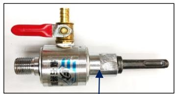

四坑運水頭(配在油壓鑽/電鑽上使用)  

<table><tr><td>產品名稱:</td><td>油壓鑰用囉頭運水頭--油壓鑰/電鑰用</td></tr><tr><td>編號:</td><td>WS</td></tr><tr><td>規格:</td><td>螺紋:M16X1.5 (1/2&quot; X20UNF)</td></tr></table>

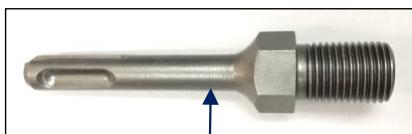

四坑油壓鑽接杆  

<table><tr><td>產品名稱:</td><td>四坑油壓鑰用接杆</td></tr><tr><td>編號:</td><td>SDSM16x1.5</td></tr><tr><td>規格:</td><td>螺紋:M16X1.5</td></tr></table>

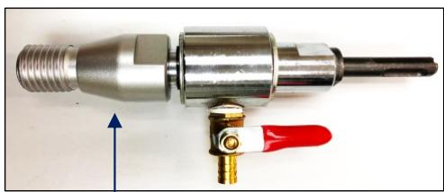

產品名稱: 運水頭牙轉為大陸尖牙.(運水頭--大陸尖牙)

編號: DS-W-C (四坑運水頭另計)

規格: 運水頭牙 轉為 大陸尖牙(配油壓鑽用)

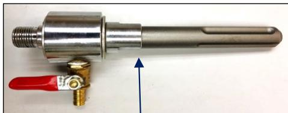

五坑運水頭(配在油壓鑽上使用)  

<table><tr><td>產品名稱:</td><td>油壓鑰用囉頭運水頭--油壓鑰/電鑰用</td></tr><tr><td>編號:</td><td>WSM</td></tr><tr><td>規格:</td><td>螺紋:M16X1.5 (1/2&quot; X20UNF)</td></tr></table>

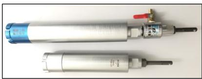

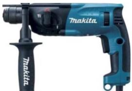

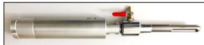

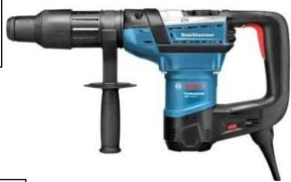

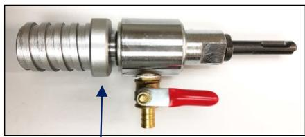

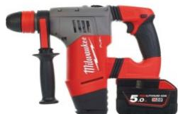

運水頭牙轉為日本方牙---(運水頭---日本方牙)

DS-W-J (四坑運水頭另計)

運水頭牙 轉為 日本1-1/4"(UNC)方牙(配油壓鑽用)

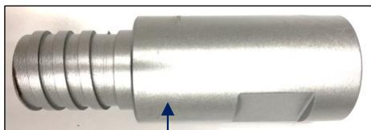

產品名稱: 鑽孔機轉接頭--(美國機尖牙轉為日本機方牙)

編號: DS-A-J

規格: 美國機1-1/4"(A-Rod)尖牙 轉為日本機1-1/4"(UNC)方牙

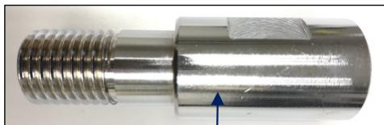

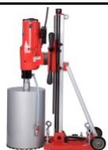

鑽孔機轉換接頭---(日本機方牙轉為美國機尖牙)

DS-J-A

日本機1-1/4"(UNC)方牙 轉為 美機1-1/4"(A-Rod)尖牙

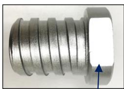

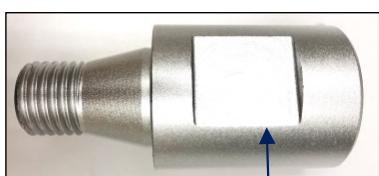

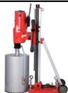

產品名稱: 鑽孔機轉換接頭---(大陸機尖牙轉為日本機方牙)

編號: DS-C-J

規格: 大陸機尖牙 轉為日本機1-1/4"(UNC)方牙

鑽孔機轉換接頭---(日本機方牙轉為大陸機尖牙)

DS-J-C

日本機1-1/4"(UNC)方牙轉為大陸機尖牙

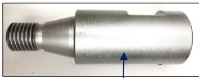

產品名稱: 鑽孔機轉換接頭---(美國機尖牙轉為大陸機尖牙)

編號: DS-A-C

規格: 美國機1-1/4"(A-Rod)尖牙 轉為大陸機尖牙

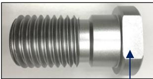

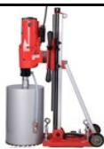

鑽孔機轉換接頭---(大陸機尖牙轉為美國機尖牙)

DS-C-A

大陸機尖牙轉為美國機1-1/4"(A-Rod)尖牙

## 鑽孔機加長杆 & 集水器, 麻石/雲石令梳

鑽孔機加長杆 (配在鑽孔機上使用)  

<table><tr><td>產品名稱:</td><td>鑽孔機加長杆8&quot;長</td></tr><tr><td>編號:</td><td>DS200</td></tr><tr><td>規格:</td><td>內&amp;外螺紋:1-1/4UNC(1&quot;三方牙)</td></tr><tr><td></td><td>全長245MM-外螺紋長45MM</td></tr></table>

<table><tr><td>產品名稱:</td><td>鑽孔機加長杆12&quot;長</td></tr><tr><td>編號:</td><td>DS300</td></tr><tr><td>規格:</td><td>內&amp;外螺紋:1-1/4UNC(1&quot;三方牙)</td></tr><tr><td></td><td>全長345MM-外螺紋長45MM</td></tr></table>

<table><tr><td>產品名稱:</td><td>鑽孔機加長杆16&quot;長</td></tr><tr><td>編號:</td><td>DS400</td></tr><tr><td>規格:</td><td>內&amp;外螺紋:1-1/4UNC(1&quot;三方牙)</td></tr><tr><td></td><td>全長445MM-外螺紋長45MM</td></tr></table>

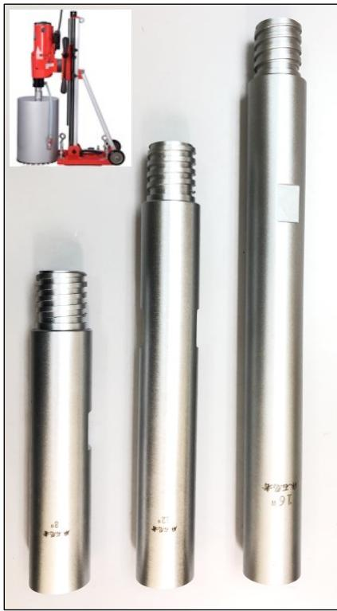

鑽孔機集水器 (配在鑽孔機上使用)  

<table><tr><td>產品名稱:</td><td>鑽孔機集水器</td></tr><tr><td>編號:</td><td>WH</td></tr><tr><td>規格:</td><td>4-1/2&quot;或以下鑽頭用</td></tr></table>

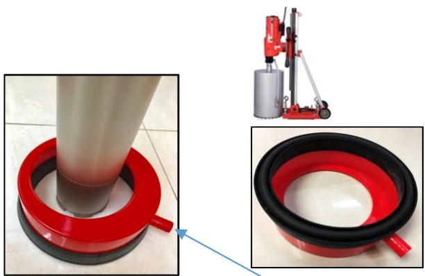  
接駁1/2"內徑去水喉管

麻石/雲石令梳 (配在3/8"電鑽/電批上使用)  

<table><tr><td>編號:</td><td>產品名稱:</td></tr><tr><td>HS20</td><td>20MM(3/4&quot;)--麻石/雲石令梳</td></tr><tr><td>HS25</td><td>25MM(1&quot;)--麻石/雲石令梳</td></tr><tr><td>HS32</td><td>32MM(1-1/4&quot;)--麻石/雲石令梳</td></tr><tr><td>HS35</td><td>35MM(1-3/8&quot;)--麻石/雲石令梳</td></tr><tr><td>HS38</td><td>38MM(1-1/2&quot;)--麻石/雲石令梳</td></tr><tr><td>HS45</td><td>45MM(1-3/4&quot;)--麻石/雲石令梳</td></tr><tr><td>HS50</td><td>50MM(2&quot;)--麻石/雲石令梳</td></tr><tr><td>HS60</td><td>60MM(2-3/8&quot;)--麻石/雲石令梳</td></tr><tr><td>打孔材料:</td><td>麻石,雲石,人造石,混凝土…</td></tr><tr><td></td><td>帶定位鑰咀,有效打孔深度約70MM.</td></tr></table>

### 專業型

#### 20MM---60MM

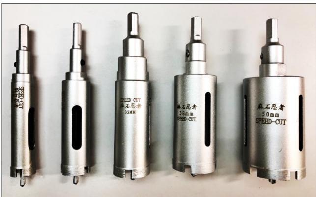  
防滑三角柄

### 六角柄(電批尾)電鍍玻璃令梳 : 專業型--BEST 鷹嘜

<table><tr><td>名稱:</td><td>六角柄(電批尾)玻璃令梳--BEST</td></tr><tr><td>編號:</td><td>HEHS</td></tr><tr><td>規格:</td><td>6MM, 6.5MM, 7MM, 8MM,10MM.
其他規格會陸續加入!!</td></tr><tr><td>打孔:</td><td>麻石, 雲石, 玻璃, 瓷磚,人造石...</td></tr><tr><td colspan="2">包裝:5/10支掛袋裝          (需加水打孔)</td></tr></table>

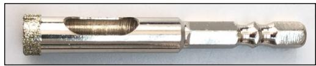

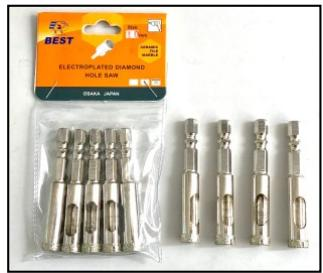

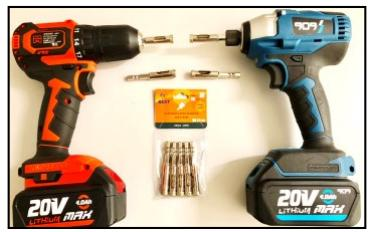  
(可適用於3/8"電鑽,電批,起子批)

電鍍玻璃令梳(圓柄/三角柄)(專業型)(鷹嘜) 3MM---200MM  

<table><tr><td>名稱:</td><td>電鍍玻璃令梳--專業型 &quot;BEST&quot;</td></tr><tr><td>編號:</td><td>EHS</td></tr><tr><td>規格:</td><td>3,4,5,6,6.5,7,8,10,12,13,14,15,16,
18,20,22,23,24,25,26,28,30,32,35,
38,40,42,45,48,50,53,55,60,65,70,
75,80,85,90,95,100,105,110,115,
120,125,130,140,150,160,180,200...</td></tr><tr><td>打孔:</td><td>麻石,雲石,玻璃,瓷磚,人造石...</td></tr><tr><td>包裝:</td><td>獨立掛袋包裝!!        (需加水打孔)</td></tr><tr><td></td><td>3/8&quot;(10MM)電鑰或電批上使用</td></tr></table>

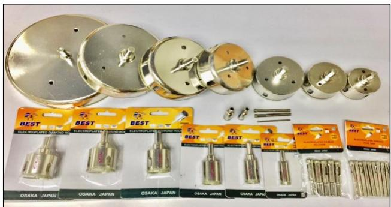

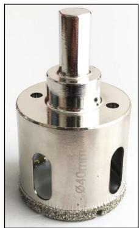

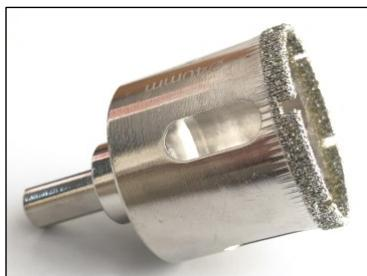  
圓柄/防滑三角柄  
有效打孔深度約:32MM

麻石/雲石拋光碟 (專業型)  

<table><tr><td>名稱:</td><td>麻石/雲石抛光碟--專業型&quot;SUPER&quot;</td></tr><tr><td>編號:</td><td>PP4S</td></tr><tr><td>規格:</td><td>4&quot;(100x3mm)</td></tr><tr><td rowspan="3">號數:</td><td>#50,#100,#150,#200,#300,#400,#500,</td></tr><tr><td>#800,#1000,#1500,#2000,#3000,</td></tr><tr><td>#10000(黑材料),#10000(白材料)</td></tr><tr><td>打磨:</td><td>麻石/雲石/人造石抛光（需加水打磨）</td></tr><tr><td>包裝:</td><td>10片/白紙盒</td></tr></table>

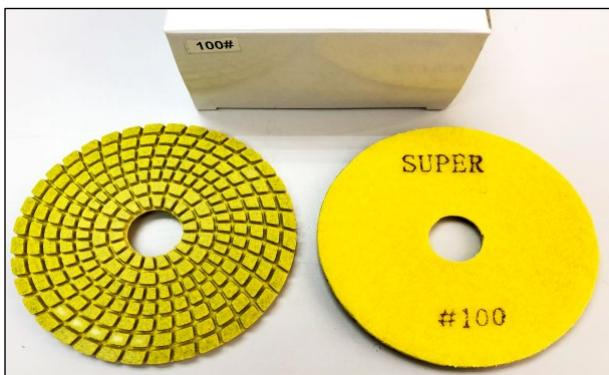  
注意!必須要加水拋光!!

## 電動工具系列---12V & 16.8V鋰電批

### 12V鋰電雙速電批--"SpeeD "

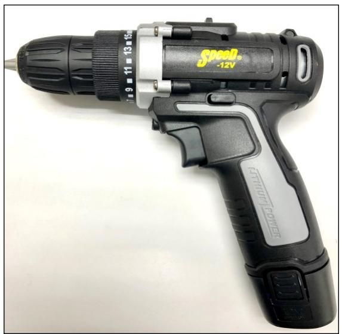

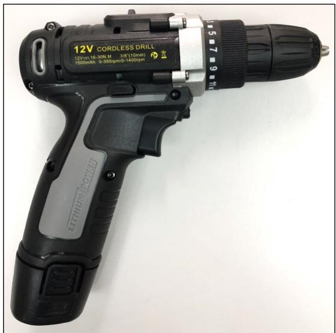

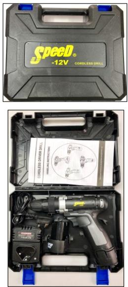

(配:鋰電池--2個, 充電器1個.)

<table><tr><td>名稱:</td><td>12V鋰電雙速電批(10MM)</td></tr><tr><td>編號:</td><td>LD12V-SET</td></tr><tr><td>配件:</td><td>2粒鋰電池, 1個充電器, 塑盒.</td></tr><tr><td>包裝:</td><td>12套/紙箱</td></tr></table>

#### 热賣產品！

鋰電池&充電器, 原廠保養1年.(不包括人為損壞)

### 16.8V鋰電雙速電批--"SpeeD"

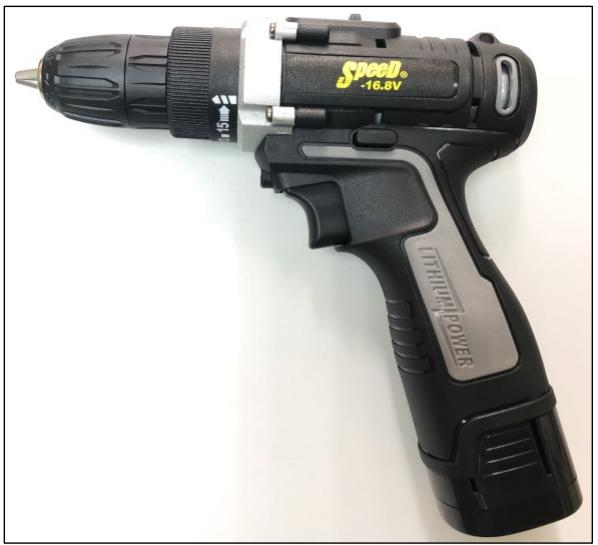

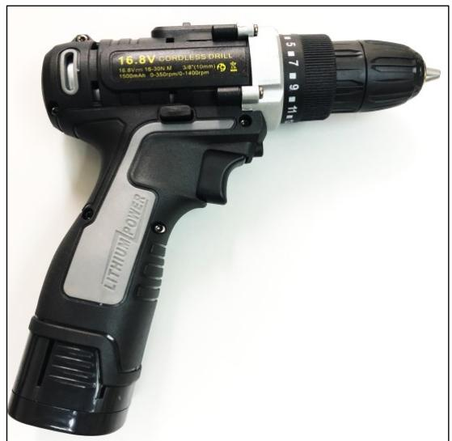

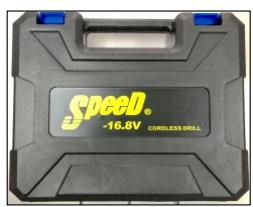

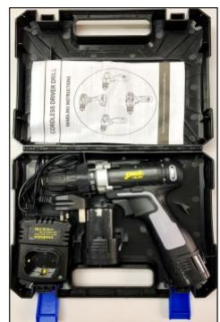

(配:鋰電池--2個, 充電器1個.)

<table><tr><td>名稱:</td><td>16.8V鋰電雙速電批(10MM)</td></tr><tr><td>編號:</td><td>LD16V-SET</td></tr><tr><td>配件:</td><td>2粒鋰電池, 1個充電器, 塑盒。</td></tr><tr><td>包裝:</td><td>12套/紙箱</td></tr></table>

#### 热賣產品

鋰電池&充電器, 原廠保養1年.(不包括人為損壞)

## 電動工具系列---20V鋰電產品

(以下產品可與18V得偉鋰電池系列產品通用!)

### 20V無碳刷鋰電雙速電批--"SpeeD "

<table><tr><td>名稱:</td><td>20V無碳刷鋰電雙速電批(13MM)</td></tr><tr><td>編號:</td><td>LD20V-SET</td></tr><tr><td>配件:</td><td>2粒4.0AH鋰電池, 1個快速充電器, 尼龍袋.</td></tr><tr><td>包裝:</td><td>5套/紙箱</td></tr></table>

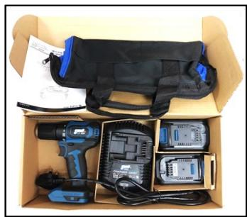

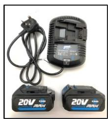

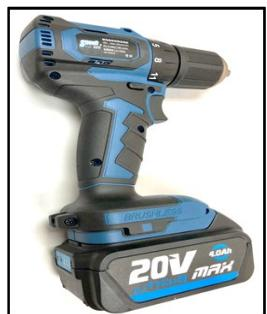

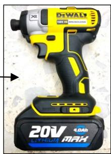

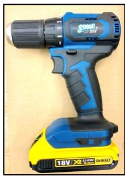

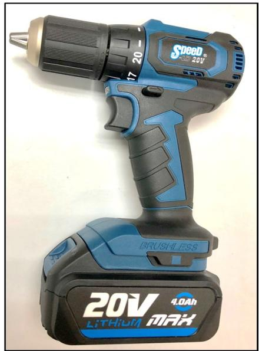

### 20V無碳刷鋰電衝擊起子批(衝擊批)--"SpeeD "

<table><tr><td>名稱:</td><td>20V無碳刷鋰電衝擊起子批(1/4&quot;)</td></tr><tr><td>編號:</td><td>LS20V-SET</td></tr><tr><td>配件:</td><td>2粒4.0AH鋰電池, 1個快速充電器, 尼龍袋.</td></tr><tr><td>包裝:</td><td>5套/紙箱</td></tr></table>

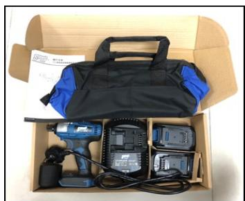

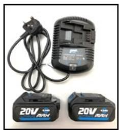

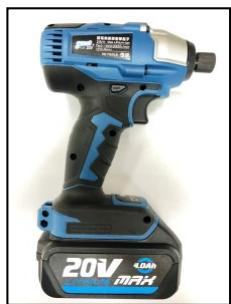

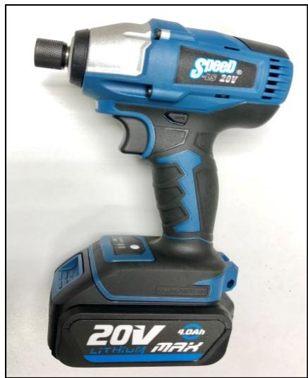

### 20V無碳刷鋰電衝擊扳手(卜批)--"SpeeD"

<table><tr><td>名稱:</td><td>20V無碳刷鋰電衝擊扳手(1/2&quot;)</td></tr><tr><td>編號:</td><td>LW20V-SET</td></tr><tr><td>配件:</td><td>2粒4.0AH鋰電池, 1個快速充電器, 尼龍袋.</td></tr><tr><td>包裝:</td><td>5套/紙箱</td></tr></table>

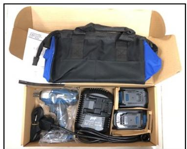

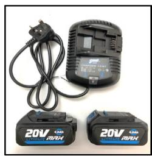

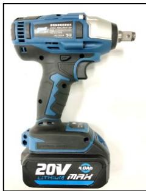

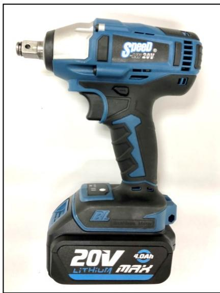

## 電動工具系列---21V鋰電產品

### (以下BOSS產品與"紅M"全線18V系列鋰電池通用)

### 21V無碳刷鋰電池起子批(衝擊批)--台灣"BOSS"

<table><tr><td>名稱:</td><td>21V無碳刷鋰電池起子批(1/4&quot;)(淨機)</td></tr><tr><td>編號:</td><td>LS21V (淨機,不包括鋰電池和充電器)</td></tr><tr><td>扭力:</td><td>約380N.m</td></tr><tr><td>包裝:</td><td>獨立彩盒包裝,每箱10部.</td></tr></table>

### 21V無碳刷鋰電池扳手(卜批)--台灣"BOSS"

<table><tr><td>名稱:</td><td>21V無碳刷鋰電池扳手(1/2&quot;)(淨機)</td></tr><tr><td>編號:</td><td>LW21V (淨機,不包括鋰電池和充電器)</td></tr><tr><td>扭力:</td><td>約280N.m</td></tr><tr><td>包裝:</td><td>獨立彩盒包裝,每箱10部.</td></tr></table>

### 21V無碳刷鋰電池 4"磨機--台灣"BOSS"

<table><tr><td>名稱:</td><td>21V無碳刷鋰電池4&quot;磨機(淨機)</td></tr><tr><td>編號:</td><td>LG21V (淨機,不包括鋰電池和充電器)</td></tr><tr><td>回轉數:</td><td>9,000R/Min (幼柄)</td></tr><tr><td>錫片直徑</td><td>4&quot;(105mm)</td></tr></table>

## 電動工具系列---21V鋰電產品

### 21V鋰電高壓水槍--"SpeeD "

<table><tr><td>名稱:</td><td>21V鋰電池高壓水槍</td></tr><tr><td>編號:</td><td>WG21V-SET</td></tr><tr><td>配件:</td><td>鋰電池, 充電器, 加長杆, 水喉各1, 塑箱裝.</td></tr><tr><td>用途:</td><td>清洗汽車, 電單車, 冷氣, 外墻, 天台花園…</td></tr><tr><td>包裝:</td><td>4套/紙箱</td></tr></table>

#### 可配"紅M"18V鋰電池使用

鋰電池&充電器, 原廠保養1年.

(不包括人為損壞)

(配件:鋰電池,充電器,加長杆,水喉,過濾頭各1個)

四種噴咀模式:0度,15度,25度,40度.

H檔: 22bar, L檔:6.5bar

  
(4套/紙箱)

用於:清洗汽車,電單車,冷氣,外墻,天台花園…

## 電動工具系列---鋰電代用產品

### 7.2V--21V代用紅M鋰電池充電器(快充)

<table><tr><td>名稱:</td><td>7.2V--21V紅M代用鋰電池充電器</td></tr><tr><td>編號:</td><td>CH18V-MKT</td></tr><tr><td>代用:</td><td>與紅M鋰電池通用(輸入:100V--260V-AC)</td></tr></table>

代用於所有紅M18V的鋰電池產品

### 優質紅M代用鋰電池

<table><tr><td>名稱:</td><td>紅M--18V代用鈰電池5.0Ah</td></tr><tr><td>編號:</td><td>LB18V-MKT</td></tr><tr><td>包裝:</td><td>10個/內箱</td></tr><tr><td>代用:</td><td>代用於所有紅M18V的鋰電產品&amp;充電器</td></tr></table>

代用於所有紅M18V的鋰電產品&充電器

  
18V--5.0Ah

  
(1年原廠保養)

### 18V鋰電池轉換器: 得偉----轉----牧田(紅M)

<table><tr><td>名稱:</td><td>18V鋰電池轉換器(得偉轉紅M)</td></tr><tr><td>編號:</td><td>18VDS-D-M</td></tr><tr><td>包裝:</td><td>10套/紙盒 （附帶USB充電功能）</td></tr><tr><td>轉換:</td><td>得偉鋰電池-----轉-----牧田(紅M)機用</td></tr></table>

  
(得偉代用電池)

  
(原裝得偉電池)

  
(附帶: USB 充電功能)  
(背面)

## 電動工具系列---鋰電代用產品

優質得偉18V代用鋰電池

<table><tr><td>名稱:</td><td>得偉18V代用鈯電池4.0Ah</td></tr><tr><td>編號:</td><td>LB18V-DW</td></tr><tr><td>包裝:</td><td>10個/內箱</td></tr><tr><td>代用:</td><td>代用於所有得偉18V的鈯電產品&amp;充電器</td></tr></table>

20V--4.0Ah

(1年原廠保養)

代用於所有得偉18V鋰電產品 & 充電器

### 得偉18V代用鋰電池充電器(快充)

<table><tr><td>名稱:</td><td>得偉18V代用鈰電池充電器</td></tr><tr><td>編號:</td><td>CH18V-DW</td></tr><tr><td>代用:</td><td>代用得偉18V鈰電池 (輸入:100V--240V-AC)</td></tr></table>

代用於所有得偉18V的鋰電池產品.

## 電動工具系列---磨機,石材切割機

### 4"(100MM)幼柄磨機--- "SpeeD" 750W

電壓: 220V

<table><tr><td>名稱:</td><td>4&quot;磨機(220V)(側開,幼柄)</td></tr><tr><td>編號:</td><td>GD220V-SET</td></tr><tr><td>回轉數:</td><td>0-12000R/Min</td></tr><tr><td>電壓:</td><td>220V-50HZ</td></tr><tr><td>包裝/功率:</td><td>12套/箱 750W</td></tr></table>

#### 電壓: 110V

<table><tr><td>名稱:</td><td>4&quot;磨機(110V)(側開,幼柄)</td></tr><tr><td>編號:</td><td>GD110V-SET</td></tr><tr><td>回轉數:</td><td>0-12000R/Min</td></tr><tr><td>電壓:</td><td>110V-50HZ</td></tr><tr><td>包裝/功率:</td><td>12套/箱 750W</td></tr></table>

  
側面開關

輕巧

  
幼柄

小蠻腰

### 4"(110MM)石材切割機--"SpeeD " 1200W

#### 電壓: 220V

<table><tr><td>名稱:</td><td>4&quot;石材切割機 (220V)</td></tr><tr><td>編號:</td><td>MC220V-SET</td></tr><tr><td>回轉數:</td><td>1100R/Min, 最大切割深度34MM,</td></tr><tr><td>電壓:</td><td>220V-50HZ</td></tr><tr><td>包裝/功率:</td><td>6套/紙箱 1200W</td></tr></table>

#### 電壓: 110V

<table><tr><td>名稱:</td><td>4&quot;石材切割機 (110V)</td></tr><tr><td>編號:</td><td>MC110V-SET</td></tr><tr><td>回轉數:</td><td>1100R/Min, 最大切割深度34MM,</td></tr><tr><td>電壓:</td><td>110V-50HZ</td></tr><tr><td>包裝/功率:</td><td>6套/紙箱 1200W</td></tr></table>

  
輕巧

## 電動工具系列---攪拌機 & 配件

220V電壓--攪拌機(攪油機) "SpeeD" 850W   

<table><tr><td>名稱:</td><td>攪拌機--220V電壓</td></tr><tr><td>編號:</td><td>BD220V-SET</td></tr><tr><td>功率/轉速:</td><td>850W, 550R/Min</td></tr><tr><td>配件:</td><td>6&quot;攪拌碟, 22&quot; 杆, 碳刷各1</td></tr><tr><td>包裝/電壓:</td><td>7套/箱, 220V-50HZ</td></tr></table>

110V電壓--攪拌機(攪油機) "SpeeD" 850W   

<table><tr><td>名稱:</td><td>攪拌機--110V電壓</td></tr><tr><td>編號:</td><td>BD110V-SET</td></tr><tr><td>功率/轉速:</td><td>850W, 550R/Min</td></tr><tr><td>配件:</td><td>6&quot;攪拌碟, 22&quot; 杆, 碳刷各1</td></tr><tr><td>包裝/電壓:</td><td>7套/箱, 110V-50HZ</td></tr></table>

攪拌機(攪油機)配件  

<table><tr><td>名稱:</td><td>6&quot;攪拌碟</td></tr><tr><td>編號:</td><td>BD6</td></tr><tr><td>包裝:</td><td>10個/箱</td></tr></table>

<table><tr><td>名稱:</td><td>22&quot;攪拌杆(杆粗:13MM)</td></tr><tr><td>編號:</td><td>BS22</td></tr><tr><td>包裝:</td><td>10支/箱        (M10&amp;M12)</td></tr></table>

## 電動工具系列---萬應寶震震機,石材切割機

### 萬應寶震震機

<table><tr><td>產品名稱:</td><td>萬應寶震震機</td></tr><tr><td>編號:</td><td>FN-MAC</td></tr><tr><td>電壓:</td><td>220V-50Hz,</td></tr><tr><td>配件:</td><td>六角匙, 錾片, 介木片, 三角魔術貼托
各1.三角魔術貼砂紙3張, 碳精1對</td></tr><tr><td>空載速度/功率:</td><td>15000-22000RPM 300W</td></tr><tr><td>包裝:</td><td>12套/箱</td></tr></table>

#### 萬應寶震震機配件:

萬應寶/Bosch/其他牌子機通用:木工/薄金屬/水泥鋸片/磨片

配件之詳細資料, 請參閱我司之:五金工具系列

### BOSUN博深:4"(110MM)石材切割機

<table><tr><td>產品編號: BS-6801</td></tr><tr><td>額定功率: 1240W</td></tr><tr><td>額定轉速: 
12,000R/MIN</td></tr><tr><td>錫介石礫最大直徑:112MM</td></tr><tr><td>最大切割厚度:34MM</td></tr><tr><td>淨重: 3.1KG</td></tr><tr><td>電壓: 220V-50Hz</td></tr><tr><td>獨立彩盒包裝, 6部/箱</td></tr></table>

  
(不包括鎅石碟)

## 電動工具系列---手提/台式鑽孔機

### BOSUN博深:4"--110B手提式鑽孔機(黃超人)

<table><tr><td>產品編號：BS-Z1Z-110B</td></tr><tr><td>額定功率：1,350W</td></tr><tr><td>額定轉速/電壓：1,050R/MIN，220V-50Hz</td></tr><tr><td>最大鑽孔直徑：（建議在75MM內）</td></tr><tr><td>機械離合器保護裝置，接頭：大陸牙</td></tr><tr><td>淨重：4.5KG</td></tr><tr><td>包裝：獨立塑膠盒包裝，4部/原紙箱</td></tr></table>

### BOSUN博深:7"--180T台式鑽孔機

<table><tr><td>產品編號：BS-Z1Z-180T</td></tr><tr><td>額定功率：2,800W</td></tr><tr><td>額定轉速/電壓：1,200R/MIN，220V-50Hz</td></tr><tr><td>最大鑲孔直徑：（建議在125MM內）</td></tr><tr><td>機械離合器保護裝置，接頭：日本牙。</td></tr><tr><td>淨重：12.5KG （單速）</td></tr><tr><td>包裝：1部/紙箱</td></tr></table>

機身輕巧,功率大

### BOSUN博深: 8"--200M台式鑽孔機 (單速)

<table><tr><td>產品編號：BS-Z1Z-200M</td></tr><tr><td>額定功率：3,000W</td></tr><tr><td>額定轉速/電壓：520R/MIN，220V-50Hz</td></tr><tr><td>最大鑽孔直徑：（建議在150MM內）</td></tr><tr><td>機械離合器保護裝置，接頭：日本牙。</td></tr><tr><td>淨重：24KG</td></tr><tr><td>包裝：1部/紙箱</td></tr></table>

  
(不包括鑽頭)

### BOSUN博深:10"--254台式鑽孔機 (單速)

<table><tr><td>產品編號：BS-Z1Z-254</td></tr><tr><td>額定功率：3,500W</td></tr><tr><td>額定轉速/電壓：350R/MIN，200V-50Hz</td></tr><tr><td>最大鑽孔直徑：（建議在200MM內）</td></tr><tr><td>機械離合器保護裝置，接頭：日本牙。</td></tr><tr><td>淨重：25.8KG</td></tr><tr><td>包裝：1部/紙箱</td></tr></table>

  
(不包括鑽頭)

## 五金工具系列---拮碟

### METAL KING--"金屬王"超薄拮碟

<table><tr><td>產品編號</td><td>產品名稱</td><td>產品規格</td></tr></table>

3"超薄拮碟 (76MM)厚度1MM-- 3"鋰電手提機專用!

<table><tr><td>COW3-MK</td><td>3&quot;雙網超薄拮礫1MM厚</td><td>76x1x10mm</td></tr><tr><td>適用於:</td><td colspan="2">切割各種鋼鐵材料.                    10MM內孔</td></tr><tr><td>包裝(膠筒/外箱):</td><td colspan="2">10片/收縮膜包裝．80片/盒．800片/箱．</td></tr></table>

4"超薄拮碟

1.2MM厚

<table><tr><td>COW4-MK</td><td>4&quot;雙網超薄拮礫1.2MM厚</td><td>107x1.2x16mm</td></tr><tr><td>適用於:</td><td colspan="2">切割各種鋼鐵材料:角鐵,工字鐵,鐵喉管,不銹鋼…</td></tr><tr><td>包裝(膠筒/外箱):</td><td colspan="2">10片/收縮膜包裝.50或100片/膠筒.800片/彩色箱.</td></tr></table>

5"超薄拮碟

1.2MM厚

<table><tr><td>COW5-MK</td><td>5&quot;雙網超薄拮碟1.2MM厚</td><td>125x1.2x22.23mm</td></tr><tr><td>適用於:</td><td colspan="2">切割各種鋼鐵材料:角鐵,工字鐵,鐵喉管,不銹鋼…</td></tr><tr><td>包裝(內盒/外箱):</td><td colspan="2">10片/收縮膜包裝.50片/彩盒.500片/彩色箱.</td></tr></table>

6"超薄拮碟

1.3MM厚

<table><tr><td>COW6-MK</td><td>6&quot;雙網超薄拮礫1.3MM厚</td><td>150x1.3x22.23mm</td></tr><tr><td>適用於:</td><td colspan="2">切割各種鋼鐵材料:角鐵,工字鐵,鋼筋,鐵喉管…</td></tr><tr><td>包裝(內盒/外箱):</td><td colspan="2">10片/收縮膜包裝.50片/彩盒.300片/彩色箱.</td></tr></table>

7"超薄拮碟

1.5MM厚

<table><tr><td>COW7-MK</td><td>7&quot;雙網超薄拮碟1.5MM厚</td><td>180x1.5x22.23mm</td></tr><tr><td>適用於:</td><td colspan="2">切割各種鋼鐵材料:角鐵,工字鐵,鋼筋,鐵喉管…</td></tr><tr><td>包裝(內盒/外箱):</td><td colspan="2">10片/收縮膜包裝.50片/彩盒.200片/彩色箱.</td></tr></table>

14"拮碟

3MM厚

<table><tr><td>COW14-MK</td><td>14&quot; 括碟--3.0MM厚</td><td>355x3.0x25.4mm</td></tr><tr><td>適用於:</td><td colspan="2">切割各種鋼鐵材料:角鐵,工字鐵,鋼筋,鐵喉管...</td></tr><tr><td>包裝(外箱):</td><td colspan="2">5片/收縮膜包裝. 30片/彩色箱.</td></tr></table>

### "鷹嘜"SPEED-CUT" 薄拮碟

<table><tr><td>產品編號</td><td>產品名稱</td><td>內盒//原箱</td></tr><tr><td>COW4</td><td>4&quot;超薄拮碟1.2厚</td><td>100片/膠筒.800/箱</td></tr><tr><td>COW5</td><td>5&quot;拮碟</td><td>50片/內盒.500/箱</td></tr><tr><td>COW6</td><td>6&quot;拮碟</td><td>25片/內盒.200/箱</td></tr><tr><td>適用於:</td><td colspan="2">切割各種鋼鐵材料;角鐵,工字鐵,鐵喉管,不銹鋼…</td></tr></table>

## 五金工具系列---萬用碟

### A級鷹嘜萬用碟--(專業型) 4"

<table><tr><td>名稱:</td><td>4&quot;A級鷹嘜萬用碟(40齒)--專業型</td></tr><tr><td>編號:</td><td>MC4-40T</td></tr><tr><td>規格:</td><td>4&quot; (100x1.5x20(內孔)mm)-40T</td></tr><tr><td>切割:</td><td>木板,纖維板,薄膠板,薄鋁合金板,銅喉管,薄鐵板</td></tr><tr><td>包裝:</td><td>20片/白盒, 200片/箱</td></tr></table>

<table><tr><td>名稱:</td><td>4&quot;A級鷹鴨萬用碟(20齒)--專業型</td></tr><tr><td>編號:</td><td>MC4-20T</td></tr><tr><td>規格:</td><td>4&quot; (100x1.5x20(內孔)mm)-20T</td></tr><tr><td>切割:</td><td>木板,纖維板,薄膠板,薄鋁合金板,銅喉管.薄鐵板</td></tr><tr><td>包裝:</td><td>20片/白盒, 200片/箱</td></tr></table>

### 萬用碟(經濟型) 4"

<table><tr><td>名稱:</td><td>4&quot;萬用碟(20齒)--經濟型</td></tr><tr><td>編號:</td><td>MC4-20L</td></tr><tr><td>規格:</td><td>4&quot; (100 x 1.5 x 20(內孔)mm)-20T</td></tr><tr><td>切割:</td><td>木板,纖維板,薄膠板,薄鋁合金板,膠喉管</td></tr><tr><td>包裝:</td><td>20片/白盒,200片/箱</td></tr></table>

### 萬用碟(通用型) 4"

<table><tr><td>名稱:</td><td>4&quot;萬用碟(40齒)--通用型</td></tr><tr><td>編號:</td><td>MC4-40E</td></tr><tr><td>規格:</td><td>4&quot; (100x1.5x20(內孔)mm)-40T</td></tr><tr><td>切割:</td><td>木板,纖維板,薄膠板,薄鋁合金板,膠/銅喉管</td></tr><tr><td>包裝:</td><td>20片/白盒, 200片/箱</td></tr></table>

<table><tr><td>名稱:</td><td>4&quot;萬用碟(20齒)---通用型</td></tr><tr><td>編號:</td><td>MC4-20E</td></tr><tr><td>規格:</td><td>4&quot; (100x1.5x20(內孔)mm)-20T</td></tr><tr><td>切割:</td><td>木板,纖維板,薄膠板,薄鋁合金板,膠/銅喉管</td></tr><tr><td>包裝:</td><td>20片/白盒, 200片/箱</td></tr></table>

### A級鷹嘜萬用碟--(專業型) 6"

<table><tr><td>名稱:</td><td>6&quot;A級鷹鴨萬用碟(52齒)--專業型</td></tr><tr><td>編號:</td><td>MC6-52T</td></tr><tr><td>規格:</td><td>6&quot; (150x1.7x25.4(內孔)mm)-52T</td></tr><tr><td>切割:</td><td>木板,纖維板,薄膠板,薄鋁合金板,銅喉管.薄鐵板</td></tr><tr><td>包裝:</td><td>10片/白盒,50片/箱</td></tr></table>

### A級鷹嘜萬用碟--(專業型) 7"

<table><tr><td>名稱:</td><td>7&quot;A級鷹鴨萬用碟(60齒)--專業型</td></tr><tr><td>編號:</td><td>MC7-60T</td></tr><tr><td>規格:</td><td>7&quot; (180x1.7x25.4(內孔)mm)-60T</td></tr><tr><td>切割:</td><td>木板,纖維板,薄膠板,薄鋁合金板,銅喉管,薄鐵板</td></tr><tr><td>包裝:</td><td>10片/白盒,50片/箱</td></tr></table>

#### (鋒利,耐用,切割面整齊) (可鎅薄鐵板)

#### (鋒利,耐用,切割面整齊) (可鎅薄鐵板)

## 五金工具系列---18V手提鋸專用碟

牧田,得偉,博世,日立…等,18V鋰電手提鋸專用鎅木碟&鎅薄金屬碟

鎅木碟   
5-3/8"(136MM)- 24T   

<table><tr><td>名稱:</td><td>5-3/8&quot; (136MM)錫木碟(24齒)</td></tr><tr><td>編號:</td><td>MC5.3W-24</td></tr><tr><td>規格:</td><td>5-3/8&quot; (136x1.5x20(內孔)-24T</td></tr><tr><td>包裝:</td><td>10片/盒, 50片/箱</td></tr></table>

鎅木碟   
6-1/2"(165MM)- 40T   

<table><tr><td>名稱:</td><td>6-1/2&quot; (165MM)錫木碟(40齒)</td></tr><tr><td>編號:</td><td>MC6.5W-40</td></tr><tr><td>規格:</td><td>6-1/2&quot; (165x1.6x20(內孔)-40T</td></tr><tr><td>包裝:</td><td>10片/盒, 50片/箱</td></tr></table>

  
專業型

鎅薄金屬碟   
5-3/8"(136MM)- 30T   

<table><tr><td>名稱:</td><td>5-3/8&quot; (136MM)錫薄金屬碟(30齒)</td></tr><tr><td>編號:</td><td>MC5.3M-30</td></tr><tr><td>規格:</td><td>5-3/8&quot; (136x1.4x20(內孔)-30T</td></tr><tr><td>包裝:</td><td>10片/盒, 50片/箱</td></tr></table>

鎅薄金屬碟   
6-1/2"(165MM)- 40T   

<table><tr><td>名稱:</td><td>6-1/2&quot; (165MM)錳薄金屬碟(40齒)</td></tr><tr><td>編號:</td><td>MC6.5M-40</td></tr><tr><td>規格:</td><td>6-1/2&quot; (165x1.4x20(內孔)-40T</td></tr><tr><td>包裝:</td><td>10片/盒, 50片/箱</td></tr></table>

  
專業型

雙面鎅木碟  
4"(110MM)- 40T   

<table><tr><td>名稱:</td><td>4&quot; (110MM)雙面錳木碟(40齒)</td></tr><tr><td>編號:</td><td>TS4W-D40T</td></tr><tr><td>規格:</td><td>4&quot; (110x1.8x20(內孔)-40T</td></tr><tr><td>包裝:</td><td>20片/盒, 200片/箱</td></tr></table>

4"雙面鎅木碟

## 五金工具系列---木鎅碟(吸嗦包裝)

### 木鎅碟

#### 4"- 30T

吸嗦包裝

<table><tr><td>名稱:</td><td>4&quot;木錫碟(30齒)-WOOD CUTTER</td></tr><tr><td>編號:</td><td>TS4WC-30T</td></tr><tr><td>規格:</td><td>4&quot; (110×20(內孔)16mm)-30T</td></tr><tr><td>切割:</td><td>木板,纖維板,薄膠板,膠喉管</td></tr><tr><td>包裝:</td><td>20片/白盒,200片/箱</td></tr></table>

### 木鎅碟

#### 4"- 40T

<table><tr><td>名稱:</td><td>4&quot;木錳碟(40齒)-WOOD CUTTER</td></tr><tr><td>編號:</td><td>TS4WC-40T</td></tr><tr><td>規格:</td><td>4&quot; (110×20(內孔)16mm)-40T</td></tr><tr><td>切割:</td><td>木板,纖維板,薄膠板,膠喉管</td></tr><tr><td>包裝:</td><td>20片/白盒,200片/箱</td></tr></table>

質量檢測:

### 木鎅碟

#### 7"- 40T

<table><tr><td>名稱:</td><td>7&quot;木錳碟(40齒)-WOOD CUTTER</td></tr><tr><td>編號:</td><td>TS7WC-40T</td></tr><tr><td>規格:</td><td>7&quot; (180 x 25.4(內孔)/20mm)-40T</td></tr><tr><td>切割:</td><td>木板,纖維板,薄膠板,膠喉管</td></tr><tr><td>包裝:</td><td>10片/白盒,50片/箱</td></tr></table>

### 木鎅碟

#### 7"- 60T

<table><tr><td>名稱:</td><td>7&quot;木錳碟(60齒)-WOOD CUTTER</td></tr><tr><td>編號:</td><td>TS7WC-60T</td></tr><tr><td>規格:</td><td>7&quot; (180 x 25.4(內孔)/20mm)-60T</td></tr><tr><td>切割:</td><td>木板,纖維板,薄膠板,膠喉管</td></tr><tr><td>包裝:</td><td>10片/白盒,50片/箱</td></tr></table>

吸嗦包裝

### 木鎅碟

#### 9"- 40T

<table><tr><td>名稱:</td><td>9&quot;木錳碟(40齒)-WOOD CUTTER</td></tr><tr><td>編號:</td><td>TS9WC-40T</td></tr><tr><td>規格:</td><td>9&quot; (230 x 25.4(內孔)/20mm)-40T</td></tr><tr><td>切割:</td><td>木板,纖維板,薄膠板,膠喉管</td></tr><tr><td>包裝:</td><td>10片/白盒,50片/箱</td></tr></table>

### 木鎅碟

#### 9"- 60T

<table><tr><td>名稱:</td><td>9&quot;木錳碟(60齒)-WOOD CUTTER</td></tr><tr><td>編號:</td><td>TS9WC-60T</td></tr><tr><td>規格:</td><td>9&quot; (230 x 25.4(內孔)/20mm)-60T</td></tr><tr><td>切割:</td><td>木板,纖維板,薄膠板,膠喉管</td></tr><tr><td>包裝:</td><td>10片/白盒,50片/箱</td></tr></table>

吸嗦包裝

## 五金工具系列---木/鋁合金鎅碟(彩盒包裝)

### 木鎅碟:

#### "OSAKA//大阪"

4"----14"

<table><tr><td>產品編號</td><td>產品名稱</td><td>規格</td></tr><tr><td>TS4W-30T</td><td>4&quot;錳木碟--30齒</td><td>4&quot;(110x2.2x30Tx20mm(16mm)</td></tr><tr><td>TS4W-40T</td><td>4&quot;錳木碟--40齒</td><td>4&quot;(110x2.2x30Tx20mm(16mm)</td></tr><tr><td>TS6W-40T</td><td>6&quot;錳木碟--40齒</td><td>6&quot;(150x2.2x40Tx25.4mm(22.2&amp;20mm)</td></tr><tr><td>TS6W-60T</td><td>6&quot;錳木碟--60齒</td><td>6&quot;(150x2.2x60Tx25.4mm(22.2&amp;20mm)</td></tr><tr><td>TS7W-40T</td><td>7&quot;錳木碟--40齒</td><td>7&quot;(180x2.2x40Tx20/25.4mm(22.2&amp;20mm)</td></tr><tr><td>TS7W-60T</td><td>7&quot;錳木碟--60齒</td><td>7&quot;(180x2.2x60Tx20/25.4mm(22.2&amp;20mm)</td></tr><tr><td>TS8W-40T</td><td>8&quot;錳木碟--40齒</td><td>8&quot;(200x2.2x40Tx25.4mm(22.2&amp;20mm)</td></tr><tr><td>TS8W-60T</td><td>8&quot;錳木碟--60齒</td><td>8&quot;(200x2.2x60Tx25.4mm(22.2&amp;20mm)</td></tr><tr><td>TS9W-40T</td><td>9&quot;錳木碟--40齒</td><td>9&quot;(230x3.0x40Tx25.4mm(22.2&amp;20mm)</td></tr><tr><td>TS9W-60T</td><td>9&quot;錳木碟--60齒</td><td>9&quot;(230x3.0x60Tx25.4mm(22.2&amp;20mm)</td></tr><tr><td>TS10W-40T</td><td>10&quot;錳木碟--40齒</td><td>10&quot;(250x3.0x40Tx25.4mm(22.2&amp;20mm)</td></tr><tr><td>TS10W-60T</td><td>10&quot;錳木碟--60齒</td><td>10&quot;(250x3.0x60Tx25.4mm(22.2&amp;20mm)</td></tr><tr><td>TS10W-80T</td><td>10&quot;錳木碟--80齒</td><td>10&quot;(250x3.0x80Tx25.4mm(22.2&amp;20mm)</td></tr><tr><td>TS12W-60T</td><td>12&quot;錳木碟--60齒</td><td>12&quot;(300x3.0x60Tx25.4mm(22.2&amp;20mm)</td></tr><tr><td>TS12W-80T</td><td>12&quot;錳木碟--80齒</td><td>12&quot;(300x3.0x80Tx25.4mm(22.2&amp;20mm)</td></tr><tr><td>TS14W-60T</td><td>14&quot;錳木碟--60齒</td><td>14&quot;(350x3.0x60Tx25.4mm(22.2&amp;20mm)</td></tr><tr><td>TS14W-80T</td><td>14&quot;錳木碟--80齒</td><td>14&quot;(350x3.0x80Tx25.4mm(22.2&amp;20mm)</td></tr></table>

8"--14"

鋁合金鎅碟:   
"OSAKA//大阪"  

<table><tr><td>產品編號</td><td>產品名稱</td><td>規格</td></tr><tr><td>TS8A-100T</td><td>8&quot;鋁合金錳碟--100齒</td><td>8&quot;(200x2.2x100Tx25.4mm(22.2&amp;20mm)</td></tr><tr><td>TS9A-100T</td><td>9&quot;鋁合金錳碟--100齒</td><td>9&quot;(230x3.0x100Tx25.4mm(22.2&amp;20mm)</td></tr><tr><td>TS10A-100T</td><td>10&quot;鋁合金錳碟--100齒</td><td>10&quot;(250x3.0x100Tx25.4mm(22.2&amp;20mm)</td></tr><tr><td>TS10A-120T</td><td>10&quot;鋁合金錳碟--120齒</td><td>10&quot;(250x3.0x120Tx25.4mm(22.2&amp;20mm)</td></tr><tr><td>TS12A-100T</td><td>12&quot;鋁合金錳碟--100齒</td><td>12&quot;(300x3.0x100Tx25.4mm(22.2&amp;20mm)</td></tr><tr><td>TS12A-120T</td><td>12&quot;鋁合金錳碟--120齒</td><td>12&quot;(300x3.0x120Tx25.4mm(22.2&amp;20mm)</td></tr><tr><td>TS14A-100T</td><td>14&quot;鋁合金錳碟--100齒</td><td>14&quot;(350x3.0x100Tx25.4mm(22.2&amp;20mm)</td></tr><tr><td>TS14A-120T</td><td>14&quot;鋁合金錳碟--120齒</td><td>14&quot;(350x3.0x120Tx25.4mm(22.2&amp;20mm)</td></tr></table>

## 五金工具系列---木/鋁合金鎅碟(彩盒包裝)

### 木鎅碟:

#### "SpeeD"

10"----14"

特價倉底貨!售完即止!

<table><tr><td>產品編號</td><td>產品名稱</td><td>規格</td></tr><tr><td>ATS10W-40T</td><td>10&quot;鎘木碟--40齒</td><td>10&quot;(250x3.2x40Tx25.4mm(22.2&amp;20mm)</td></tr><tr><td>ATS12W-80T</td><td>12&quot;鎘木碟--80齒</td><td>12&quot;(300x3.2x80Tx25.4mm(22.2&amp;20mm)</td></tr><tr><td>ATS14W-40T</td><td>14&quot;鎘木碟--40齒</td><td>14&quot;(350x3.2x40Tx25.4mm(22.2&amp;20mm)</td></tr><tr><td>ATS14W-60T</td><td>14&quot;鎘木碟--60齒</td><td>14&quot;(350x3.2x60Tx25.4mm(22.2&amp;20mm)</td></tr><tr><td>ATS14W-80T</td><td>14&quot;鎘木碟--80齒</td><td>14&quot;(350x3.2x80Tx25.4mm(22.2&amp;20mm)</td></tr></table>

### 鋁合金鎅碟:

#### "SpeeD"

9"--14"

特價倉底貨!售完即止!

<table><tr><td>產品編號</td><td>產品名稱</td><td>規格</td></tr><tr><td>ATS9A-100T</td><td>9&quot;鋁合金錫碟--100齒</td><td>9&quot;(230x3.2x100Tx25.4mm(22.2&amp;20mm)</td></tr><tr><td>ATS12A-100T</td><td>12&quot;鋁合金錫碟--100齒</td><td>12&quot;(300x3.2x100Tx25.4mm(22.2&amp;20mm)</td></tr><tr><td>ATS14A-100T</td><td>14&quot;鋁合金錫碟--100齒</td><td>14&quot;(350x3.2x100Tx25.4mm(22.2&amp;20mm)</td></tr></table>

## 五金工具系列---黑頭加硬炮尖

炮尖(細電炮用): (已加硬) (黑頭)

<table><tr><td>產品名稱:</td><td>長炮尖</td><td>扁炮鑿</td><td>短炮尖</td><td>18&quot;加長炮尖</td><td>18&quot;加長扁炮鑿</td></tr><tr><td>編號:</td><td>CS280</td><td>CS280F</td><td>CS210</td><td>CS450</td><td>CS450F</td></tr><tr><td>規格:</td><td>(17x280)mm</td><td>(17x280x25)mm</td><td>(17x200/210)mm</td><td>(17x450)mm</td><td>(17x450x25)mm</td></tr><tr><td>包裝:</td><td>原箱:60支</td><td>原箱:60支</td><td>原箱:100支</td><td>原箱:30支(膠筒裝)</td><td>原箱:30支(膠筒裝)</td></tr></table>

所有黑頭炮尖已過火加硬,

不需要再返打加工!!

<table><tr><td>產品名稱:</td><td>24&quot;加長炮尖</td><td>24&quot;加長扁炮擊</td><td>40&quot;加長炮尖</td></tr><tr><td>編號:</td><td>CS600</td><td>CS600F</td><td>CS1000</td></tr><tr><td>規格:</td><td>(17x600)mm</td><td>(17x600x25)mm</td><td>(17x1000)mm</td></tr><tr><td>包裝:</td><td>原箱:20支(膠筒裝)</td><td>原箱:20支(膠筒裝)</td><td>原箱:20支(膠筒裝)</td></tr></table>

  
超薄!刃口鋒利!

<table><tr><td>產品名稱:</td><td>3&quot;扁炮鑿</td><td>2&quot;超薄扁炮鑿</td><td>2&quot;超薄短扁炮鑿</td><td>1-1/2&quot;超薄短扁炮鑿</td><td>四坑2&quot;超薄扁短炮鑿</td></tr><tr><td>編號:</td><td>CS280F75</td><td>CS280F50</td><td>CS210F50</td><td>CS210F38</td><td>CS180-F40</td></tr><tr><td>規格:</td><td>(17x280x75)mm</td><td>(17x280x50)mm</td><td>(17x210x50)mm</td><td>(17x210x38)mm</td><td>(14x180x43)mm</td></tr><tr><td>包裝:</td><td>原箱:50支(掛袋裝)</td><td>原箱:60支(掛袋裝)</td><td>原箱:80支(掛袋裝)</td><td>原箱:80支(掛袋裝)</td><td>20支/扎(掛袋裝)</td></tr></table>

### 四坑炮尖(四坑油壓鑽用): (已加硬) (黑頭)

<table><tr><td>產品名稱:</td><td>四坑炮尖</td><td>四坑扁炮盤</td><td>四坑2&quot; 扁炮盤</td><td>四坑短炮尖</td><td>四坑短扁炮盤</td></tr><tr><td>編號:</td><td>CS250</td><td>CS250F</td><td>CS250-F40</td><td>CS165</td><td>CS165F</td></tr><tr><td>規格:</td><td>(14x250)mm</td><td>(14x250x20)mm</td><td>(14x250x40)mm</td><td>(10x160)mm</td><td>(10x160x15)mm</td></tr><tr><td>包裝:</td><td>20支/扎(膠筒裝)</td><td>20支/扎(膠筒裝)</td><td>20支/扎(掛袋裝)</td><td>50支/扎(掛袋裝)</td><td>50支/扎(掛袋裝)</td></tr></table>