# 五金工具系列---各種加硬炮尖,瓦仔鎅筆

## 大電炮尖(大電炮用): (已加硬) (黑頭)

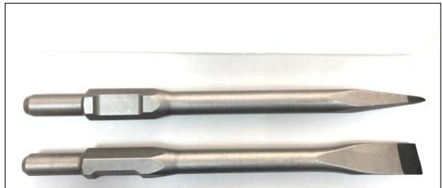

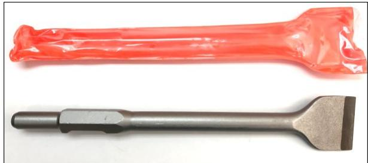

<table><tr><td>產品名稱:</td><td>大電炮尖</td><td>大電炮扁鑿</td><td>3&quot;大電炮扁鑿</td></tr><tr><td>編號:</td><td>CS410</td><td>CS410-F</td><td>CS410-F75</td></tr><tr><td>規格:</td><td>(30x390)mm</td><td>(30x390x35)mm</td><td>(30x410x75)mm</td></tr><tr><td>包裝:</td><td>原箱:20支(膠筒裝)</td><td>原箱:20支(膠筒裝)</td><td>原箱:15支(掛袋裝)</td></tr></table>

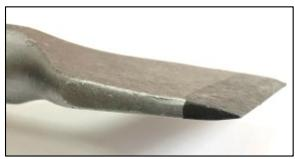  
刃口鋒利!

## 大電炮尖(大電炮用):

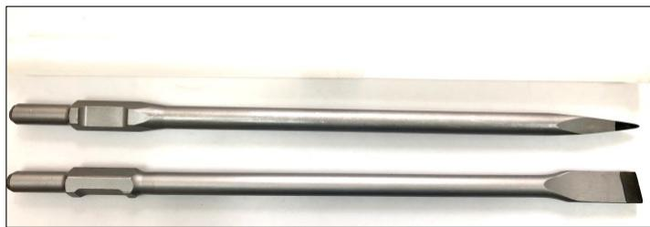

## 五坑炮尖五坑油壓鑽用

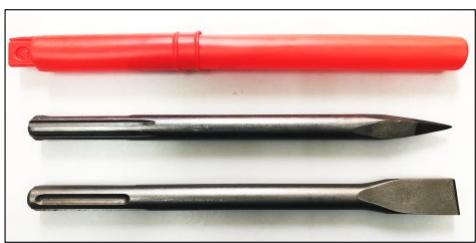

<table><tr><td>產品名稱:</td><td>24&quot;加長大電炮尖</td><td>24&quot;加長大電炮扁鑿</td><td>五坑炮尖</td><td>五坑扁炮鑿</td></tr><tr><td>編號:</td><td>CS410-600</td><td>CS410F-600</td><td>CS5-280</td><td>CS5-280F</td></tr><tr><td>規格:</td><td>(30x600)mm</td><td>(30x600X35)mm</td><td>(18x270)mm</td><td>(18x270x25)mm</td></tr><tr><td>包裝:</td><td>原箱:10支(膠筒裝)</td><td>原箱:10支(膠筒裝)</td><td>原箱:60支(膠筒裝)</td><td>原箱:60支(膠筒裝)</td></tr></table>

## 瓦仔鎅筆:

規格:1/4", 5/16", 3/8", 1/2"   

<table><tr><td>產品編號</td><td>規格</td></tr><tr><td>TC6</td><td>1/4&quot; (6mm)</td></tr><tr><td>TC8</td><td>5/16&quot; (8mm)</td></tr><tr><td>TC10</td><td>3/8&quot; (10mm)</td></tr><tr><td>TC13-6</td><td>1/2&quot; (13mm)6&quot; 柄長</td></tr><tr><td>TC13-9</td><td>1/2&quot; (13mm)9&quot; 柄長</td></tr><tr><td>包裝:</td><td>散裝/膠套, 50支/盒</td></tr><tr><td>用途:</td><td>鑿水泥, 混凝土, 銅瓷磚</td></tr></table>

(1/2"有: 9"特長手柄 & 6"普通長手柄)

### " SKARP "

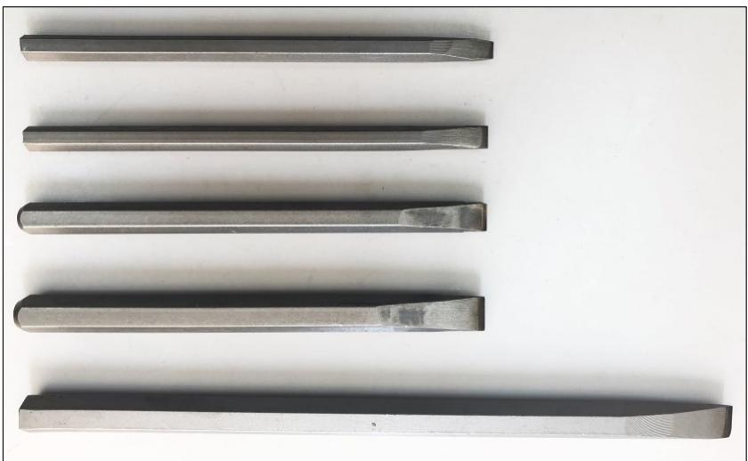

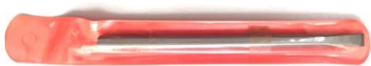

# 五金工具系列---萬應寶多功能震震機配件萬應寶/Bosch/其他牌子機通用:木工/薄金屬/水泥鋸片/磨片

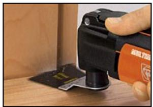

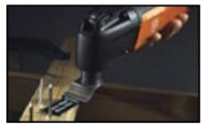

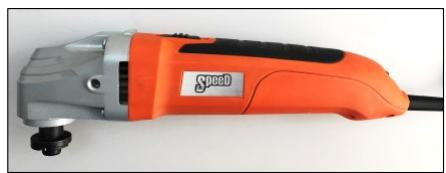

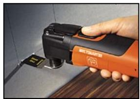

<table><tr><td>產品編號</td><td>產品名稱</td></tr><tr><td></td><td>(切割材料: 木材)</td></tr><tr><td>FN-WS33</td><td>萬應寶木工銘片33MM闢(粗齒)</td></tr><tr><td>FN-WS65</td><td>萬應寶木工銘片65MM闢(粗齒)</td></tr><tr><td>FN-WT</td><td>萬應寶木工銘片40MM闢(70MM長)</td></tr><tr><td></td><td>(切割材料: 薄金屬)</td></tr><tr><td>FN-SS33</td><td>萬應寶薄金屬鋅片33MM闢(幼齒)</td></tr><tr><td>FN-SS65</td><td>萬應寶薄金屬鋅片65MM闢(幼齒)</td></tr><tr><td>FN-E</td><td>萬應寶木/薄金屬鋅片33MM闢(E型幼齒)</td></tr><tr><td>FN-ST</td><td>萬應寶木/薄金屬鋅片45MM闢(幼齒)</td></tr><tr><td>FN-SS10</td><td>萬應寶木/薄金屬鋅片10MM闢(幼齒)</td></tr><tr><td></td><td>(切割材料: 鍍油漆)</td></tr><tr><td>FN-S</td><td>萬應寶機用不銹鋼鑰片51MM闢</td></tr></table>

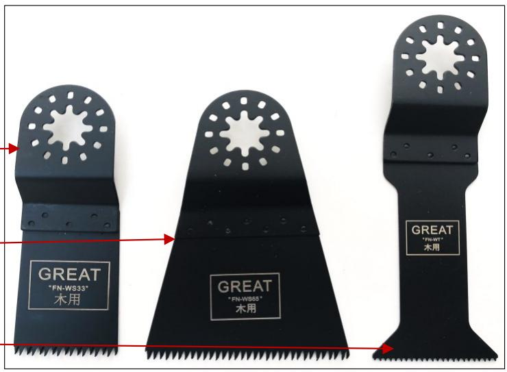

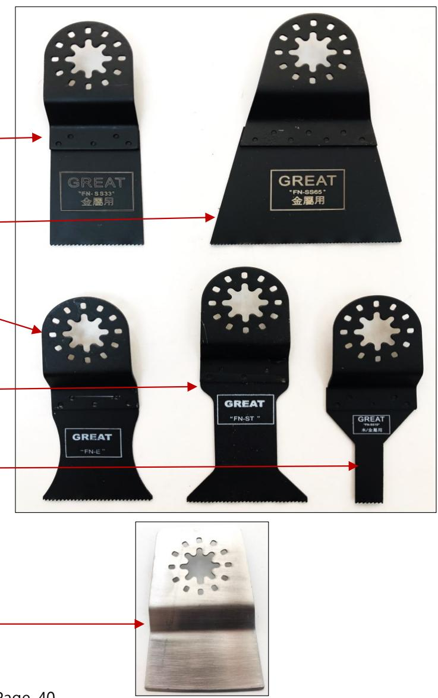

## 五金工具系列---萬應寶多功能震震機配件

### 萬應寶/Bosch/其他牌子機通用:木工/薄金屬/水泥鋸片/磨片

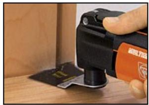

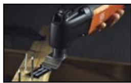

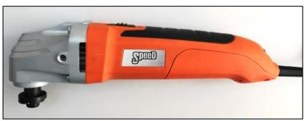

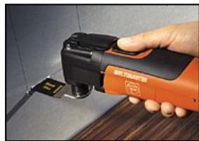

<table><tr><td>產品編號</td><td>產品名稱</td></tr><tr><td></td><td>(切割材料:水泥)</td></tr><tr><td>FN-EDW</td><td>萬應寶沉頭鑽石鋸片(專業型)</td></tr><tr><td></td><td>規格:(85x2.0x5x10)內孔)mm</td></tr><tr><td>FN-EEDW</td><td>萬應寶沉頭鑽石鋸片(經濟型)</td></tr><tr><td></td><td>規格:(65x2.0x5x10)內孔)mm</td></tr><tr><td>FN-CS65</td><td>萬應寶鑽石鋸片(經濟型)(軌型)</td></tr><tr><td></td><td>規格:(58x2.0x6x10)內孔)mm</td></tr><tr><td></td><td>(打磨材料:水泥/油漆)</td></tr><tr><td>FN-EF</td><td>萬應寶沉頭三角打磨片(專業型)</td></tr><tr><td></td><td>規格:(90x90x20)內孔)mm</td></tr><tr><td>FN-EEF</td><td>萬應寶沉頭三角打磨片(經濟型)</td></tr><tr><td></td><td>規格:(75x75x20)內孔)mm</td></tr></table>

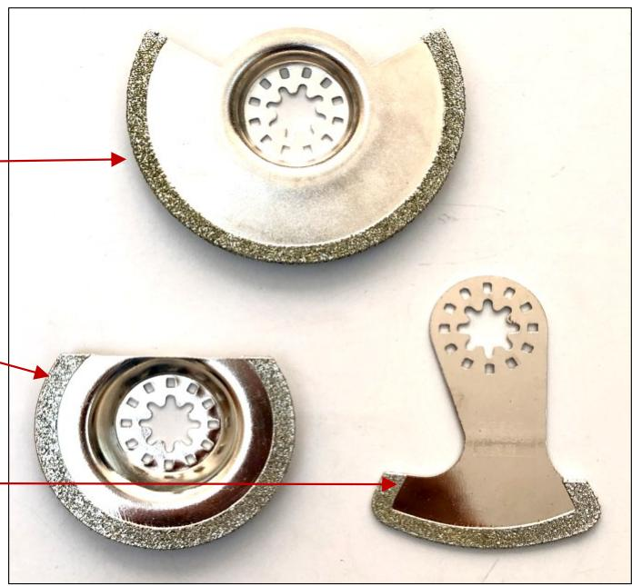

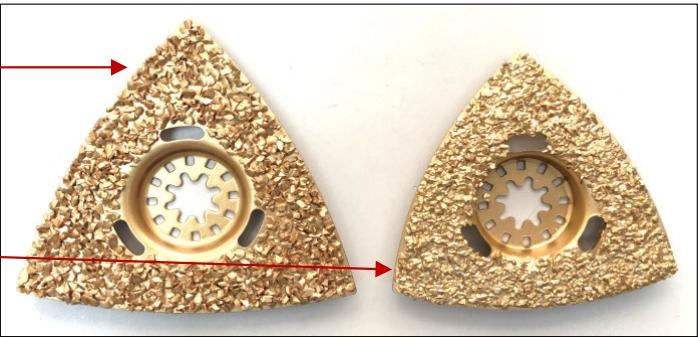

開口萬應寶鋸片:  

<table><tr><td></td><td>(切割材料: 木材)</td></tr><tr><td>AFN-WS33</td><td>開口萬應寶木工錸片33MM闢(粗齒)</td></tr><tr><td>AFN-WS65</td><td>開口萬應寶木工錸片65MM闢(粗齒)</td></tr><tr><td></td><td>(切割材料: 薄金屬)</td></tr><tr><td>AFN-SS33</td><td>開口萬應寶薄金屬鋅片33MM闢(幼齒)</td></tr><tr><td>AFN-E</td><td>開口萬應寶木/薄金屬鋅片33MM闢(E型幼齒)</td></tr><tr><td>AFN-SS65</td><td>開口萬應寶薄金屬鋅片65MM闢(幼齒)</td></tr></table>

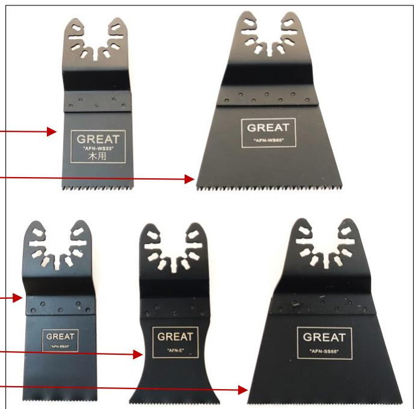

## 五金工具系列---十字頭/三角頭玻璃鑽咀

鷹嘜"SPEED" 十字頭瓷磚,玻璃,陶瓷開孔鑽咀.(電批六角柄)

<table><tr><td>產品編號:</td><td>產品名稱:</td></tr><tr><td>GD3+</td><td>3MM(1/8&quot;)十字頭瓷磚/玻璃鑰咀</td></tr><tr><td>GD4+</td><td>4MM(5/32&quot;)十字頭瓷磚/玻璃鑰咀</td></tr><tr><td>GD5+</td><td>5MM(3/16&quot;)十字頭瓷磚/玻璃鑰咀</td></tr><tr><td>GD6+</td><td>6MM(15/64&quot;)十字頭瓷磚/玻璃鑰咀</td></tr><tr><td>GD6.5+</td><td>6.5MM(1/4&quot;)十字頭瓷磚/玻璃鑰咀</td></tr><tr><td>GD7+</td><td>7MM(9/32&quot;)十字頭瓷磚/玻璃鑰咀</td></tr><tr><td>GD8+</td><td>8MM(5/16&quot;)十字頭瓷磚/玻璃鑰咀</td></tr><tr><td>GD10+</td><td>10MM(3/8&quot;)十字頭瓷磚/玻璃鑰咀</td></tr><tr><td>GD12+</td><td>12MM(15/32&quot;)十字頭瓷磚/玻璃鑰咀</td></tr></table>

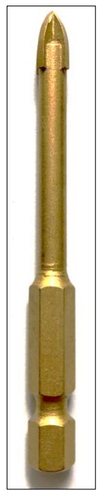

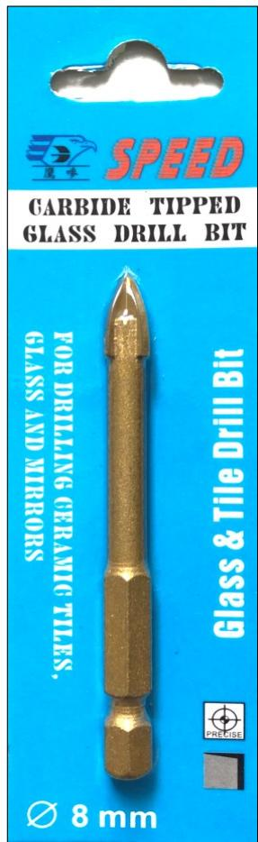

鷹嘜"SPEED" 三角頭瓷磚,玻璃,陶瓷開孔鑽咀.(防滑三角柄)

<table><tr><td>產品編號:</td><td>產品名稱:</td></tr><tr><td>GD3</td><td>3MM(1/8&quot;)三角頭瓷磚/玻璃鑰咀</td></tr><tr><td>GD4</td><td>4MM(5/32&quot;)三角頭瓷磚/玻璃鑰咀</td></tr><tr><td>GD5</td><td>5MM(3/16&quot;)三角頭瓷磚/玻璃鑰咀</td></tr><tr><td>GD6</td><td>6MM(15/64&quot;)三角頭瓷磚/玻璃鑰咀</td></tr><tr><td>GD6.5</td><td>6.5MM(1/4&quot;)三角頭瓷磚/玻璃鑰咀</td></tr><tr><td>GD7</td><td>7MM(9/32&quot;)三角頭瓷磚/玻璃鑰咀</td></tr><tr><td>GD8</td><td>8MM(5/16&quot;)三角頭瓷磚/玻璃鑰咀</td></tr><tr><td>GD10</td><td>10MM(3/8&quot;)三角頭瓷磚/玻璃鑰咀</td></tr><tr><td>GD12</td><td>12MM(15/32&quot;)三角頭瓷磚/玻璃鑰咀</td></tr></table>

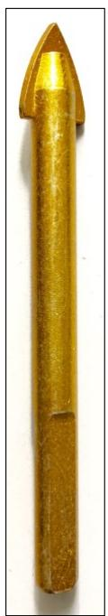

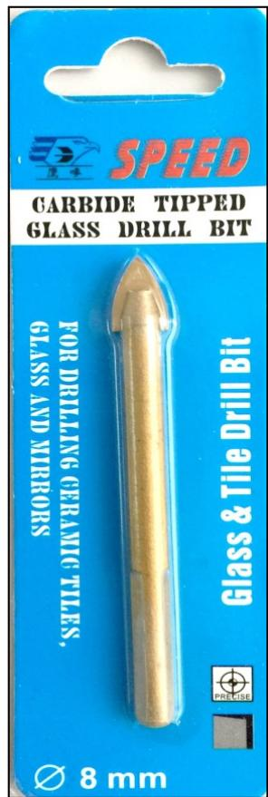

## 五金工具系列---鋒鋼令梳

### 台灣"鷹嘜"黑鋒鋼(高速鋼)令梳 ---"SKARP" 專業型

<table><tr><td>產品編號</td><td>規格</td></tr><tr><td>HSS16MM</td><td>5/8&quot; (16mm)</td></tr><tr><td>HSS19MM</td><td>3/4&quot; (19mm)</td></tr><tr><td>HSS20MM</td><td>25/32&quot; (20mm)</td></tr><tr><td>HSS22MM</td><td>7/8&quot; (22mm)</td></tr><tr><td>HSS25MM</td><td>1&quot; (25mm)</td></tr><tr><td>HSS30MM</td><td>1-3/16&quot; (30mm)</td></tr><tr><td>HSS32MM</td><td>1-1/4&quot; (32mm)</td></tr><tr><td>HSS35MM</td><td>1-3/8&quot; (35mm)</td></tr><tr><td>HSS38MM</td><td>1-1/2&quot; (38mm)</td></tr><tr><td>HSS40MM</td><td>1-9/16&quot; (40mm)</td></tr><tr><td>HSS45MM</td><td>1-3/4&quot; (45mm)</td></tr><tr><td>HSS50MM</td><td>(50mm)</td></tr><tr><td>HSS51MM</td><td>2&quot; (51mm)</td></tr><tr><td>HSS57MM</td><td>2-1/4&quot; (57mm)</td></tr><tr><td>HSS60MM</td><td>2-3/8&quot; (60mm)</td></tr><tr><td>HSS65MM</td><td>2-1/2&quot; (65mm)</td></tr><tr><td>HSS70MM</td><td>2-3/4&quot; (70mm)</td></tr><tr><td>HSS75MM</td><td>3&quot; (75mm)</td></tr><tr><td>HSS80MM</td><td>3-1/8&quot; (80mm)</td></tr><tr><td colspan="2">用途:薄鋼板/鋼管,鋁合金板,木板等打孔.</td></tr></table>

排屑槽設計,開孔更輕鬆!

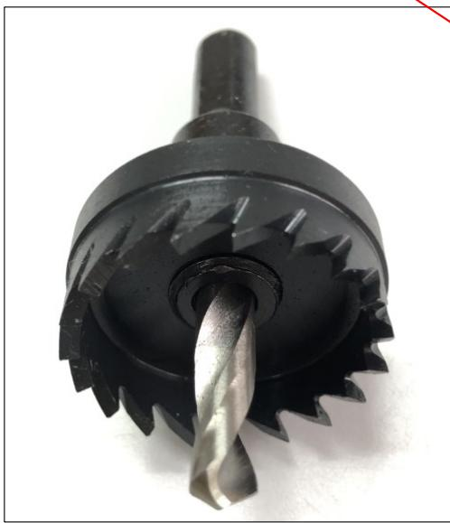

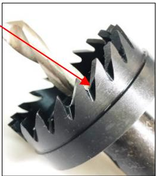

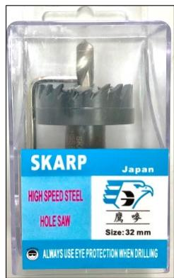

不建議打3MM或以上厚的金屬板!

(加水冷卻效果更佳)

<table><tr><td>鑽咀:6MM</td><td>柄部:8.5/9MM</td></tr><tr><td>包裝:</td><td>10套/內盒,200套/箱</td></tr></table>

鋒鋼(高速鋼)令梳 ---"SPEED"   

<table><tr><td>產品編號</td><td>規格</td></tr><tr><td>HSS16E</td><td>5/8&quot; (16mm)</td></tr><tr><td>HSS19E</td><td>3/4&quot; (19mm)</td></tr><tr><td>HSS20E</td><td>(20mm)</td></tr><tr><td>HSS22E</td><td>7/8&quot; (22mm)</td></tr><tr><td>HSS25E</td><td>1&quot; (25mm)</td></tr><tr><td>HSS30E</td><td>(30mm)</td></tr><tr><td>HSS32E</td><td>1-1/4&quot; (32mm)</td></tr><tr><td>HSS35E</td><td>1-3/8&quot; (35mm)</td></tr><tr><td>HSS38E</td><td>1-1/2&quot; (38mm)</td></tr><tr><td>HSS45E</td><td>1-3/4&quot; (45mm)</td></tr><tr><td>HSS51E</td><td>2&quot; (51mm)</td></tr><tr><td>HSS57E</td><td>2-1/4&quot; (57mm)</td></tr><tr><td>HSS60E</td><td>2-3/8&quot; (60mm)</td></tr><tr><td>HSS65E</td><td>2-1/2&quot; (65mm)</td></tr><tr><td>HSS70E</td><td>2-3/4&quot; (70mm)</td></tr><tr><td>HSS75E</td><td>3&quot; (75mm)</td></tr><tr><td>HSS80E</td><td>3-1/8&quot; (80mm)</td></tr><tr><td colspan="2">用途:薄鋼板/鋼管,鋁合金板,木板等打孔.</td></tr></table>

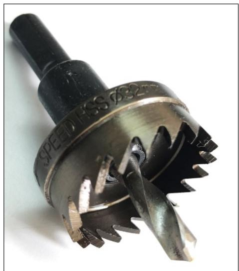  
優惠型

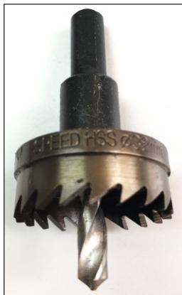

不建議打3MM或以上厚的金屬板!

(加水冷卻效果更佳)

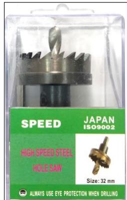

## 五金工具系列---鋒鋼/鑽石鋼令梳

### 鋒鋼(高速鋼)令梳 ---"BEST"

### 經濟型(超低價!)

<table><tr><td>產品編號</td><td>產品規格</td></tr><tr><td>HSSB20</td><td>(20mm)</td></tr><tr><td>HSSB25</td><td>1&quot; (25mm)</td></tr><tr><td>HSSB32</td><td>1-1/4&quot; (32mm)</td></tr><tr><td colspan="2"></td></tr><tr><td colspan="2">用途:薄鋼板/鋼管,鋁合金板,木板等打孔.</td></tr></table>

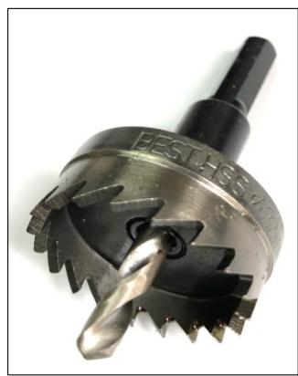

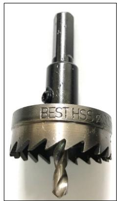

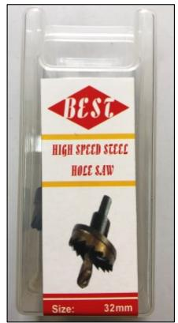

不建議打2MM或以上厚的金屬板!(加冷卻水打孔)  

<table><tr><td>包裝:</td><td>10套/內盒,200套/箱</td><td>鑽咀:5/6MM</td><td>柄部:7.2MM</td></tr></table>

象仔嘜"GREAT"日式 鑽石鋼令梳

不建議打3MM或以上厚的金屬板!  
(加水冷卻效果更佳)   

<table><tr><td>產品編號</td><td>產品規格</td></tr><tr><td>THSU16</td><td>16MM (5/8&quot;)</td></tr><tr><td>THSU19</td><td>19MM (3/4&quot;)</td></tr><tr><td>THSU20</td><td>20MM</td></tr><tr><td>THSU22</td><td>22MM (7/8&quot;)</td></tr><tr><td>THSU25</td><td>25MM (1&quot;)</td></tr><tr><td>THSU28</td><td>28MM</td></tr><tr><td>THSU30</td><td>30MM</td></tr><tr><td>THSU32</td><td>32MM (1-1/4&quot;)</td></tr><tr><td>THSU35</td><td>35MM (1-3/8&quot;)</td></tr><tr><td>THSU38</td><td>38MM (1-1/2&quot;)</td></tr><tr><td>THSU40</td><td>40MM</td></tr><tr><td>THSU45</td><td>45MM (1-3/4&quot;)</td></tr><tr><td>THSU48</td><td>48MM (1-7/8&quot;)</td></tr><tr><td>THSU51</td><td>51MM (2&quot;)</td></tr><tr><td>THSU54</td><td>54MM (2-1/8&quot;)</td></tr><tr><td>THSU57</td><td>57MM (2-1/4&quot;)</td></tr><tr><td>THSU60</td><td>60MM (2-3/8&quot;)</td></tr><tr><td>THSU65</td><td>65MM (2-1/2&quot;)</td></tr><tr><td>THSU70</td><td>70MM (2-3/4&quot;)</td></tr><tr><td>THSU75</td><td>75MM (3&quot;)</td></tr><tr><td>THSU80</td><td>80MM (3-1/8&quot;)</td></tr><tr><td>THSU90</td><td>90MM (3-1/2&quot;)</td></tr><tr><td>THSU100</td><td>100MM</td></tr><tr><td colspan="2">用途：不銹鋼薄板，薄鋼板/鋼管，鋁合金板，木(加冷卻液使用效果更佳</td></tr></table>

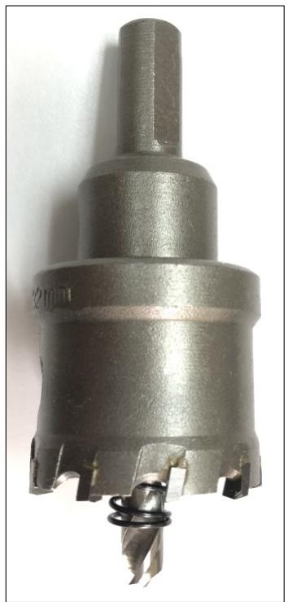

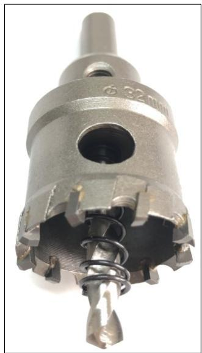

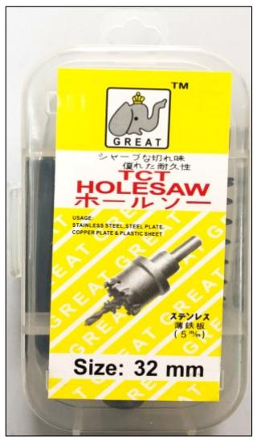

## 五金工具系列---鑽石鋼令梳

"MORE"德式 鑽石鋼令梳   

<table><tr><td>產品編號</td><td>規格</td></tr><tr><td>THSG15</td><td>15MM</td></tr><tr><td>THSG16</td><td>16MM (5/8&quot;)</td></tr><tr><td>THSG19</td><td>19MM (3/4&quot;)</td></tr><tr><td>THSG20</td><td>20MM</td></tr><tr><td>THSG22</td><td>22MM (7/8&quot;)</td></tr><tr><td>THSG25</td><td>25MM (1&quot;)</td></tr><tr><td>THSG30</td><td>30MM</td></tr><tr><td>THSG32</td><td>32MM (1-1/4&quot;)</td></tr><tr><td>THSG35</td><td>35MM (1-3/8&quot;)</td></tr><tr><td>THSG38</td><td>38MM (1-1/2&quot;)</td></tr><tr><td>THSG40</td><td>40MM</td></tr><tr><td>THSG45</td><td>45MM (1-3/4&quot;)</td></tr><tr><td>THSG51</td><td>51MM (2&quot;)</td></tr><tr><td>THSG53</td><td>53MM</td></tr><tr><td>THSG55</td><td>55MM</td></tr><tr><td>THSG58</td><td>58MM</td></tr></table>

<table><tr><td colspan="3">用途:不銹鋼薄板,薄鋼板/鋼管,鋁合金板,木板等打孔.</td></tr><tr><td>包裝:</td><td>10套/內盒,200套/箱</td><td></td></tr><tr><td>鑰咀:6M</td><td>柄部:9.3MM</td><td>(加水冷卻效果更</td></tr></table>

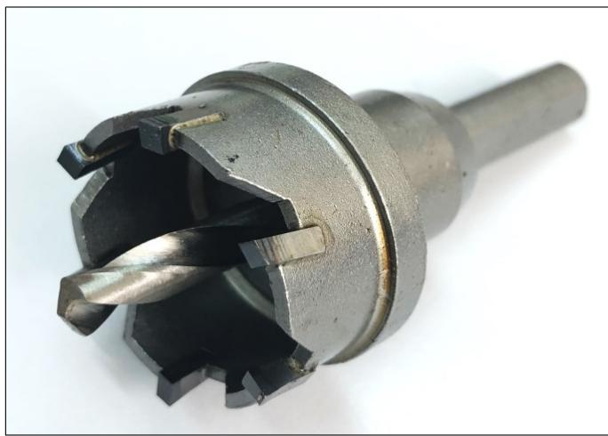  
通用型

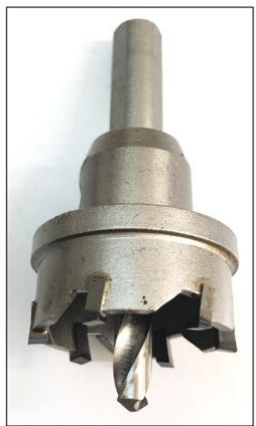  
不建議打3MM或以上厚的金屬板!

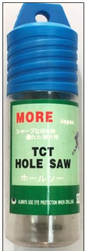

鑽石鋼令梳---SKARP   

<table><tr><td>產品編號</td><td>規格</td></tr><tr><td>THS16MM</td><td>5/8&quot; (16mm)</td></tr><tr><td>THS19MM</td><td>3/4&quot; (19mm)</td></tr><tr><td>THS30MM</td><td>(30mm)</td></tr><tr><td>THS32MM</td><td>1-1/4&quot; (32mm)</td></tr><tr><td>THS38MM</td><td>1-1/2&quot; (38mm)</td></tr><tr><td>THS48MM</td><td>1-7/8&quot; (48mm)</td></tr><tr><td>THS54MM</td><td>2-1/8&quot; (54mm)</td></tr><tr><td>THS57MM</td><td>2-1/4&quot; (57mm)</td></tr></table>

<table><tr><td colspan="3">用途:不銹鋼薄板,薄鋼板/鋼管,鋁合金板,木板等打孔.</td></tr><tr><td>包裝:</td><td>10套/內盒,200套/箱</td><td rowspan="2">(加水冷卻效果更佳)</td></tr><tr><td>鑰咀:6M</td><td>柄部:9.3MM</td></tr></table>

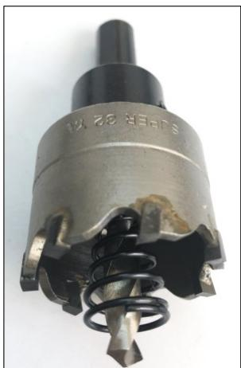  
經濟型

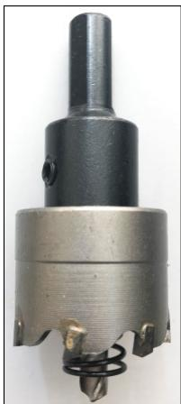

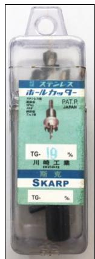  
不建議打3MM或以上厚的金屬板!

特價倉底貨,售完即止!

## 五金工具系列---美式鋒鋼令梳杯

美式鋒鋼令梳杯--"GREAT"鷹嘜

5/8"---8"(16MM---203MM)

<table><tr><td>產品編號</td><td>規格</td></tr><tr><td>M42-16</td><td>5/8&quot; (16mm)</td></tr><tr><td>M42-19</td><td>3/4&quot; (19mm)</td></tr><tr><td>M42-20</td><td>25/32&quot; (20mm)</td></tr><tr><td>M42-22</td><td>7/8&quot; (22mm)</td></tr><tr><td>M42-25</td><td>1&quot; (25mm)</td></tr><tr><td>M42-29</td><td>1-1/8&quot; (29mm)</td></tr><tr><td>M42-30</td><td>1-3/16&quot; (30mm)</td></tr><tr><td>M42-32</td><td>1-1/4&quot; (32mm)</td></tr><tr><td>M42-35</td><td>1-3/8&quot; (35mm)</td></tr><tr><td>M42-38</td><td>1-1/2&quot; (38mm)</td></tr><tr><td>M42-40</td><td>1-9/16&quot; (40mm)</td></tr><tr><td>M42-44</td><td>1-3/4&quot; (44mm)</td></tr><tr><td>M42-48</td><td>1-7/8&quot; (48mm)</td></tr><tr><td>M42-51</td><td>2&quot; (51mm)</td></tr><tr><td>M42-54</td><td>2-1/8&quot; (54mm)</td></tr><tr><td>M42-57</td><td>2-1/4&quot; (57mm)</td></tr><tr><td>M42-60</td><td>2-3/8&quot; (60mm)</td></tr><tr><td>M42-64</td><td>2-1/2&quot; (64mm)</td></tr><tr><td>M42-67</td><td>2-5/8&quot; (67mm)</td></tr><tr><td>M42-70</td><td>2-3/4&quot; (70mm)</td></tr><tr><td>M42-73</td><td>2-7/8&quot; (73mm)</td></tr><tr><td>M42-76</td><td>3&quot; (76mm)</td></tr><tr><td>M42-79</td><td>3-1/8&quot; (79mm)</td></tr><tr><td>M42-83</td><td>3-1/4&quot; (83mm)</td></tr><tr><td>M42-86</td><td>3-3/8&quot; (86mm)</td></tr><tr><td>M42-89</td><td>3-1/2&quot; (89mm)</td></tr><tr><td>M42-92</td><td>3-5/8&quot; (92mm)</td></tr><tr><td>M42-95</td><td>3-3/4&quot; (95mm)</td></tr><tr><td>M42-98</td><td>3-7/8&quot; (98mm)</td></tr><tr><td>M42-102</td><td>4&quot; (102mm)</td></tr><tr><td>M42-105</td><td>4-1/8&quot; (105mm)</td></tr><tr><td>M42-108</td><td>4-1/4&quot; (108mm)</td></tr><tr><td>M42-111</td><td>4-3/8&quot; (111mm)</td></tr><tr><td>M42-114</td><td>4-1/2&quot; (114mm)</td></tr><tr><td>M42-121</td><td>4-3/4&quot; (121mm)</td></tr><tr><td>M42-127</td><td>5&quot; (127mm)</td></tr><tr><td>M42-140</td><td>5-1/2&quot; (140mm)</td></tr><tr><td>M42-146</td><td>5-3/4&quot; (146mm)</td></tr><tr><td>M42-152</td><td>6&quot; (152mm)</td></tr><tr><td>M42-165</td><td>6-1/2&quot; (165mm)</td></tr><tr><td>M42-178</td><td>7&quot; (178mm)</td></tr><tr><td>M42-203</td><td>8&quot; (203mm)</td></tr></table>

用途:薄鋼板/銅管, 鋁合金板, 木板等打孔.

包裝: 獨立彩盒包裝

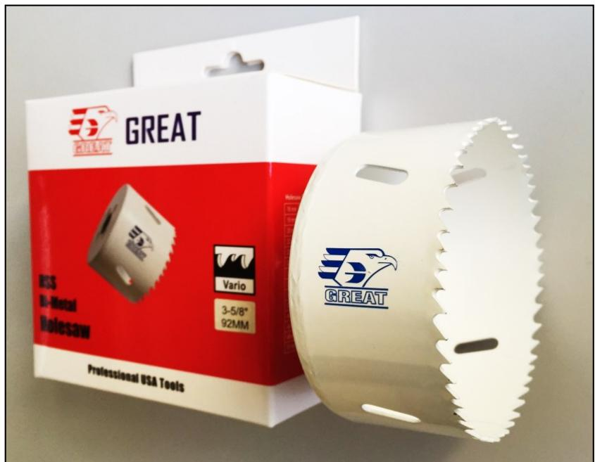

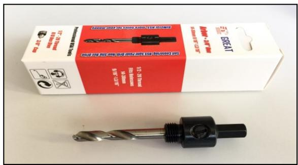

細令梳鑽芯: #3/8"(16MM--30MM用)

產品編號:M42-D-S

(螺紋:1/2"-20)

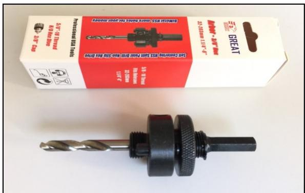

大令梳鑽芯:#3/8"(32MM--203MM用)

產品編號:M42-D-L

(螺紋:5/8"-18)

不建議打2MM或以上厚的金屬板!

(加水冷卻效果更佳)

## 五金工具系列---老虎鋸片/大利鋸

### 多功能鋸(配電鑽,電批,起子批使用)

<table><tr><td>產品名稱:</td><td>多功能錶 (電鑰老虎錯)</td></tr><tr><td>產品編號:</td><td>MSD</td></tr><tr><td>規格:</td><td>16 X 17CM</td></tr><tr><td>配件:</td><td>配有鎋木&amp;鎋鐵錯片&amp;六角匙各一支.</td></tr><tr><td>特點</td><td>可多角度,不同方位上使用,慾位,輕便</td></tr><tr><td></td><td>配在各款電鑰或電批,起子批上使用.</td></tr><tr><td>柄部:</td><td>三角柄/六角電批尾</td></tr></table>

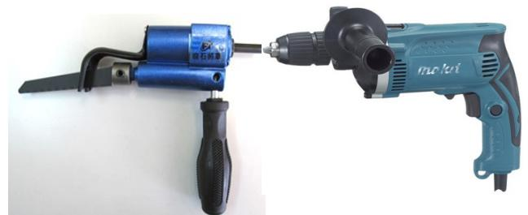

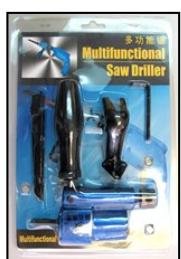

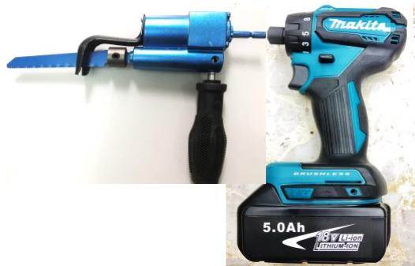

### 6" / 9"老虎鋸片---鋸木/膠等用 (BOSS)

<table><tr><td>產品編號</td><td>規格</td></tr><tr><td>S944D</td><td>6&quot; (150mm) 老虎鋅片(木用)(5支裝)
HCS 6&quot;/6TPI (150MM/4.0MM)</td></tr><tr><td>包裝:</td><td>5支/包, 20包/白盒</td></tr><tr><td>S1144D</td><td>9&quot; (225mm) 老虎鋅片(木用)(5支裝)
HCS 9&quot;/6TPI (225MM/4.0MM)</td></tr><tr><td>包裝:</td><td>5支/包, 20包/白盒</td></tr></table>

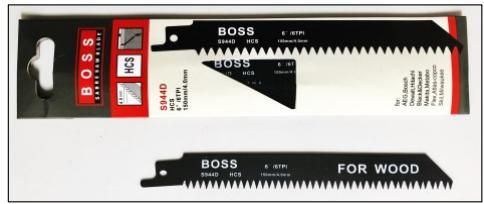

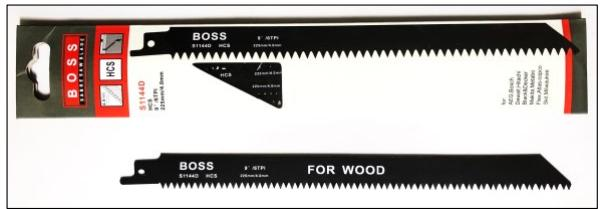

### 6" / 9"老虎鋸片--- 金屬用 (BOSS)

<table><tr><td>產品編號</td><td>規格</td></tr><tr><td>S922BF</td><td>6&quot;(150mm)老虎錸片(金屬用)(5支裝)BI-METAL 6&quot;/14TPI (150MM/1.8MM)</td></tr><tr><td>包裝:</td><td>5支/包,20包/白盒</td></tr><tr><td>S1122BF</td><td>9&quot;(225mm)老虎錸片(金屬用)(5支裝)BI-METAL 9&quot;/14TPI (225MM/1.8MM)</td></tr><tr><td>包裝:</td><td>5支/包,20包/白盒</td></tr></table>

### 細 齒 鋸(大利鋸) "BEST"

<table><tr><td>產品編號</td><td>規格</td></tr><tr><td>SS-270</td><td>鋅齒長270MM</td></tr><tr><td>切割：</td><td>木板,纖維板.竹枝等.</td></tr><tr><td>包裝：</td><td>12把/內盒</td></tr></table>

### 摺 鋸 "BEST"

<table><tr><td>產品編號</td><td>規格</td></tr><tr><td>FS-210</td><td>鋅齒長210MM</td></tr><tr><td>切割:</td><td>木板,纖維板.竹枝等.</td></tr><tr><td>包裝:</td><td>12把/內盒</td></tr></table>

(三面磨齒+黑齒)

## 五金工具系列---膠托/風喉喼輪

### 魔術貼膠托 (磨機用) BEST 4"--7"

<table><tr><td>產品名稱（螺紋）</td><td>產品編號</td></tr><tr><td>4&quot;（100)魔術貼膠托(M10x1.5)</td><td>BP4M10-1.5</td></tr><tr><td>4&quot;（100)魔術貼膠托(M10x1.25)</td><td>BP4M10-1.25
(4&quot;牧田M9500磨機用)</td></tr><tr><td>4-1/2&quot; (115)魔術貼膠托(M14x2)</td><td>BP4.5M14--2</td></tr><tr><td>5&quot; (125)魔術貼膠托(M10x1.5)</td><td>BP5M10--1.5
(4&quot;磨機用)</td></tr><tr><td>5&quot; (125)魔術貼膠托(M14x2)</td><td>BP5M14--2</td></tr><tr><td>6&quot; (150)魔術貼膠托(M14x2)</td><td>BP6M14--2</td></tr><tr><td>7&quot; (180)魔術貼膠托(M14x2)</td><td>BP7M14--2</td></tr><tr><td colspan="2">適用於：黏貼各種附魔術貼的拋光碟或砂紙碟.</td></tr></table>

  
包裝:25個/白盒

### 橡膠托 (磨機用) BEST

<table><tr><td>5&quot; (125)橡膠托(M14x2)</td><td>BPP5M14--2</td></tr><tr><td>7&quot; (180)橡膠托(M14x2)</td><td>BPP7M14--2</td></tr><tr><td>適用於:</td><td>夾貼砂紙碟.</td></tr></table>

(1/4"牙)

風喉喼輪  

<table><tr><td>產品名稱:</td><td>兩頭風喉噁輪</td></tr><tr><td>產品編號:</td><td>SMV</td></tr><tr><td>包裝:</td><td>獨立彩盒包裝,120個/箱</td></tr></table>

<table><tr><td>產品名稱：</td><td>三頭風喉噁輪</td></tr><tr><td>產品編號：</td><td>SMY</td></tr><tr><td>包裝：</td><td>獨立彩盒包裝,100個/箱</td></tr></table>

兩頭喼輪

三頭喼輪

### 各種風喉喼輪:

  
5x8風喉喼輪

5X8風喉喼輪

  
公外牙

母外牙

  
公內牙

母內牙

  
公有尾

母有尾

(1/4"牙)

"BEST"   

<table><tr><td>產品編號:</td><td>產品名稱:</td><td>每盒包裝:</td></tr><tr><td>QC5X8</td><td>風喉噉輪</td><td>10套/內盒</td></tr><tr><td>20 SM</td><td>母外牙</td><td>10個/內盒</td></tr><tr><td>20 PM</td><td>公外牙</td><td>50個/內盒</td></tr><tr><td>20 SF</td><td>母内牙</td><td>10個/內盒</td></tr><tr><td>20 PF</td><td>公內牙</td><td>50個/內盒</td></tr><tr><td>20 SH</td><td>母有尾</td><td>10個/內盒</td></tr><tr><td>20 PH</td><td>公有尾</td><td>50個/內盒</td></tr></table>

## 五金工具系列---六角磁卜/接杆/四坑油壓鑽咀

六角磁卜  
(5支裝)   

<table><tr><td>產品編號</td><td>規格:</td></tr><tr><td>MNS06</td><td>6mm x 65mm</td></tr><tr><td>MNS07</td><td>7mm x 65mm</td></tr><tr><td>MNS08</td><td>8mm x 65mm</td></tr><tr><td>MNS10</td><td>10mm x 65mm</td></tr><tr><td>MNS12</td><td>12mm x 65mm</td></tr><tr><td>MNS13</td><td>13mm x 65mm</td></tr><tr><td>MNS14</td><td>14mm x 65mm</td></tr><tr><td>MNS1/4</td><td>1/4&quot; x 65mm</td></tr></table>

磁性接杆   
(5支裝)   

<table><tr><td>產品編號</td><td>規格:</td></tr><tr><td>MBH60</td><td>60MM</td></tr><tr><td>MBH75</td><td>75MM</td></tr><tr><td>MBH100</td><td>100MM</td></tr></table>

### "SPEED"四坑油壓鑽咀: (SDS-PLUS)

<table><tr><td>產品編號</td><td>規格(mm)</td></tr><tr><td>SDS5x110</td><td>5 x 110</td></tr><tr><td>SDS5x160</td><td>5 x 160</td></tr><tr><td>SDS6x110</td><td>6 x 110</td></tr><tr><td>SDS6x160</td><td>6 x 160</td></tr><tr><td>SDS6.5x110</td><td>6.5 x 110</td></tr><tr><td>SDS6.5x160</td><td>6.5 x 160</td></tr><tr><td>SDS8x110</td><td>8 x 110</td></tr><tr><td>SDS8x160</td><td>8 x 160</td></tr></table>

包裝:塑料掛袋包裝,(25支/透明袋)50支/白盒

<table><tr><td>產品編號</td><td>規格 (mm)</td></tr><tr><td>SDS10x110</td><td>10 x 110</td></tr><tr><td>SDS10x160</td><td>10 x 160</td></tr><tr><td>SDS11x160</td><td>11 x 160</td></tr><tr><td>SDS12x160</td><td>12 x 160</td></tr><tr><td>SDS14x160</td><td>14 x 160</td></tr><tr><td>SDS14x210</td><td>14 x 210</td></tr><tr><td>SDS15x160</td><td>15 x 160</td></tr><tr><td>SDS15x210</td><td>15 x 210</td></tr></table>

包裝:塑料掛袋包裝,(25支/透明袋)50支/白盒

### 其他規格稍後陸續推出!

## 行李密碼鎖

(可自行更改密碼)

<table><tr><td>產品編號:</td></tr><tr><td>CZ-02B</td></tr><tr><td>CZ-10</td></tr><tr><td>CZ-16</td></tr><tr><td>包裝:12把/內盒(雜色)</td></tr></table>

  
CZ-02B

  
CZ-10

  
CZ-16

## 五金工具系列---批咀

(10支裝)

"十""十"雙頭批咀: "GREAT"   

<table><tr><td>產品編號</td><td>規格（mm）</td></tr><tr><td>SB++1x50</td><td>1# x 50</td></tr><tr><td>SB++1x65</td><td>1# x 65</td></tr><tr><td>SB++1x75</td><td>1# x 75</td></tr><tr><td>SB++2x50</td><td>2# x 50</td></tr><tr><td>SB++2x65</td><td>2# x 65</td></tr><tr><td>SB++2x75</td><td>2# x 75</td></tr><tr><td>SB++2x110</td><td>2# x 110</td></tr><tr><td>SB++2x150</td><td>2# x 150</td></tr><tr><td>SB++2x200</td><td>2# x 200</td></tr></table>

(10支裝)

"十" 字單頭批咀: "GREAT"   

<table><tr><td>產品編號</td><td>規格（mm）</td></tr><tr><td>SB+1x65</td><td>1# x 65</td></tr><tr><td>SB+1x75</td><td>1# x 75</td></tr><tr><td>SB+2x65</td><td>2# x 65</td></tr><tr><td>SB+2x75</td><td>2# x 75</td></tr><tr><td>SB+2x110</td><td>2# x 110</td></tr></table>

(10支裝)

"十" "一" 雙頭批咀: "GREAT"   

<table><tr><td>產品編號</td><td>規格（mm）</td></tr><tr><td>SB+ -16x65</td><td>1# / 6mm x 50</td></tr><tr><td>SB+ -16x75</td><td>1# / 6mm x 75</td></tr><tr><td>SB+ -26x50</td><td>2# / 6mm x 50</td></tr><tr><td>SB+ -26x65</td><td>2# / 6mm x 65</td></tr><tr><td>SB+ -26x75</td><td>2# / 6mm x 75</td></tr><tr><td>SB+ -26x110</td><td>2# / 6mm x 110</td></tr><tr><td>SB+ -26x150</td><td>2# / 6mm x 150</td></tr></table>

(10支裝)

! 字單頭批咀: "GREAT"   

<table><tr><td>產品編號</td><td>規格（mm）</td></tr><tr><td>SB-6x65</td><td>6mm x 65</td></tr><tr><td>SB-6x75</td><td>6mm x 75</td></tr><tr><td>SB-6x110</td><td>6mm x 110</td></tr></table>

其他款式的批咀, 稍後會陸續推出!!

(目錄所有相關資料只供參考之用, 如有更改, 恕不另行通知!)

### 更多優質的工具產品, 日後將會陸續加入!!

# 香港工具有限公司

電話:25408908 傳真:25483406

WhatsApp: 90102502

Facebook:Hong Kong Tools Co Limited